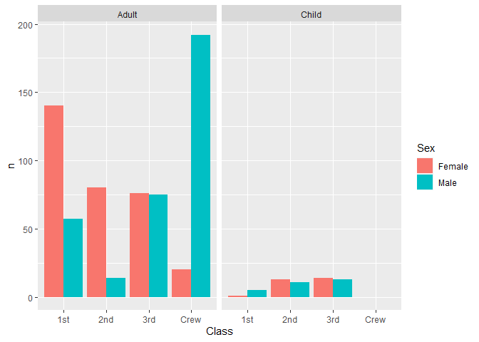
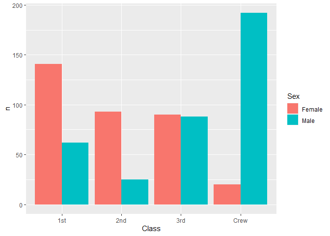
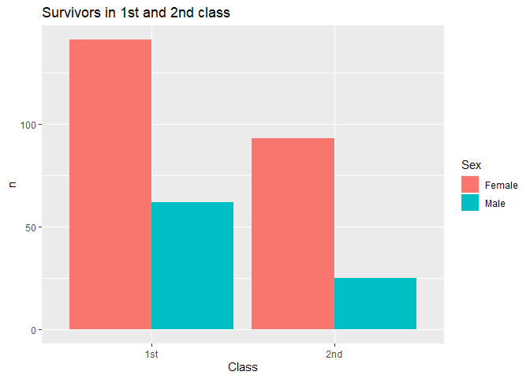
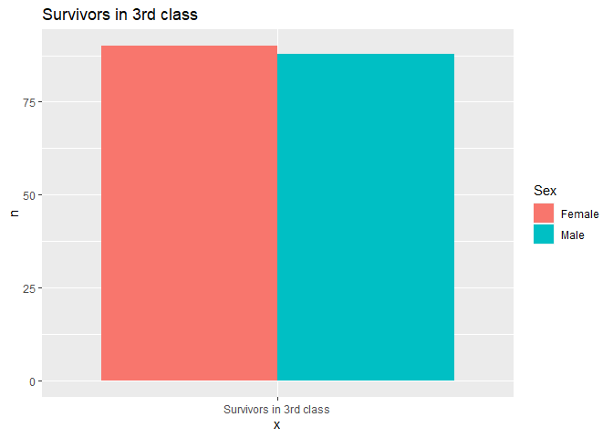
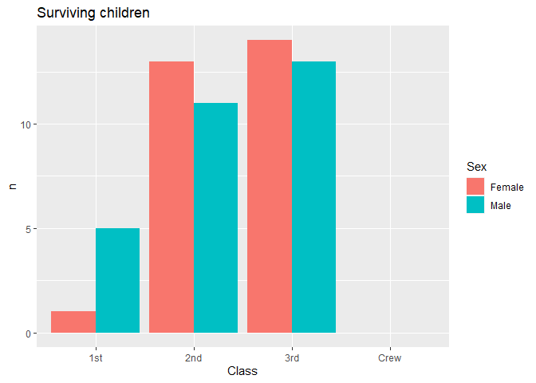
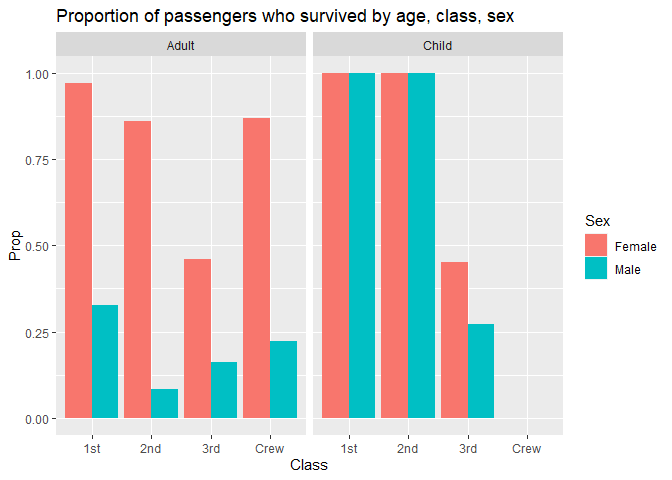
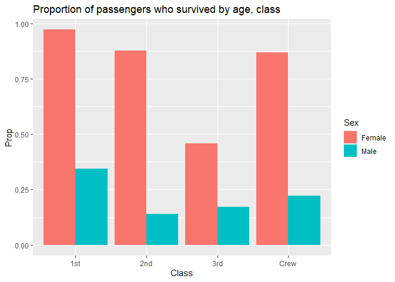
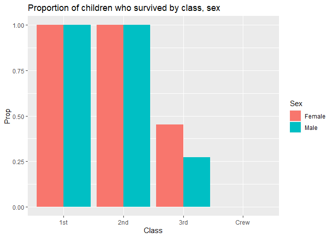
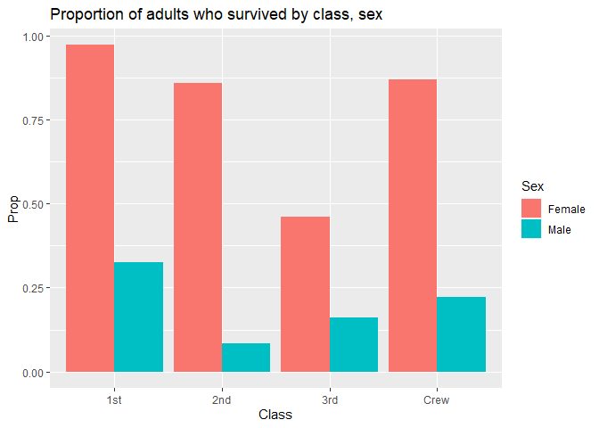

RMS Titanic
================
branish
2020-7-16

  - [Grading Rubric](#grading-rubric)
      - [Individual](#individual)
      - [Team](#team)
      - [Due Date](#due-date)
  - [First Look](#first-look)
  - [Deeper Look](#deeper-look)
  - [Notes](#notes)

*Purpose*: Most datasets have at least a few variables. Part of our task
in analyzing a dataset is to understand trends as they vary across these
different variables. Unless we’re careful and thorough, we can easily
miss these patterns. In this challenge you’ll analyze a dataset with a
small number of categorical variables and try to find differences among
the groups.

*Reading*: (Optional) [Wikipedia
article](https://en.wikipedia.org/wiki/RMS_Titanic) on the RMS Titanic.

<!-- include-rubric -->

# Grading Rubric

<!-- -------------------------------------------------- -->

Unlike exercises, **challenges will be graded**. The following rubrics
define how you will be graded, both on an individual and team basis.

## Individual

<!-- ------------------------- -->

| Category    | Unsatisfactory                                                                   | Satisfactory                                                               |
| ----------- | -------------------------------------------------------------------------------- | -------------------------------------------------------------------------- |
| Effort      | Some task **q**’s left unattempted                                               | All task **q**’s attempted                                                 |
| Observed    | Did not document observations                                                    | Documented observations based on analysis                                  |
| Supported   | Some observations not supported by analysis                                      | All observations supported by analysis (table, graph, etc.)                |
| Code Styled | Violations of the [style guide](https://style.tidyverse.org/) hinder readability | Code sufficiently close to the [style guide](https://style.tidyverse.org/) |

## Team

<!-- ------------------------- -->

| Category   | Unsatisfactory                                                                                   | Satisfactory                                       |
| ---------- | ------------------------------------------------------------------------------------------------ | -------------------------------------------------- |
| Documented | No team contributions to Wiki                                                                    | Team contributed to Wiki                           |
| Referenced | No team references in Wiki                                                                       | At least one reference in Wiki to member report(s) |
| Relevant   | References unrelated to assertion, or difficult to find related analysis based on reference text | Reference text clearly points to relevant analysis |

## Due Date

<!-- ------------------------- -->

All the deliverables stated in the rubrics above are due on the day of
the class discussion of that exercise. See the
[Syllabus](https://docs.google.com/document/d/1jJTh2DH8nVJd2eyMMoyNGroReo0BKcJrz1eONi3rPSc/edit?usp=sharing)
for more information.

``` r
library(tidyverse)
```

    ## -- Attaching packages ---------------------------------------------------------------------------------------------------- tidyverse 1.3.0 --

    ## v ggplot2 3.3.2     v purrr   0.3.4
    ## v tibble  3.0.1     v dplyr   1.0.0
    ## v tidyr   1.1.0     v stringr 1.4.0
    ## v readr   1.3.1     v forcats 0.5.0

    ## -- Conflicts ------------------------------------------------------------------------------------------------------- tidyverse_conflicts() --
    ## x dplyr::filter() masks stats::filter()
    ## x dplyr::lag()    masks stats::lag()

``` r
df_titanic <- as_tibble(Titanic)
```

*Background*: The RMS Titanic sank on its maiden voyage in 1912; about
67% of its passengers died.

# First Look

<!-- -------------------------------------------------- -->

**q1** Perform a glimpse of `df_titanic`. What variables are in this
dataset?

``` r
## TASK: Perform a `glimpse` of df_titanic
glimpse(df_titanic)
```

    ## Rows: 32
    ## Columns: 5
    ## $ Class    <chr> "1st", "2nd", "3rd", "Crew", "1st", "2nd", "3rd", "Crew", ...
    ## $ Sex      <chr> "Male", "Male", "Male", "Male", "Female", "Female", "Femal...
    ## $ Age      <chr> "Child", "Child", "Child", "Child", "Child", "Child", "Chi...
    ## $ Survived <chr> "No", "No", "No", "No", "No", "No", "No", "No", "No", "No"...
    ## $ n        <dbl> 0, 0, 35, 0, 0, 0, 17, 0, 118, 154, 387, 670, 4, 13, 89, 3...

**Observations**:

  - Variables: Class, Sex, Age, Survived, n

**q2** Skim the [Wikipedia
article](https://en.wikipedia.org/wiki/RMS_Titanic) on the RMS Titanic,
and look for a total count of passengers. Compare against the total
computed below. Are there any differences? Are those differences large
or small? What might account for those differences?

``` r
## NOTE: No need to edit! We'll cover how to
## do this calculation in a later exercise.
df_titanic %>% summarize(total = sum(n))
```

    ## # A tibble: 1 x 1
    ##   total
    ##   <dbl>
    ## 1  2201

**Observations**:

  - The Wikipedia article says there were approximately 1317 passengers
    and 885 crew members, for a total of around 2202, and that the ship
    was under capacity on its maiden voyage. Wikipedia’s passenger count
    has one extra passenger compared to the dataset.
  - Wikipedia says that the exact number of people aboard is not known
    because some ticketholders never boarded the ship, and some left
    before the end of the voyage.

<!-- end list -->

``` r
df_titanic %>% group_by(Class) %>% summarize(total_dataset = sum(n))
```

    ## `summarise()` ungrouping output (override with `.groups` argument)

    ## # A tibble: 4 x 2
    ##   Class total_dataset
    ##   <chr>         <dbl>
    ## 1 1st             325
    ## 2 2nd             285
    ## 3 3rd             706
    ## 4 Crew            885

  - The dataset has 325 1st-class passengers. Wikipedia has 324
    1st-class passengers.
  - 2nd class: the dataset has 285, Wikipedia has 284.
  - 3rd class: the dataset has 706, Wikipedia has 709.
  - This dataset does have 885 crew. This matches Wikipedia.

<!-- end list -->

``` r
df_titanic %>% group_by(IsCrewMember = (Class == "Crew"), Sex) %>% summarize(total_dataset = sum(n))
```

    ## `summarise()` regrouping output by 'IsCrewMember' (override with `.groups` argument)

    ## # A tibble: 4 x 3
    ## # Groups:   IsCrewMember [2]
    ##   IsCrewMember Sex    total_dataset
    ##   <lgl>        <chr>          <dbl>
    ## 1 FALSE        Female           447
    ## 2 FALSE        Male             869
    ## 3 TRUE         Female            23
    ## 4 TRUE         Male             862

  - The number of male and female passengers matches Wikipedia (869 male
    and 447 female). Wikipedia’s extra passenger does not seem to be
    included in these totals. The Wikipedia article must have used
    different sources for the sex breakdown vs. the class breakdown.
  - The number of male and female crew members matches Wikipedia (862
    male and 23 female crew).

<!-- end list -->

``` r
df_titanic %>% group_by(Age) %>% summarize(total = sum(n))
```

    ## `summarise()` ungrouping output (override with `.groups` argument)

    ## # A tibble: 2 x 2
    ##   Age   total
    ##   <chr> <dbl>
    ## 1 Adult  2092
    ## 2 Child   109

  - Dataset has 109 children (all passengers). Wikipedia has 107
    children.

**q3** Create a plot showing the count of passengers who *did* survive,
along with aesthetics for `Class` and `Sex`. Document your observations
below.

*Note*: There are many ways to do this.

``` r
## TASK: Visualize counts against `Class` and `Sex`
df_titanic %>%
  filter(Survived == "Yes") %>%
  ggplot() +
  geom_col(mapping = aes(x = Class, y = n, fill = Sex), position = "dodge") +
  facet_wrap( ~ Age)
```

<!-- -->

``` r
df_titanic %>%
  filter(Survived == "Yes") %>%
  count(Sex, Class) %>%
  ggplot() +
  geom_col(mapping = aes(x = Class, y = n, fill = Sex), position = "dodge")
```

    ## Using `n` as weighting variable
    ## i Quiet this message with `wt = n` or count rows with `wt = 1`

<!-- -->

**Observations**:

  - In first and second class, there were more female than male
    survivors.

<!-- end list -->

``` r
df_titanic %>%
  filter(Survived == "Yes", Class %in% c("1st", "2nd")) %>%
  count(Sex, Class) %>%
  ggplot() +
  ggtitle("Survivors in 1st and 2nd class") +
  geom_col(mapping = aes(x = Class, y = n, fill = Sex), position = "dodge")
```

    ## Using `n` as weighting variable
    ## i Quiet this message with `wt = n` or count rows with `wt = 1`

<!-- -->

  - In 3rd class the numbers of male and female survivors were nearly
    equal.

<!-- end list -->

``` r
df_titanic %>%
  filter(Survived == "Yes", Class == "3rd") %>%
  count(Sex) %>%
  ggplot() +
  ggtitle("Survivors in 3rd class") +
  geom_col(mapping = aes(x = "Survivors in 3rd class", y = n, fill = Sex), position = "dodge")
```

    ## Using `n` as weighting variable
    ## i Quiet this message with `wt = n` or count rows with `wt = 1`

<!-- -->

  - Among the crew, there were many more male survivors than female.
    However, there were only 23 female crew members in the first place.
  - Sex ratios among the surviving children were much closer to even.

<!-- end list -->

``` r
df_titanic %>%
  filter(Survived == "Yes", Age == "Child") %>%
  ggplot() +
  ggtitle("Surviving children") +
  geom_col(mapping = aes(x = Class, y = n, fill = Sex), position = "dodge")
```

<!-- -->

  - There were not many surviving children in any passenger class, and
    none in crew. (There were no child crew members.)

# Deeper Look

<!-- -------------------------------------------------- -->

Raw counts give us a sense of totals, but they are not as useful for
understanding differences between groups. This is because the
differences we see in counts could be due to either the relative size of
the group OR differences in outcomes for those groups. To make
comparisons between groups, we should also consider *proportions*.\[1\]

The following code computes proportions within each `Class, Sex, Age`
group.

``` r
## NOTE: No need to edit! We'll cover how to
## do this calculation in a later exercise.
df_prop <-
  df_titanic %>%
  group_by(Class, Sex, Age) %>%
  mutate(
    Total = sum(n),
    Prop = n / Total
  ) %>%
  ungroup()
df_prop
```

    ## # A tibble: 32 x 7
    ##    Class Sex    Age   Survived     n Total    Prop
    ##    <chr> <chr>  <chr> <chr>    <dbl> <dbl>   <dbl>
    ##  1 1st   Male   Child No           0     5   0    
    ##  2 2nd   Male   Child No           0    11   0    
    ##  3 3rd   Male   Child No          35    48   0.729
    ##  4 Crew  Male   Child No           0     0 NaN    
    ##  5 1st   Female Child No           0     1   0    
    ##  6 2nd   Female Child No           0    13   0    
    ##  7 3rd   Female Child No          17    31   0.548
    ##  8 Crew  Female Child No           0     0 NaN    
    ##  9 1st   Male   Adult No         118   175   0.674
    ## 10 2nd   Male   Adult No         154   168   0.917
    ## # ... with 22 more rows

``` r
df_prop_ageless <-
  df_titanic %>%
  group_by(Class, Sex, Survived) %>%
  summarize(n = sum(n)) %>%
  # now it's grouped by Class, Sex
  mutate(
    Total = sum(n),
    Prop = n / Total
  ) %>%
  ungroup()
```

    ## `summarise()` regrouping output by 'Class', 'Sex' (override with `.groups` argument)

**q4** Replicate your visual from q3, but display `Prop` in place of
`n`. Document your observations, and note any new/different observations
you make in comparison with q3.

``` r
df_prop %>%
  filter(Survived == "Yes") %>%
  ggplot() +
  ggtitle("Proportion of passengers who survived by age, class, sex") +
  geom_col(mapping = aes(x = Class, y = Prop, fill = Sex), position = "dodge") +
  facet_wrap( ~ Age)
```

    ## Warning: Removed 2 rows containing missing values (geom_col).

<!-- -->

``` r
df_prop_ageless %>%
  filter(Survived == "Yes") %>%
  ggplot() +
  ggtitle("Proportion of passengers who survived by age, class") +
  geom_col(mapping = aes(x = Class, y = Prop, fill = Sex), position = "dodge")
```

<!-- -->

**Observations**:

``` r
df_prop %>%
  filter(Survived == "Yes", Age == "Child") %>%
  ggplot() +
  ggtitle("Proportion of children who survived by class, sex") +
  geom_col(mapping = aes(x = Class, y = Prop, fill = Sex), position = "dodge")
```

    ## Warning: Removed 2 rows containing missing values (geom_col).

<!-- -->
- All of the children in 1st and 2nd class survived. - Less than half of
the children in 3rd class survived. The survival rate for girls in 3rd
class was higher than for boys in 3rd class.

``` r
df_prop %>%
  filter(Survived == "Yes", Age == "Adult") %>%
  ggplot() +
  ggtitle("Proportion of adults who survived by class, sex") +
  geom_col(mapping = aes(x = Class, y = Prop, fill = Sex), position = "dodge")
```

<!-- -->

  - The survival rate for adult female passengers in 1st class was
    almost 100%. For adult males it was around a third of that.
  - The survival rate for adult female passengers was almost 80% in 2nd
    class. For adult males it was closer to 10%.
  - 80% of female crew members survived. Around 20% of male crew members
    survived.
  - The survival rate for adult female passengers in 3rd class was under
    50%. For adult males it was closer to 15%.

**q5** Create a plot showing the group-proportion of passengers who
*did* survive, along with aesthetics for `Class`, `Sex`, *and* `Age`.
Document your observations below.

*Hint*: Don’t forget that you can use `facet_grid` to help consider
additional variables\!

``` r
df_prop %>%
  filter(Survived == "Yes") %>%
  ggplot() +
  ggtitle("Proportion of passengers who survived by age, class, sex") +
  geom_col(mapping = aes(x = Class, y = Prop, fill = Sex), position = "dodge") +
  facet_wrap( ~ Age)
```

    ## Warning: Removed 2 rows containing missing values (geom_col).

<!-- -->

**Observations**:

(See above)

# Notes

<!-- -------------------------------------------------- -->

\[1\] This is basically the same idea as [Dimensional
Analysis](https://en.wikipedia.org/wiki/Dimensional_analysis); computing
proportions is akin to non-dimensionalizing a quantity.
