Gapminder
================
(Your name here)
2020-

  - [Grading Rubric](#grading-rubric)
      - [Individual](#individual)
      - [Team](#team)
      - [Due Date](#due-date)
  - [Guided EDA](#guided-eda)
  - [Your Own EDA](#your-own-eda)

*Purpose*: Learning to do EDA well takes practice\! In this challenge
you’ll further practice EDA by first completing a guided exploration,
then by conducting your own investigation. This challenge will also give
you a chance to use the wide variety of visual tools we’ve been
learning.

<!-- include-rubric -->

# Grading Rubric

<!-- -------------------------------------------------- -->

Unlike exercises, **challenges will be graded**. The following rubrics
define how you will be graded, both on an individual and team basis.

## Individual

<!-- ------------------------- -->

| Category    | Unsatisfactory                                                                   | Satisfactory                                                               |
| ----------- | -------------------------------------------------------------------------------- | -------------------------------------------------------------------------- |
| Effort      | Some task **q**’s left unattempted                                               | All task **q**’s attempted                                                 |
| Observed    | Did not document observations                                                    | Documented observations based on analysis                                  |
| Supported   | Some observations not supported by analysis                                      | All observations supported by analysis (table, graph, etc.)                |
| Code Styled | Violations of the [style guide](https://style.tidyverse.org/) hinder readability | Code sufficiently close to the [style guide](https://style.tidyverse.org/) |

## Team

<!-- ------------------------- -->

| Category   | Unsatisfactory                                                                                   | Satisfactory                                       |
| ---------- | ------------------------------------------------------------------------------------------------ | -------------------------------------------------- |
| Documented | No team contributions to Wiki                                                                    | Team contributed to Wiki                           |
| Referenced | No team references in Wiki                                                                       | At least one reference in Wiki to member report(s) |
| Relevant   | References unrelated to assertion, or difficult to find related analysis based on reference text | Reference text clearly points to relevant analysis |

## Due Date

<!-- ------------------------- -->

All the deliverables stated in the rubrics above are due on the day of
the class discussion of that exercise. See the
[Syllabus](https://docs.google.com/document/d/1jJTh2DH8nVJd2eyMMoyNGroReo0BKcJrz1eONi3rPSc/edit?usp=sharing)
for more information.

``` r
library(tidyverse)
```

    ## -- Attaching packages ---------------------------------------------------------------------------------------------------- tidyverse 1.3.0 --

    ## v ggplot2 3.3.2     v purrr   0.3.4
    ## v tibble  3.0.1     v dplyr   1.0.0
    ## v tidyr   1.1.0     v stringr 1.4.0
    ## v readr   1.3.1     v forcats 0.5.0

    ## -- Conflicts ------------------------------------------------------------------------------------------------------- tidyverse_conflicts() --
    ## x dplyr::filter() masks stats::filter()
    ## x dplyr::lag()    masks stats::lag()

``` r
library(gapminder)
library(knitr)
```

*Background*: [Gapminder](https://www.gapminder.org/about-gapminder/) is
an independent organization that seeks to education people about the
state of the world. They promote a “fact-based worldview” by focusing on
data. The dataset we’ll study in this challenge is from Gapminder.

# Guided EDA

<!-- -------------------------------------------------- -->

First, we’ll go through a round of *guided EDA*. Try to pay attention to
the high-level process we’re going through—after this guided round
you’ll be responsible for doing another cycle of EDA on your own\!

**q0** Perform your “first checks” on the dataset. What variables are in
this dataset?

``` r
## TASK: Do your "first checks" here!
glimpse(gapminder)
```

    ## Rows: 1,704
    ## Columns: 6
    ## $ country   <fct> Afghanistan, Afghanistan, Afghanistan, Afghanistan, Afgha...
    ## $ continent <fct> Asia, Asia, Asia, Asia, Asia, Asia, Asia, Asia, Asia, Asi...
    ## $ year      <int> 1952, 1957, 1962, 1967, 1972, 1977, 1982, 1987, 1992, 199...
    ## $ lifeExp   <dbl> 28.801, 30.332, 31.997, 34.020, 36.088, 38.438, 39.854, 4...
    ## $ pop       <int> 8425333, 9240934, 10267083, 11537966, 13079460, 14880372,...
    ## $ gdpPercap <dbl> 779.4453, 820.8530, 853.1007, 836.1971, 739.9811, 786.113...

**Observations**:

  - Write the variable names here

**q1** Determine the most and least recent years in the `gapminder`
dataset.

``` r
## TASK: Find the largest and smallest values of `year` in `gapminder`
year_max <- summarize(gapminder, max(year))[1]
year_min <- summarize(gapminder, min(year))[1]
```

Use the following test to check your work.

``` r
## NOTE: No need to change this
assertthat::assert_that(year_max %% 7 == 5)
```

    ## [1] TRUE

``` r
assertthat::assert_that(year_max %% 3 == 0)
```

    ## [1] TRUE

``` r
assertthat::assert_that(year_min %% 7 == 6)
```

    ## [1] TRUE

``` r
assertthat::assert_that(year_min %% 3 == 2)
```

    ## [1] TRUE

``` r
print("Nice!")
```

    ## [1] "Nice!"

**q2** Filter on years matching `year_min`, and make a plot of the GDE
per capita against continent. Choose an appropriate `geom_` to visualize
the data. What observations can you make?

You may encounter difficulties in visualizing these data; if so document
your challenges and attempt to produce the most informative visual you
can.

``` r
## TASK: Create a visual of gdpPercap vs continent
early <-
  gapminder %>%
  filter(year %in% year_min) %>%
  mutate(gdp = gdpPercap * pop)
```

``` r
early %>%
  select(continent, pop, gdp) %>%
  group_by(continent) %>%
  summarize(gdpTotal = sum(gdp), popTotal = sum(pop)) %>%
  mutate(gdpPercap = gdpTotal / popTotal) %>%
  ggplot() +
  ggtitle("GDP per capita for each continent - 1952") +
  geom_col(aes(x = continent, y = gdpPercap))
```

    ## `summarise()` ungrouping output (override with `.groups` argument)

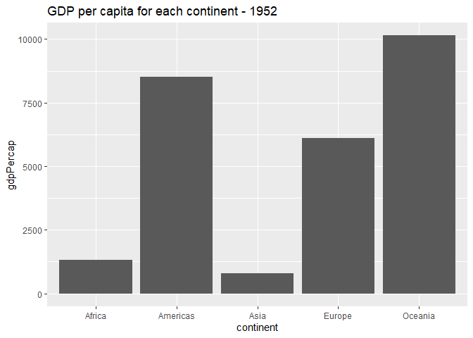<!-- -->
I interpreted the prompt as a request to plot the gdp per capita for
each continent. The challenge then was to calculate the GDP per capita
by dividing the sum of all GDPs on the continent by the total population
of the continent.

However, there can’t be three outliers among only five continents. I’ll
go back to looking at individual countries to find some outliers.

``` r
early %>%
  ggplot() +
  ggtitle("Distribution of GDP per capita for each country in a continent - 1952") +
  geom_boxplot(aes(x = continent, y = gdpPercap))
```

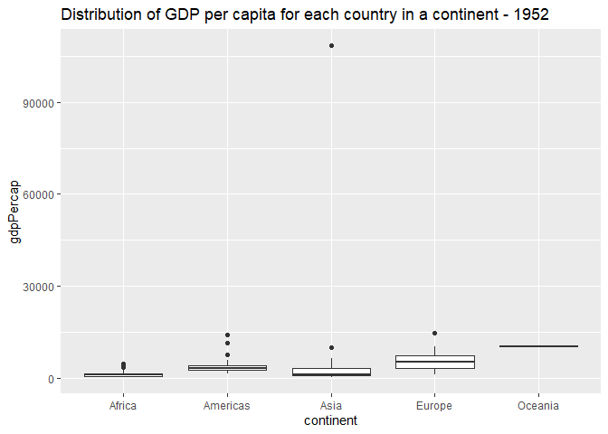<!-- -->
The outlier in Asia is compressing all the other data points into the
bottom of the plot. What country is that?

``` r
top3GdpPercap <- 
  early %>%
  select(country, gdpPercap) %>%
  arrange(desc(gdpPercap)) %>%
  slice(1:3) %>%
  mutate(rank = rank(desc(gdpPercap)))
top3GdpPercap <- top3GdpPercap[ , c('rank', 'country', 'gdpPercap')]
topGdpPercap <- slice(top3GdpPercap, 1)
kable(top3GdpPercap, caption = 'Top 3 countries ranked by GDP per capita in 1952')
```

| rank | country       | gdpPercap |
| ---: | :------------ | --------: |
|    1 | Kuwait        | 108382.35 |
|    2 | Switzerland   |  14734.23 |
|    3 | United States |  13990.48 |

Top 3 countries ranked by GDP per capita in 1952

It’s Kuwait.

``` r
early %>%
  filter(!(country %in% topGdpPercap$country)) %>%
  ggplot() +
  ggtitle("Distribution of GDP per capita for each country in a continent - 1952") +
  labs(subtitle = "excluding Kuwait") +
  geom_boxplot(aes(x = continent, y = gdpPercap))
```

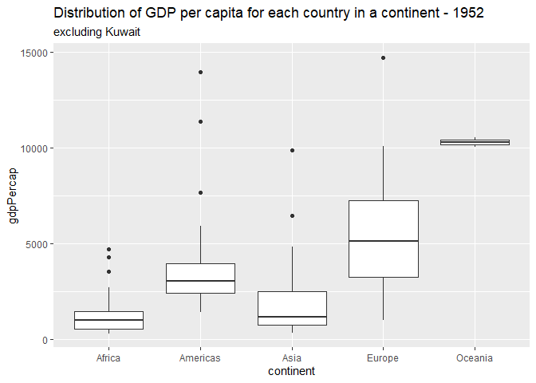<!-- -->

Now I’ll look at GDP and population.

``` r
# Top 3 countries ranked by GDP
top3gdp <- 
  early %>%
  select(country, gdp) %>%
  arrange(desc(gdp)) %>%
  slice(1:3) %>%
  mutate(rank = rank(desc(gdp)))
top3gdp <- top3gdp[ , c('rank', 'country', 'gdp')] # How do I reorder columns in the same pipeline/expression as the mutate?
topGdp = top3gdp %>% slice(1)
kable(top3gdp, caption = 'Top 3 countries ranked by GDP in 1952')
```

| rank | country        |          gdp |
| ---: | :------------- | -----------: |
|    1 | United States  | 2.204242e+12 |
|    2 | United Kingdom | 5.032666e+11 |
|    3 | Germany        | 4.939866e+11 |

Top 3 countries ranked by GDP in 1952

``` r
# Top 3 countries ranked by population
top3pop <- 
  early %>%
  select(country, pop) %>%
  arrange(desc(pop)) %>%
  slice(1:3) %>%
  mutate(rank = rank(desc(pop)))
top3pop <- top3pop[ , c('rank', 'country', 'pop')]
topPop = top3pop %>% slice(1:2)
kable(top3pop, caption = 'Top 3 countries ranked by population in 1952')
```

| rank | country       |       pop |
| ---: | :------------ | --------: |
|    1 | China         | 556263527 |
|    2 | India         | 372000000 |
|    3 | United States | 157553000 |

Top 3 countries ranked by population in 1952

``` r
early %>%
  ggplot() +
  ggtitle("Distribution of GDP for each country in a continent - 1952") +
  geom_boxplot(aes(x = continent, y = gdp))
```

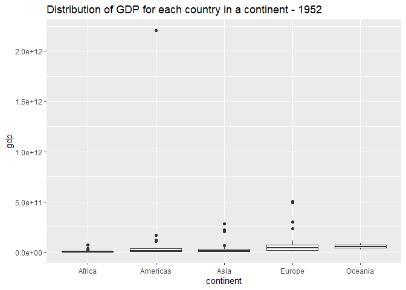<!-- -->

``` r
 early %>%
   filter(!(country %in% topGdp$country)) %>%
   ggplot() +
   ggtitle("Distribution of GDP for each country in a continent - 1952") +
   labs(subtitle = "excluding United States") +
   geom_boxplot(aes(x = continent, y = gdp))
```

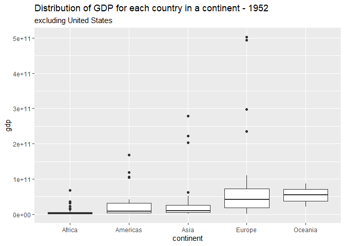<!-- -->

``` r
early %>%
  ggplot() +
  ggtitle("Distribution of country populations in each continent - 1952") +
  geom_boxplot(aes(x = continent, y = pop))
```

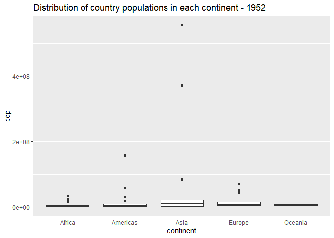<!-- -->

``` r
early %>%
  filter(!(country %in% top3pop$country)) %>%
  ggplot() +
  ggtitle("Distribution of country populations in each continent - 1952") +
  labs(subtitle = "excluding China and India") +
  geom_boxplot(aes(x = continent, y = pop))
```

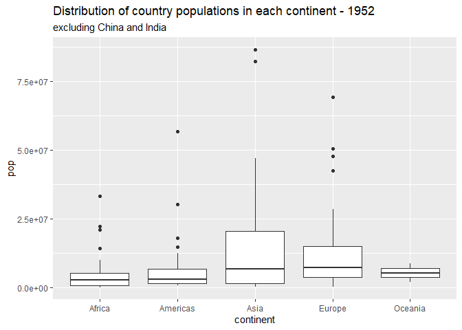<!-- -->

``` r
early %>%
  filter(!(country %in% topGdpPercap$country), !(country %in% topPop$country)) %>%
  ggplot() +
  ggtitle('GDP per capita vs. population for countries in each continent - 1952') +
  labs(subtitle = 'excluding Kuwait, China, and India') +
  geom_point(aes(x = pop, y = gdpPercap)) +
  facet_wrap( ~ continent)
```

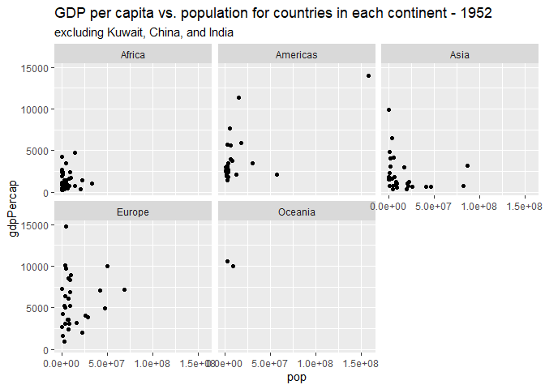<!-- -->

``` r
early %>%
  #filter(!(country %in% topGdpPercap$country)) %>%
  ggplot() +
  ggtitle('GDP per capita vs. population for all countries in dataset - 1952') +
  #labs(subtitle = 'excluding Kuwait') +
  geom_point(aes(x = pop, y = gdpPercap, shape = continent), size = 2)
```

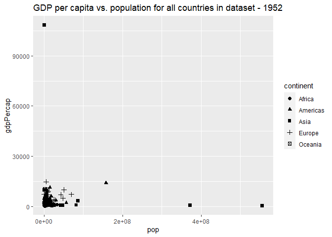<!-- -->

**Observations**:

  - Write your observations here

**Difficulties & Approaches**:

  - If you try to plot gdpPerCap vs continent, geom\_col will
    automatically try to add up the gdpPerCap of every country without
    taking into account the populations of each country. You need to
    calculate the GDP for each country, the GDP and population of each
    continent, and the GDP per capita of each continent manually.

**q3** You should have found at least three outliers in q2. Identify
those outliers (figure out which countries they are).

``` r
## TASK: Identify the outliers from q2
kable(topPop, caption = "Highest population")
```

| rank | country |       pop |
| ---: | :------ | --------: |
|    1 | China   | 556263527 |
|    2 | India   | 372000000 |

Highest population

``` r
kable(topGdpPercap, caption = "Highest GDP per capita")
```

| rank | country | gdpPercap |
| ---: | :------ | --------: |
|    1 | Kuwait  |  108382.4 |

Highest GDP per capita

**Observations**:

  - Kuwait (GDP per capita), China and India (population)

**q4** Create a plot similar to yours from q2 studying both `year_min`
and `year_max`. Find a way to highlight the outliers from q3 on your
plot. Compare the patterns between `year_min` and `year_max`.

*Hint*: We’ve learned a lot of different ways to show multiple
variables; think about using different aesthetics or facets.

``` r
## TASK: Create a visual of gdpPercap vs continent
late <-
  gapminder %>%
  filter(year %in% year_max)

outliers <-
  topGdpPercap %>%
  full_join(topPop) %>%
  select(country)
```

    ## Joining, by = c("rank", "country")

``` r
both <- full_join(early, late)
```

    ## Joining, by = c("country", "continent", "year", "lifeExp", "pop", "gdpPercap")

``` r
bothoutliers <- both %>% filter(country %in% outliers$country)

both %>%
  ggplot() +
  ggtitle('GDP per capita vs. population for all countries in dataset') +
  geom_point(aes(x = pop, y = gdpPercap, shape = continent), size = 2) +
  geom_point(data = bothoutliers, aes(x = pop, y = gdpPercap, shape = continent, color = country), size = 2) +
  facet_wrap( ~ year)
```

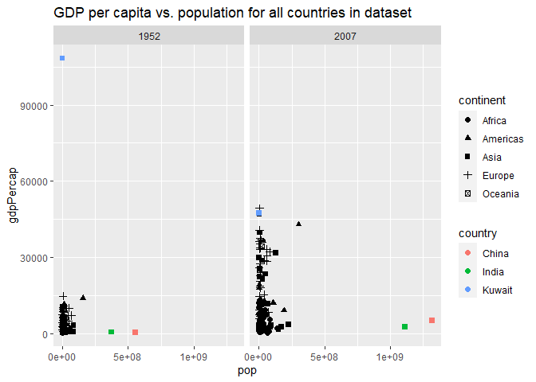<!-- -->

``` r
both %>%
  filter(!(country %in% outliers$country)) %>%
  ggplot() +
  ggtitle('GDP per capita vs population for all countries EXCEPT Kuwait, China, India') +
  geom_point(aes(x = pop, y = gdpPercap, shape = continent), size = 2) +
  facet_wrap( ~ year)
```

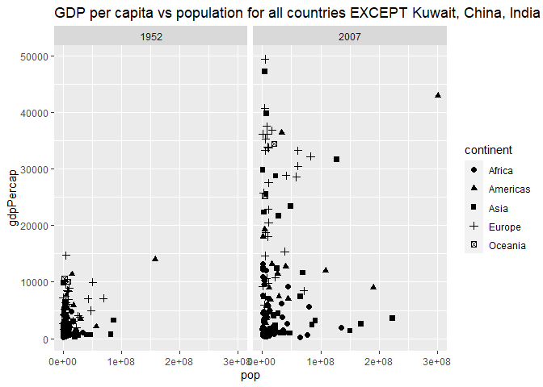<!-- -->

``` r
bothoutliers %>%
  filter(country == "Kuwait") %>%
  ggplot() +
  ggtitle("GDP per capita vs population for Kuwait in 1952 and 2007") +
  geom_line(aes(x = pop, y = gdpPercap, group = country), size = .5, linetype = "longdash") +
  geom_point(aes(x = pop, y = gdpPercap, shape = factor(year)), size = 3) +
  expand_limits(x = 0, y = 0)
```

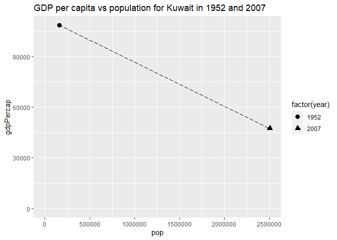<!-- -->

``` r
bothoutliers %>%
  filter(country %in% c("China", "India")) %>%
  ggplot() +
  ggtitle("GDP per capita vs population for China and India in 1952 and 2007") +
  geom_line(aes(x = pop, y = gdpPercap, color = country, group = country), size = .5, linetype = "longdash") +
  geom_point(aes(x = pop, y = gdpPercap, color = country, shape = factor(year)), size = 3) +
  expand_limits(x = 0, y = 0)
```

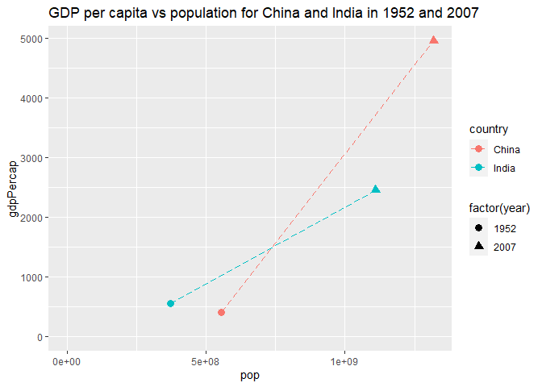<!-- -->

**Observations**:

  - Kuwait’s population grew by an order of magnitude, yet its GDP per
    capita only fell by a little more than 50%.
  - China and India saw a severalfold increase in both GDP and
    population. In particular, China’s population (more than) doubled,
    while its GDP per capita rose by an order of magnitude.
  - I wonder if these GDP figures are adjusted for inflation.

# Your Own EDA

<!-- -------------------------------------------------- -->

Now it’s your turn\! We just went through guided EDA considering the GDP
per capita at two time points. You can continue looking at outliers,
consider different years, repeat the exercise with `lifeExp`, consider
the relationship between variables, or something else entirely.

**q5** Create *at least* three new figures below. With each figure, try
to pose new questions about the data.

``` r
## TASK: Your first graph
usacanada <- gapminder %>% filter(country %in% c("United States", "Canada"))
gapminder %>%
  filter(continent == "Americas", !(country %in% c("United States", "Canada"))) %>%
  ggplot() +
  geom_line(aes(x = year, y = gdpPercap, color = country)) +
  #geom_line(data = usacanada, aes(x = year, y = gdpPercap, linetype = country), size = 2) +
  geom_line(data = filter(gapminder, country == "Argentina"), aes(x = year, y = gdpPercap, color = country), size = 2)
```

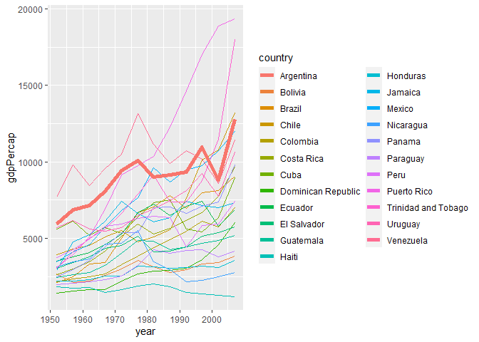<!-- --> Q:
Four countries in Central + South America saw a notable dip in GDP per
capita in 2002, but then recovered by 2007. What happened and why did it
only affect those countries?

``` r
## TASK: Your second graph
```

Sorry this isn’t finished, I’ve fallen a couple days behind.

``` r
## TASK: Your third graph
```
