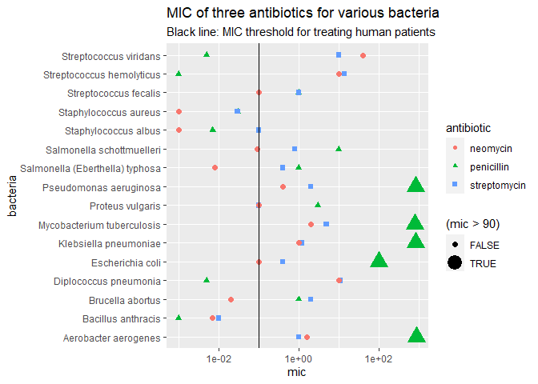

Antibiotics
================
branish
2020-

  - [Due Date](#due-date)
  - [Visualization](#visualization)
      - [Purpose: Compare Effectiveness](#purpose-compare-effectiveness)
      - [Purpose: Categorize Bacteria](#purpose-categorize-bacteria)
  - [References](#references)

*Purpose*: To create an effective visualization, we need to keep our
*purpose* firmly in mind. There are many different ways to visualize
data, and the only way we can judge efficacy is with respect to our
purpose.

In this challenge you’ll visualize the same data in two different ways,
aimed at two different purposes.

*Note*: Please complete your initial visual design **alone**. Work on
both of your graphs alone, and save a version to your repo *before*
coming together with your team. This way you can all bring a diversity
of ideas to the table\!

## Due Date

<!-- ------------------------- -->

All the deliverables stated in the rubrics above are due on the day of
the class discussion of that exercise. See the
[Syllabus](https://docs.google.com/document/d/1jJTh2DH8nVJd2eyMMoyNGroReo0BKcJrz1eONi3rPSc/edit?usp=sharing)
for more information.

``` r
library(tidyverse)
```

    ## -- Attaching packages ---------------------------------------------------------------------------------------------------- tidyverse 1.3.0 --

    ## v ggplot2 3.3.2     v purrr   0.3.4
    ## v tibble  3.0.1     v dplyr   1.0.0
    ## v tidyr   1.1.0     v stringr 1.4.0
    ## v readr   1.3.1     v forcats 0.5.0

    ## -- Conflicts ------------------------------------------------------------------------------------------------------- tidyverse_conflicts() --
    ## x dplyr::filter() masks stats::filter()
    ## x dplyr::lag()    masks stats::lag()

``` r
library(ggrepel)
```

*Background*: The data\[1\] we study in this challenge report the
[*minimum inhibitory
concentration*](https://en.wikipedia.org/wiki/Minimum_inhibitory_concentration)
(MIC) of three drugs for different bacteria. The smaller the MIC for a
given drug and bacteria pair, the more practical the drug is for
treating that particular bacteria. An MIC value of *at most* 0.1 is
considered necessary for treating human patients.

These data report MIC values for three antibiotics—penicillin,
streptomycin, and neomycin—on 16 bacteria. Bacteria are categorized into
a genus based on a number of features, including their resistance to
antibiotics.

``` r
## NOTE: If you extracted all challenges to the same location,
## you shouldn't have to change this filename
filename <- "./data/antibiotics.csv"

## Load the data
df_antibiotics <- read_csv(filename)
```

    ## Parsed with column specification:
    ## cols(
    ##   bacteria = col_character(),
    ##   penicillin = col_double(),
    ##   streptomycin = col_double(),
    ##   neomycin = col_double(),
    ##   gram = col_character()
    ## )

``` r
df_antibiotics %>% knitr::kable()
```

| bacteria                        | penicillin | streptomycin | neomycin | gram     |
| :------------------------------ | ---------: | -----------: | -------: | :------- |
| Aerobacter aerogenes            |    870.000 |         1.00 |    1.600 | negative |
| Brucella abortus                |      1.000 |         2.00 |    0.020 | negative |
| Bacillus anthracis              |      0.001 |         0.01 |    0.007 | positive |
| Diplococcus pneumonia           |      0.005 |        11.00 |   10.000 | positive |
| Escherichia coli                |    100.000 |         0.40 |    0.100 | negative |
| Klebsiella pneumoniae           |    850.000 |         1.20 |    1.000 | negative |
| Mycobacterium tuberculosis      |    800.000 |         5.00 |    2.000 | negative |
| Proteus vulgaris                |      3.000 |         0.10 |    0.100 | negative |
| Pseudomonas aeruginosa          |    850.000 |         2.00 |    0.400 | negative |
| Salmonella (Eberthella) typhosa |      1.000 |         0.40 |    0.008 | negative |
| Salmonella schottmuelleri       |     10.000 |         0.80 |    0.090 | negative |
| Staphylococcus albus            |      0.007 |         0.10 |    0.001 | positive |
| Staphylococcus aureus           |      0.030 |         0.03 |    0.001 | positive |
| Streptococcus fecalis           |      1.000 |         1.00 |    0.100 | positive |
| Streptococcus hemolyticus       |      0.001 |        14.00 |   10.000 | positive |
| Streptococcus viridans          |      0.005 |        10.00 |   40.000 | positive |

# Visualization

<!-- -------------------------------------------------- -->

## Purpose: Compare Effectiveness

<!-- ------------------------- -->

**q1** Create a visualization of `df_antibiotics` that helps you to
compare the effectiveness of the three antibiotics across all the
bacteria reported. Can you make any broad statements about antibiotic
effectiveness?

``` r
## TASK: Create your visualization
glimpse(df_antibiotics)
```

    ## Rows: 16
    ## Columns: 5
    ## $ bacteria     <chr> "Aerobacter aerogenes", "Brucella abortus", "Bacillus ...
    ## $ penicillin   <dbl> 870.000, 1.000, 0.001, 0.005, 100.000, 850.000, 800.00...
    ## $ streptomycin <dbl> 1.00, 2.00, 0.01, 11.00, 0.40, 1.20, 5.00, 0.10, 2.00,...
    ## $ neomycin     <dbl> 1.600, 0.020, 0.007, 10.000, 0.100, 1.000, 2.000, 0.10...
    ## $ gram         <chr> "negative", "negative", "positive", "positive", "negat...

``` r
ab2 <- 
  df_antibiotics %>%
  pivot_longer(names_to = "antibiotic", values_to = "mic", cols = c(-bacteria, -gram))

# ab2 %>%
#   ggplot(mapping = aes(antibiotic, mic)) +
#   geom_point(aes(color = bacteria)) +
#   geom_hline(yintercept = 0.1) +
#   scale_y_log10()

# I tried using the color aesthetic to show the hline on the legend, but the
#legend didn't show up, probably because there's only one line.
# This size hack is hacky...but it *almost* does what I wanted (I'd just like a better legend label).
ab2 %>%
  #filter(mic < 0.1) %>%
  ggplot(mapping = aes(bacteria, mic)) +
  ggtitle('MIC of three antibiotics for various bacteria') +
  labs(subtitle = 'Black line: MIC threshold for treating human patients') +
  geom_point(aes(color = antibiotic, shape = antibiotic, size = (mic > .9e2))) +
  #geom_col(aes(fill = antibiotic), position = position_dodge2(preserve = "single", padding = 0.2)) +
  geom_hline(yintercept = 0.1) + 
  scale_y_log10() +
  coord_flip()
```

    ## Warning: Using size for a discrete variable is not advised.

<!-- -->
Penicillin has an unacceptably high MIC for several bacteria. The
highest MICs for penicillin are orders of magnitude larger than the
highest MICs for neomycin and streptomycin. Penicillin was the first
antibiotic discovered, so it’s likely that these bacteria have had a
long time to perfect their resistance to it.

Since we can only consider antibiotics with a MIC \<= 0.1 for treating
humans, let’s ignore the MICs higher than 0.1.

``` r
ab2 %>%
  filter(mic < 0.1) %>%
  ggplot(mapping = aes(bacteria, mic)) +
  ggtitle('MIC of three antibiotics for various bacteria') +
  labs(subtitle = "Only showing MIC values <= 0.1") +
  ylim(0, 0.1) +
  geom_point(aes(color = antibiotic, shape = antibiotic), size = 2) +
  geom_hline(yintercept = 0.1) +
  coord_flip() #+
```

<!-- -->

``` r
  #scale_y_log10()
```

This plot shows only MIC values \<= 0.1. For several bacteria
(Pseudomonas aeruginosa, Mycobacterium tuberculosis, Klebsiella
pneumoniae, Aerobacter aerogenes), all three antibiotics have a MIC over
0.1. I understand this to mean that these antibiotics cannot be used to
treat these bacteria in humans.

For several more bacteria there is only one antibiotic with a MIC under
0.1. Neomycin: - Streptococcus fecalis - Salmonella schottmuelleri -
Salmonella typhosa - Escherichia coli Penicillin: - Streptococcus
viridans - Streprococcus hemolyticus - Diplococcus pneumonia

``` r
humans <- ab2 %>% filter(mic <= 0.1)
distinct(humans, bacteria)
```

    ## # A tibble: 12 x 1
    ##    bacteria                       
    ##    <chr>                          
    ##  1 Brucella abortus               
    ##  2 Bacillus anthracis             
    ##  3 Diplococcus pneumonia          
    ##  4 Escherichia coli               
    ##  5 Proteus vulgaris               
    ##  6 Salmonella (Eberthella) typhosa
    ##  7 Salmonella schottmuelleri      
    ##  8 Staphylococcus albus           
    ##  9 Staphylococcus aureus          
    ## 10 Streptococcus fecalis          
    ## 11 Streptococcus hemolyticus      
    ## 12 Streptococcus viridans

``` r
df_antibiotics %>%
  anti_join(humans, by = 'bacteria') %>%
  select(-gram) %>%
  knitr::kable(caption = "Bacteria with all three MICs > 0.1")
```

| bacteria                   | penicillin | streptomycin | neomycin |
| :------------------------- | ---------: | -----------: | -------: |
| Aerobacter aerogenes       |        870 |          1.0 |      1.6 |
| Klebsiella pneumoniae      |        850 |          1.2 |      1.0 |
| Mycobacterium tuberculosis |        800 |          5.0 |      2.0 |
| Pseudomonas aeruginosa     |        850 |          2.0 |      0.4 |

Bacteria with all three MICs \> 0.1

``` r
# neomycin
df_antibiotics %>%
  semi_join(humans, by = 'bacteria') %>%
  filter(penicillin > 0.1, streptomycin > 0.1) %>%
  select(-gram) %>%
  knitr::kable(caption = "Bacteria that can only be treated with neomycin")
```

| bacteria                        | penicillin | streptomycin | neomycin |
| :------------------------------ | ---------: | -----------: | -------: |
| Brucella abortus                |          1 |          2.0 |    0.020 |
| Escherichia coli                |        100 |          0.4 |    0.100 |
| Salmonella (Eberthella) typhosa |          1 |          0.4 |    0.008 |
| Salmonella schottmuelleri       |         10 |          0.8 |    0.090 |
| Streptococcus fecalis           |          1 |          1.0 |    0.100 |

Bacteria that can only be treated with neomycin

``` r
df_antibiotics %>%
  semi_join(humans, by = 'bacteria') %>%
  filter(neomycin > 0.1, streptomycin > 0.1) %>%
  select(-gram) %>%
  knitr::kable(caption = "Bacteria that can only be treated with penicillin")
```

| bacteria                  | penicillin | streptomycin | neomycin |
| :------------------------ | ---------: | -----------: | -------: |
| Diplococcus pneumonia     |      0.005 |           11 |       10 |
| Streptococcus hemolyticus |      0.001 |           14 |       10 |
| Streptococcus viridans    |      0.005 |           10 |       40 |

Bacteria that can only be treated with penicillin

**Observations**:

Many species of bacteria have high resistance to penicillin, but it is
still the best antibiotic for treating some species. There are no
species that can only be treated with streptomycin.

## Purpose: Categorize Bacteria

<!-- ------------------------- -->

The *genus* of a living organism is a human categorization, based on
various characteristics of the organism. Since these categories are
based on numerous factors, we will tend to see clusters if we visualize
data according to relevant variables. We can use these visuals to
categorize observations, and to question whether given categories are
reasonable\!

**q2** Create a visualization of `df_antibiotics` that helps you to
categorize bacteria according to the variables in the data. Document
your observations on how how clusters of bacteria in the variables do—or
don’t—align with their *genus* classification.

``` r
## TASK: Create your visualization

ab3 <- 
  ab2 %>%
  separate(col = bacteria, into = c('before', NA, 'after'), sep = '[()]', remove = FALSE) %>% # So hacky
  unite(col = 'bacteria2', before, after, sep = ' ', na.rm = TRUE, remove = TRUE) %>%
  separate(col = bacteria2, into = c('genus', 'species'), remove = TRUE)
```

    ## Warning: Expected 3 pieces. Missing pieces filled with `NA` in 45 rows [1, 2, 3,
    ## 4, 5, 6, 7, 8, 9, 10, 11, 12, 13, 14, 15, 16, 17, 18, 19, 20, ...].

``` r
ab3
```

    ## # A tibble: 48 x 6
    ##    bacteria              genus       species   gram     antibiotic       mic
    ##    <chr>                 <chr>       <chr>     <chr>    <chr>          <dbl>
    ##  1 Aerobacter aerogenes  Aerobacter  aerogenes negative penicillin   870    
    ##  2 Aerobacter aerogenes  Aerobacter  aerogenes negative streptomycin   1    
    ##  3 Aerobacter aerogenes  Aerobacter  aerogenes negative neomycin       1.6  
    ##  4 Brucella abortus      Brucella    abortus   negative penicillin     1    
    ##  5 Brucella abortus      Brucella    abortus   negative streptomycin   2    
    ##  6 Brucella abortus      Brucella    abortus   negative neomycin       0.02 
    ##  7 Bacillus anthracis    Bacillus    anthracis positive penicillin     0.001
    ##  8 Bacillus anthracis    Bacillus    anthracis positive streptomycin   0.01 
    ##  9 Bacillus anthracis    Bacillus    anthracis positive neomycin       0.007
    ## 10 Diplococcus pneumonia Diplococcus pneumonia positive penicillin     0.005
    ## # ... with 38 more rows

``` r
ab3 %>%
  arrange(gram) %>%
  ggplot(aes(x = genus, y = mic)) +
  geom_point(aes(shape = antibiotic, color = gram), size = 2) +
  #geom_tile(aes(x = genus, y = gram, fill = gram), sides = 'l', inherit.aes = FALSE) +
  geom_hline(yintercept = 0.1) +
  coord_flip()  +
  scale_y_log10() 
```

<!-- -->

**Observations**: The gram-negative genera tend to be more difficult to
treat. Penicillin is good at treating the gram-positive genera.

# References

<!-- -------------------------------------------------- -->

\[1\] Neomycin in skin infections: A new topical antibiotic with wide
antibacterial range and rarely sensitizing. Scope. 1951;3(5):4-7.

\[2\] Wainer and Lysen, “That’s Funny…” /American Scientist/ (2009)
[link](https://www.americanscientist.org/article/thats-funny)
