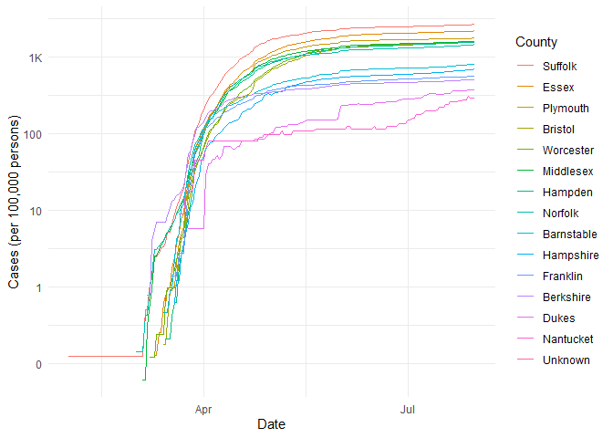

COVID-19
================
(Your name here)
2020-

  - [The Big Picture](#the-big-picture)
  - [Get the Data](#get-the-data)
      - [Navigating the Census Bureau](#navigating-the-census-bureau)
      - [Automated Download of NYT
        Data](#automated-download-of-nyt-data)
  - [Join the Data](#join-the-data)
  - [Analyze](#analyze)
      - [Normalize](#normalize)
      - [Guided EDA](#guided-eda)
      - [Self-directed EDA](#self-directed-eda)
          - [Ideas](#ideas)
          - [Aside: Some visualization
            tricks](#aside-some-visualization-tricks)
          - [Geographic exceptions](#geographic-exceptions)
  - [Notes](#notes)

*Purpose*: We can’t *possibly* do a class on data science and *not* look
at covid-19. Come on.

In this challenge, you’ll learn how to navigate the U.S. Census Bureau
website, programmatically download data from the internet, and perform a
county-level population-weighted analysis of current covid-19 trends.
Get excited\!

``` r
library(tidyverse)
```

    ## -- Attaching packages ---------------------------------------------------------------------------------------------------- tidyverse 1.3.0 --

    ## v ggplot2 3.3.2     v purrr   0.3.4
    ## v tibble  3.0.1     v dplyr   1.0.0
    ## v tidyr   1.1.0     v stringr 1.4.0
    ## v readr   1.3.1     v forcats 0.5.0

    ## -- Conflicts ------------------------------------------------------------------------------------------------------- tidyverse_conflicts() --
    ## x dplyr::filter() masks stats::filter()
    ## x dplyr::lag()    masks stats::lag()

*Background*:
[COVID-19](https://en.wikipedia.org/wiki/Coronavirus_disease_2019) is
the disease caused by the virus SARS-CoV-2. In 2020 it became a global
pandemic, leading to huge loss of life and tremendous disruption to
society. The New York Times published up-to-date data on the progression
of the pandemic across the United States—we will study these data in
this challenge.

# The Big Picture

<!-- -------------------------------------------------- -->

We’re about to go through *a lot* of weird steps, so let’s first fix the
big picture firmly in mind:

We want to study COVID-19 in terms of data: both case counts (number of
infections) and deaths. We’re going to do a county-level analysis in
order to get a high-resolution view of the pandemic. Since US counties
can vary widely in terms of their population, we’ll need population
estimates in order to compute infection rates (think back to the
`Titanic` challenge).

That’s the high-level view; now let’s dig into the details.

# Get the Data

<!-- -------------------------------------------------- -->

1.  County-level population estimates (Census Bureau)
2.  County-level COVID-19 counts (New York Times)

## Navigating the Census Bureau

<!-- ------------------------- -->

**Steps**: Our objective is to find the 2018 American Community
Survey\[1\] (ACS) Total Population estimates, disaggregated by counties.
To check your results, this is Table `B01003`.

1.  Go to [data.census.gov](data.census.gov).
2.  Scroll down and click `View Tables`.
3.  Apply filters to find the ACS Total Population estimates,
    disaggregated by counties. I used the filters:

<!-- end list -->

  - `Topics > Populations and People > Counts, Estimates, and
    Projections > Population Total`
  - `Geography > County > All counties in United States`

<!-- end list -->

5.  Click the `Download` button to download the data; make sure to
    select the 2018 y-year estimates.
6.  Unzip and move the data to your `challenges/data` folder.

<!-- end list -->

  - Note that the data will have the crazy-long filename
    `ACSDT5Y2018.B01003_data_with_overlays_2020-06-30T102151.csv`.
    That’s because metadata is stored in the filename, such as the
    year of the estimate (`Y2018`) and my access date (`2020-06-30`).

**q1** Load Table `B01003` into the following tibble. Make sure the
column names are `id, Geographic Area Name, Estimate!!Total, Margin of
Error!!Total`.

*Hint*: You will need to use the `skip` keyword when loading these
data\!

``` r
## TASK: Load the census bureau data with the following tibble name.
filename <- "./data/ACSDT5Y2018.B01003_data_with_overlays_2020-07-27T003915.csv"

## Load the data
df_pop <-
  read_csv(filename, skip = 2, na = '*****', col_names = c('id', 'name', 'population', 'errormargin'))
```

    ## Parsed with column specification:
    ## cols(
    ##   id = col_character(),
    ##   name = col_character(),
    ##   population = col_double(),
    ##   errormargin = col_logical()
    ## )

    ## Warning: 116 parsing failures.
    ##  row         col           expected actual                                                                 file
    ## 3105 errormargin 1/0/T/F/TRUE/FALSE    157 './data/ACSDT5Y2018.B01003_data_with_overlays_2020-07-27T003915.csv'
    ## 3106 errormargin 1/0/T/F/TRUE/FALSE    116 './data/ACSDT5Y2018.B01003_data_with_overlays_2020-07-27T003915.csv'
    ## 3107 errormargin 1/0/T/F/TRUE/FALSE    69  './data/ACSDT5Y2018.B01003_data_with_overlays_2020-07-27T003915.csv'
    ## 3108 errormargin 1/0/T/F/TRUE/FALSE    145 './data/ACSDT5Y2018.B01003_data_with_overlays_2020-07-27T003915.csv'
    ## 3109 errormargin 1/0/T/F/TRUE/FALSE    195 './data/ACSDT5Y2018.B01003_data_with_overlays_2020-07-27T003915.csv'
    ## .... ........... .................. ...... ....................................................................
    ## See problems(...) for more details.

``` r
df_pop
```

    ## # A tibble: 3,221 x 4
    ##    id             name                     population errormargin
    ##    <chr>          <chr>                         <dbl> <lgl>      
    ##  1 0500000US01001 Autauga County, Alabama       55200 NA         
    ##  2 0500000US01003 Baldwin County, Alabama      208107 NA         
    ##  3 0500000US01005 Barbour County, Alabama       25782 NA         
    ##  4 0500000US01007 Bibb County, Alabama          22527 NA         
    ##  5 0500000US01009 Blount County, Alabama        57645 NA         
    ##  6 0500000US01011 Bullock County, Alabama       10352 NA         
    ##  7 0500000US01013 Butler County, Alabama        20025 NA         
    ##  8 0500000US01015 Calhoun County, Alabama      115098 NA         
    ##  9 0500000US01017 Chambers County, Alabama      33826 NA         
    ## 10 0500000US01019 Cherokee County, Alabama      25853 NA         
    ## # ... with 3,211 more rows

*Note*: You can find information on 1-year, 3-year, and 5-year estimates
[here](https://www.census.gov/programs-surveys/acs/guidance/estimates.html).
The punchline is that 5-year estimates are more reliable but less
current.

## Automated Download of NYT Data

<!-- ------------------------- -->

ACS 5-year estimates don’t change all that often, but the COVID-19 data
are changing rapidly. To that end, it would be nice to be able to
*programmatically* download the most recent data for analysis; that way
we can update our analysis whenever we want simply by re-running our
notebook. This next problem will have you set up such a pipeline.

The New York Times is publishing up-to-date data on COVID-19 on
[GitHub](https://github.com/nytimes/covid-19-data).

**q2** Visit the NYT [GitHub](https://github.com/nytimes/covid-19-data)
repo and find the URL for the **raw** US County-level data. Assign that
URL as a string to the variable below.

``` r
## TASK: Find the URL for the NYT covid-19 county-level data
url_counties <- "https://raw.githubusercontent.com/nytimes/covid-19-data/master/us-counties.csv"
```

Once you have the url, the following code will download a local copy of
the data, then load the data into R.

``` r
## NOTE: No need to change this; just execute
## Set the filename of the data to download
filename_nyt <- "./data/nyt_counties.csv"

## Download the data locally
curl::curl_download(
        url_counties,
        destfile = filename_nyt
      )

## Loads the downloaded csv
df_covid <- read_csv(filename_nyt)
```

    ## Parsed with column specification:
    ## cols(
    ##   date = col_date(format = ""),
    ##   county = col_character(),
    ##   state = col_character(),
    ##   fips = col_character(),
    ##   cases = col_double(),
    ##   deaths = col_double()
    ## )

You can now re-run the chunk above (or the entire notebook) to pull the
most recent version of the data. Thus you can periodically re-run this
notebook to check in on the pandemic as it evolves.

*Note*: You should feel free to copy-paste the code above for your own
future projects\!

# Join the Data

<!-- -------------------------------------------------- -->

To get a sense of our task, let’s take a glimpse at our two data
sources.

``` r
## NOTE: No need to change this; just execute
df_pop %>% glimpse
```

    ## Rows: 3,221
    ## Columns: 4
    ## $ id          <chr> "0500000US01001", "0500000US01003", "0500000US01005", "...
    ## $ name        <chr> "Autauga County, Alabama", "Baldwin County, Alabama", "...
    ## $ population  <dbl> 55200, 208107, 25782, 22527, 57645, 10352, 20025, 11509...
    ## $ errormargin <lgl> NA, NA, NA, NA, NA, NA, NA, NA, NA, NA, NA, NA, NA, NA,...

``` r
df_covid %>% glimpse
```

    ## Rows: 389,202
    ## Columns: 6
    ## $ date   <date> 2020-01-21, 2020-01-22, 2020-01-23, 2020-01-24, 2020-01-24,...
    ## $ county <chr> "Snohomish", "Snohomish", "Snohomish", "Cook", "Snohomish", ...
    ## $ state  <chr> "Washington", "Washington", "Washington", "Illinois", "Washi...
    ## $ fips   <chr> "53061", "53061", "53061", "17031", "53061", "06059", "17031...
    ## $ cases  <dbl> 1, 1, 1, 1, 1, 1, 1, 1, 1, 1, 1, 1, 1, 1, 1, 1, 1, 1, 1, 1, ...
    ## $ deaths <dbl> 0, 0, 0, 0, 0, 0, 0, 0, 0, 0, 0, 0, 0, 0, 0, 0, 0, 0, 0, 0, ...

To join these datasets, we’ll need to use [FIPS county
codes](https://en.wikipedia.org/wiki/FIPS_county_code).\[2\] The last
`5` digits of the `id` column in `df_pop` is the FIPS county code, while
the NYT data `df_covid` already contains the `fips`.

**q3** Process the `id` column of `df_pop` to create a `fips` column.

``` r
## TASK: Create a `fips` column by extracting the county code
df_q3 <-
  df_pop %>%
  separate(id, sep = -5, into = c(NA, 'fips'))
```

Use the following test to check your answer.

``` r
## NOTE: No need to change this
## Check known county
assertthat::assert_that(
              (df_q3 %>%
              filter(str_detect(name, "Autauga County")) %>%
              pull(fips)) == "01001"
            )
```

    ## [1] TRUE

``` r
print("Very good!")
```

    ## [1] "Very good!"

Once

**q4** Join `df_covid` with `df_q3` by the `fips` column. Use the proper
type of join to preserve all rows in `df_covid`.

``` r
## TASK: Join df_covid and df_q3 by fips.
df_q4 <- 
  df_covid %>%
  left_join(df_q3, by = 'fips')
```

For convenience, I down-select some columns and produce more convenient
column names.

``` r
## NOTE: No need to change; run this to produce a more convenient tibble
df_data <-
  df_q4 %>%
  select(
    date,
    county,
    state,
    fips,
    cases,
    deaths,
    population )#= `Estimate!!Total`
  #)
```

# Analyze

<!-- -------------------------------------------------- -->

Now that we’ve done the hard work of loading and wrangling the data, we
can finally start our analysis. Our first step will be to produce county
population-normalized cases and death counts. Then we will explore the
data.

## Normalize

<!-- ------------------------- -->

**q5** Use the `population` estimates in `df_data` to normalize `cases`
and `deaths` to produce per 100,000 counts.\[3\] Store these values in
the columns `cases_perk` and `deaths_perk`.

``` r
## TASK: Normalize cases and deaths
df_normalized <-
  df_data %>%
  mutate(cases_perk = cases / (population / 1e5), deaths_perk = deaths / (population / 1e5))
```

You may use the following test to check your work.

``` r
## NOTE: No need to change this
## Check known county data
assertthat::assert_that(
              abs(df_normalized %>%
               filter(
                 str_detect(county, "Snohomish"),
                 date == "2020-01-21"
               ) %>%
              pull(cases_perk) - 0.127) < 1e-3
            )
```

    ## [1] TRUE

``` r
assertthat::assert_that(
              abs(df_normalized %>%
               filter(
                 str_detect(county, "Snohomish"),
                 date == "2020-01-21"
               ) %>%
              pull(deaths_perk) - 0) < 1e-3
            )
```

    ## [1] TRUE

``` r
print("Excellent!")
```

    ## [1] "Excellent!"

## Guided EDA

<!-- ------------------------- -->

Before turning you loose, let’s complete a couple guided EDA tasks.

**q6** Compute the mean and standard deviation for `cases_perk` and
`deaths_perk`.

``` r
## TASK: Compute mean and sd for cases_perk and deaths_perk
df_normalized %>%
  #filter(date > as.Date('July 10 2020', format = "%B %d %Y")) %>%
  summarize(
    meancases = mean(cases_perk, na.rm = TRUE),
    sdcases = sd(cases_perk, na.rm = TRUE),
    meandeaths = mean(df_normalized$deaths_perk, na.rm = TRUE),
    sddeaths = sd(deaths_perk, na.rm = TRUE)
    )
```

    ## # A tibble: 1 x 4
    ##   meancases sdcases meandeaths sddeaths
    ##       <dbl>   <dbl>      <dbl>    <dbl>
    ## 1      366.    675.       11.8     26.9

``` r
########## NOTE ########################
# I'm confused about this. Aren't these cumulative case counts?
# So why are meancases and meandeaths the same whether I look at the first month,
# the last month, or the whole dataset?
```

**q7** Find the top 10 counties in terms of `cases_perk`, and the top 10
in terms of `deaths_perk`. Report the population of each county along
with the per-100,000 counts. Compare the counts against the mean values
you found in q6. Note any observations. Does New York City show up in
the top? Why or why not?

``` r
## TASK: Find the top 10 max cases_perk counties; report populations as well
totals <-
  df_normalized %>%
  group_by(county, state, population) %>%
  summarize(cases_perk = max(cases_perk), deaths_perk = max(deaths_perk)) %>%
  ungroup()
```

    ## `summarise()` regrouping output by 'county', 'state' (override with `.groups` argument)

``` r
totals %>%
  select(-deaths_perk) %>%
  filter(rank(desc(cases_perk)) <= 10) %>%
  arrange(desc(cases_perk)) %>%
  knitr::kable(caption = 'Top 10 max cases_per_100K_pop counties')
```

| county              | state     | population | cases\_perk |
| :------------------ | :-------- | ---------: | ----------: |
| Trousdale           | Tennessee |       9573 |   16400.292 |
| Lake                | Tennessee |       7526 |   11094.871 |
| Lee                 | Arkansas  |       9398 |    9384.976 |
| Dakota              | Nebraska  |      20317 |    9356.696 |
| Buena Vista         | Iowa      |      20260 |    8795.656 |
| Lincoln             | Arkansas  |      13695 |    8506.754 |
| Nobles              | Minnesota |      21839 |    7958.240 |
| Bristol Bay Borough | Alaska    |        890 |    7078.652 |
| East Carroll        | Louisiana |       7225 |    6823.529 |
| Colfax              | Nebraska  |      10760 |    6431.227 |

Top 10 max cases\_per\_100K\_pop counties

``` r
## TASK: Find the top 10 deaths_perk counties; report populations as well
totals %>%
  select(-cases_perk) %>%
  filter(rank(desc(deaths_perk)) <= 10) %>%
  arrange(desc(deaths_perk)) %>%
  knitr::kable(caption = 'Top 10 max deaths_per_100K_pop counties')
```

| county       | state       | population | deaths\_perk |
| :----------- | :---------- | ---------: | -----------: |
| Hancock      | Georgia     |       8535 |     398.3597 |
| Randolph     | Georgia     |       7087 |     366.8689 |
| Terrell      | Georgia     |       8859 |     338.6387 |
| Early        | Georgia     |      10348 |     309.2385 |
| McKinley     | New Mexico  |      72849 |     300.6218 |
| Neshoba      | Mississippi |      29376 |     296.1601 |
| Galax city   | Virginia    |       6638 |     286.2308 |
| Emporia city | Virginia    |       5381 |     278.7586 |
| Essex        | New Jersey  |     793555 |     265.0100 |
| Holmes       | Mississippi |      18075 |     254.4952 |

Top 10 max deaths\_per\_100K\_pop counties

``` r
df_normalized %>%
  group_by(county, state, population) %>%
  summarize(cases = max(cases), deaths = max(deaths)) %>%
  arrange(desc(cases)) %>%
  knitr::kable(caption = 'Top counties by raw case counts')
```

    ## `summarise()` regrouping output by 'county', 'state' (override with `.groups` argument)

| county                            | state                    | population |  cases | deaths |
| :-------------------------------- | :----------------------- | ---------: | -----: | -----: |
| New York City                     | New York                 |         NA | 229834 |  23002 |
| Los Angeles                       | California               |   10098052 | 188481 |   4621 |
| Miami-Dade                        | Florida                  |    2715516 | 118461 |   1611 |
| Maricopa                          | Arizona                  |    4253913 | 117293 |   2054 |
| Cook                              | Illinois                 |    5223719 | 105493 |   4886 |
| Harris                            | Texas                    |    4602523 |  72964 |   1258 |
| Broward                           | Florida                  |    1909151 |  55411 |    709 |
| Dallas                            | Texas                    |    2586552 |  49976 |    671 |
| Suffolk                           | New York                 |    1487901 |  43224 |   2044 |
| Nassau                            | New York                 |    1356564 |  43203 |   2706 |
| Clark                             | Nevada                   |    2141574 |  41245 |    687 |
| Bexar                             | Texas                    |    1925865 |  40815 |    578 |
| Riverside                         | California               |    2383286 |  37308 |    695 |
| Orange                            | California               |    3164182 |  36196 |    618 |
| Westchester                       | New York                 |     968815 |  35932 |   1578 |
| Palm Beach                        | Florida                  |    1446277 |  33272 |    815 |
| San Bernardino                    | California               |    2135413 |  32309 |    419 |
| Philadelphia                      | Pennsylvania             |    1575522 |  30354 |   1691 |
| Hillsborough                      | Florida                  |    1378883 |  29116 |    335 |
| San Diego                         | California               |    3302833 |  29111 |    561 |
| Orange                            | Florida                  |    1321194 |  29010 |    215 |
| Tarrant                           | Texas                    |    2019977 |  28410 |    381 |
| Wayne                             | Michigan                 |    1761382 |  27092 |   2804 |
| Middlesex                         | Massachusetts            |    1595192 |  25706 |   1978 |
| Prince George’s                   | Maryland                 |     906202 |  22869 |    737 |
| Suffolk                           | Massachusetts            |     791766 |  21222 |   1055 |
| Davidson                          | Tennessee                |     684017 |  21060 |    198 |
| Duval                             | Florida                  |     924229 |  21038 |    153 |
| Shelby                            | Tennessee                |     937005 |  20797 |    279 |
| Travis                            | Texas                    |    1203166 |  20745 |    274 |
| Bergen                            | New Jersey               |     929999 |  20727 |   2046 |
| Mecklenburg                       | North Carolina           |    1054314 |  20502 |    202 |
| Essex                             | New Jersey               |     793555 |  19731 |   2103 |
| Hudson                            | New Jersey               |     668631 |  19647 |   1505 |
| Kern                              | California               |     883053 |  19552 |    140 |
| Milwaukee                         | Wisconsin                |     954209 |  19248 |    438 |
| Salt Lake                         | Utah                     |    1120805 |  19086 |    176 |
| Middlesex                         | New Jersey               |     826698 |  17879 |   1408 |
| Fairfield                         | Connecticut              |     944348 |  17793 |   1406 |
| Fulton                            | Georgia                  |    1021902 |  17646 |    389 |
| Montgomery                        | Maryland                 |    1040133 |  17607 |    789 |
| Passaic                           | New Jersey               |     504041 |  17580 |   1247 |
| Hennepin                          | Minnesota                |    1235478 |  17316 |    813 |
| Essex                             | Massachusetts            |     781024 |  17232 |   1177 |
| Gwinnett                          | Georgia                  |     902298 |  17130 |    238 |
| Hidalgo                           | Texas                    |     849389 |  16945 |    644 |
| Franklin                          | Ohio                     |    1275333 |  16842 |    511 |
| Union                             | New Jersey               |     553066 |  16746 |   1349 |
| Pinellas                          | Florida                  |     957875 |  16356 |    432 |
| Pima                              | Arizona                  |    1019722 |  16167 |    459 |
| Fairfax                           | Virginia                 |    1143529 |  15616 |    520 |
| Lee                               | Florida                  |     718679 |  15415 |    295 |
| King                              | Washington               |    2163257 |  15216 |    668 |
| Fresno                            | California               |     978130 |  14793 |    138 |
| Oakland                           | Michigan                 |    1250843 |  14614 |   1127 |
| Marion                            | Indiana                  |     944523 |  14575 |    766 |
| Providence                        | Rhode Island             |     634533 |  14549 |    808 |
| El Paso                           | Texas                    |     837654 |  14276 |    266 |
| Jefferson                         | Louisiana                |     435300 |  14155 |    513 |
| Rockland                          | New York                 |     323686 |  13864 |    470 |
| Worcester                         | Massachusetts            |     822280 |  13322 |    990 |
| New Haven                         | Connecticut              |     859339 |  13041 |   1101 |
| St. Louis                         | Missouri                 |     998684 |  12880 |    650 |
| Hartford                          | Connecticut              |     894730 |  12645 |   1412 |
| Polk                              | Florida                  |     668671 |  12488 |    268 |
| Cuyahoga                          | Ohio                     |    1253783 |  12399 |    470 |
| Nueces                            | Texas                    |     360486 |  12301 |    176 |
| DeKalb                            | Georgia                  |     743187 |  12127 |    222 |
| District of Columbia              | District of Columbia     |     684498 |  12126 |    585 |
| Lake                              | Illinois                 |     703619 |  11855 |    440 |
| Baltimore                         | Maryland                 |     827625 |  11840 |    547 |
| San Joaquin                       | California               |     732212 |  11483 |    168 |
| Jefferson                         | Alabama                  |     659892 |  11382 |    225 |
| Charleston                        | South Carolina           |     394708 |  11345 |    162 |
| Alameda                           | California               |    1643700 |  11324 |    182 |
| DuPage                            | Illinois                 |     931743 |  11267 |    510 |
| Baltimore city                    | Maryland                 |     614700 |  11206 |    407 |
| Cobb                              | Georgia                  |     745057 |  11206 |    297 |
| Orange                            | New York                 |     378227 |  11097 |    404 |
| Cameron                           | Texas                    |     421750 |  10971 |    325 |
| Wake                              | North Carolina           |    1046558 |  10913 |    128 |
| Yuma                              | Arizona                  |     207829 |  10896 |    255 |
| East Baton Rouge                  | Louisiana                |     444094 |  10690 |    326 |
| Ocean                             | New Jersey               |     591939 |  10482 |   1014 |
| Yakima                            | Washington               |     249325 |  10449 |    217 |
| Douglas                           | Nebraska                 |     554992 |  10255 |    134 |
| Orleans                           | Louisiana                |     389648 |  10255 |    560 |
| Norfolk                           | Massachusetts            |     698249 |  10236 |    984 |
| Monmouth                          | New Jersey               |     623387 |  10157 |    858 |
| Greenville                        | South Carolina           |     498402 |  10034 |    184 |
| Santa Clara                       | California               |    1922200 |   9913 |    192 |
| Sacramento                        | California               |    1510023 |   9819 |    133 |
| Montgomery                        | Pennsylvania             |     821301 |   9761 |    848 |
| Macomb                            | Michigan                 |     868704 |   9689 |    942 |
| Denver                            | Colorado                 |     693417 |   9623 |    412 |
| Collier                           | Florida                  |     363922 |   9581 |    122 |
| Polk                              | Iowa                     |     474274 |   9479 |    201 |
| Tulare                            | California               |     460477 |   9454 |    178 |
| Imperial                          | California               |     180216 |   9366 |    209 |
| Kane                              | Illinois                 |     530839 |   9148 |    298 |
| Plymouth                          | Massachusetts            |     512135 |   9086 |    710 |
| Bristol                           | Massachusetts            |     558905 |   9073 |    623 |
| Hamilton                          | Ohio                     |     812037 |   8977 |    245 |
| Oklahoma                          | Oklahoma                 |     782051 |   8910 |     97 |
| Stanislaus                        | California               |     539301 |   8890 |    104 |
| Prince William                    | Virginia                 |     456749 |   8838 |    170 |
| Galveston                         | Texas                    |     327089 |   8721 |     95 |
| Tulsa                             | Oklahoma                 |     642781 |   8710 |     98 |
| Delaware                          | Pennsylvania             |     563527 |   8669 |    730 |
| Manatee                           | Florida                  |     373853 |   8517 |    182 |
| Erie                              | New York                 |     919866 |   8492 |    621 |
| Will                              | Illinois                 |     688697 |   8474 |    339 |
| Osceola                           | Florida                  |     338619 |   8470 |     71 |
| Camden                            | New Jersey               |     507367 |   8356 |    573 |
| Mobile                            | Alabama                  |     414659 |   8135 |    192 |
| Allegheny                         | Pennsylvania             |    1225561 |   8094 |    239 |
| Mercer                            | New Jersey               |     368762 |   8061 |    614 |
| Pinal                             | Arizona                  |     419721 |   7990 |    136 |
| Horry                             | South Carolina           |     320915 |   7975 |    126 |
| Ada                               | Idaho                    |     446052 |   7834 |     62 |
| Richland                          | South Carolina           |     408263 |   7780 |    131 |
| Escambia                          | Florida                  |     311522 |   7738 |     95 |
| Contra Costa                      | California               |    1133247 |   7714 |    119 |
| Utah                              | Utah                     |     590440 |   7688 |     33 |
| Hampden                           | Massachusetts            |     469116 |   7404 |    696 |
| Ventura                           | California               |     848112 |   7344 |     76 |
| Morris                            | New Jersey               |     494383 |   7287 |    829 |
| Fort Bend                         | Texas                    |     739342 |   7082 |    140 |
| Kent                              | Michigan                 |     643140 |   7059 |    154 |
| Lake                              | Indiana                  |     486849 |   6977 |    283 |
| Bucks                             | Pennsylvania             |     626370 |   6902 |    578 |
| Jefferson                         | Kentucky                 |     767154 |   6888 |    248 |
| Arapahoe                          | Colorado                 |     636671 |   6877 |    362 |
| Volusia                           | Florida                  |     527634 |   6834 |    112 |
| Denton                            | Texas                    |     807047 |   6803 |     73 |
| New Castle                        | Delaware                 |     555133 |   6794 |    287 |
| Anne Arundel                      | Maryland                 |     567696 |   6778 |    216 |
| Ramsey                            | Minnesota                |     541493 |   6686 |    259 |
| San Francisco                     | California               |     870044 |   6578 |     59 |
| Seminole                          | Florida                  |     455086 |   6487 |     82 |
| Brazoria                          | Texas                    |     353999 |   6384 |     67 |
| Collin                            | Texas                    |     944350 |   6353 |     83 |
| Pasco                             | Florida                  |     510593 |   6299 |     96 |
| Calcasieu                         | Louisiana                |     200182 |   6278 |    121 |
| Santa Barbara                     | California               |     443738 |   6273 |     60 |
| Montgomery                        | Texas                    |     554445 |   6196 |     71 |
| Lafayette                         | Louisiana                |     240091 |   6155 |     84 |
| Caddo                             | Louisiana                |     248361 |   6144 |    277 |
| Montgomery                        | Alabama                  |     226941 |   6139 |    144 |
| Webb                              | Texas                    |     272053 |   6131 |    127 |
| Adams                             | Colorado                 |     497115 |   5957 |    171 |
| Rutherford                        | Tennessee                |     307128 |   5899 |     51 |
| Washington                        | Arkansas                 |     228529 |   5896 |     45 |
| Burlington                        | New Jersey               |     446367 |   5821 |    471 |
| Kansas City                       | Missouri                 |         NA |   5798 |     69 |
| Durham                            | North Carolina           |     306457 |   5789 |     77 |
| Snohomish                         | Washington               |     786620 |   5741 |    198 |
| Williamson                        | Texas                    |     527057 |   5715 |    100 |
| Sussex                            | Delaware                 |     219540 |   5608 |    191 |
| Sarasota                          | Florida                  |     412144 |   5588 |    120 |
| Lancaster                         | Pennsylvania             |     538347 |   5525 |    406 |
| Hamilton                          | Tennessee                |     357546 |   5483 |     48 |
| San Mateo                         | California               |     765935 |   5469 |    119 |
| Lubbock                           | Texas                    |     301454 |   5433 |     72 |
| Jefferson                         | Texas                    |     255210 |   5431 |     65 |
| Brevard                           | Florida                  |     576808 |   5420 |    114 |
| Hall                              | Georgia                  |     195961 |   5372 |     77 |
| Pierce                            | Washington               |     859840 |   5344 |    134 |
| Somerset                          | New Jersey               |     330176 |   5250 |    558 |
| Navajo                            | Arizona                  |     108705 |   5202 |    187 |
| Washoe                            | Nevada                   |     450486 |   5186 |    114 |
| Berks                             | Pennsylvania             |     416642 |   5152 |    365 |
| Guilford                          | North Carolina           |     523582 |   5093 |    142 |
| Hinds                             | Mississippi              |     241774 |   5091 |    102 |
| St. Lucie                         | Florida                  |     305591 |   5002 |    120 |
| Johnson                           | Kansas                   |     585502 |   4995 |     98 |
| Loudoun                           | Virginia                 |     385143 |   4995 |    110 |
| Marin                             | California               |     260295 |   4987 |     64 |
| Marion                            | Florida                  |     348371 |   4892 |     60 |
| Chester                           | Pennsylvania             |     517156 |   4885 |    349 |
| Unknown                           | New Jersey               |         NA |   4866 |     91 |
| Forsyth                           | North Carolina           |     371573 |   4833 |     49 |
| Madison                           | Alabama                  |     357560 |   4812 |     30 |
| Lehigh                            | Pennsylvania             |     362613 |   4810 |    335 |
| Chatham                           | Georgia                  |     287049 |   4808 |     67 |
| Bernalillo                        | New Mexico               |     677692 |   4735 |    120 |
| Pulaski                           | Arkansas                 |     393463 |   4733 |     77 |
| Monroe                            | New York                 |     744248 |   4711 |    266 |
| Canyon                            | Idaho                    |     212230 |   4706 |     37 |
| Lucas                             | Ohio                     |     432379 |   4658 |    314 |
| St. Tammany                       | Louisiana                |     252093 |   4621 |    201 |
| Elkhart                           | Indiana                  |     203604 |   4609 |     80 |
| Wyandotte                         | Kansas                   |     164345 |   4587 |     95 |
| El Paso                           | Colorado                 |     688153 |   4575 |    136 |
| Monterey                          | California               |     433212 |   4542 |     26 |
| Lexington                         | South Carolina           |     286316 |   4531 |     97 |
| Lake                              | Florida                  |     335362 |   4516 |     51 |
| St. Louis city                    | Missouri                 |     311273 |   4491 |    169 |
| Dutchess                          | New York                 |     293894 |   4490 |    162 |
| Benton                            | Arkansas                 |     258980 |   4458 |     38 |
| Clayton                           | Georgia                  |     278666 |   4413 |     97 |
| Kings                             | California               |     150075 |   4380 |     56 |
| Ouachita                          | Louisiana                |     156075 |   4372 |    105 |
| Multnomah                         | Oregon                   |     798647 |   4335 |     94 |
| McLennan                          | Texas                    |     248429 |   4326 |     45 |
| Hays                              | Texas                    |     204150 |   4297 |     31 |
| Merced                            | California               |     269075 |   4285 |     50 |
| Muscogee                          | Georgia                  |     196670 |   4201 |     81 |
| Sedgwick                          | Kansas                   |     512064 |   4196 |     39 |
| Leon                              | Florida                  |     288102 |   4170 |     14 |
| Minnehaha                         | South Dakota             |     186749 |   4150 |     63 |
| Dane                              | Wisconsin                |     529843 |   4086 |     37 |
| Virginia Beach city               | Virginia                 |     450135 |   4055 |     45 |
| McKinley                          | New Mexico               |      72849 |   3988 |    219 |
| Chesterfield                      | Virginia                 |     339447 |   3937 |     72 |
| Montgomery                        | Ohio                     |     532034 |   3926 |     70 |
| Brown                             | Wisconsin                |     259786 |   3919 |     51 |
| Knox                              | Tennessee                |     456185 |   3884 |     33 |
| Brazos                            | Texas                    |     219193 |   3877 |     45 |
| Jefferson                         | Colorado                 |     570427 |   3874 |    227 |
| Tuscaloosa                        | Alabama                  |     206213 |   3873 |     63 |
| Unknown                           | Wisconsin                |         NA |   3859 |      7 |
| Northampton                       | Pennsylvania             |     301778 |   3827 |    290 |
| Dakota                            | Minnesota                |     418201 |   3797 |    102 |
| St. Clair                         | Illinois                 |     263463 |   3792 |    155 |
| Berkeley                          | South Carolina           |     209065 |   3760 |     57 |
| Hillsborough                      | New Hampshire            |     411087 |   3743 |    277 |
| Spartanburg                       | South Carolina           |     302195 |   3656 |     82 |
| Winnebago                         | Illinois                 |     286174 |   3641 |    122 |
| Benton                            | Washington               |     194168 |   3636 |    110 |
| Unknown                           | Georgia                  |         NA |   3621 |     23 |
| Spokane                           | Washington               |     497875 |   3620 |     60 |
| Woodbury                          | Iowa                     |     102398 |   3620 |     48 |
| Solano                            | California               |     438530 |   3616 |     37 |
| Martin                            | Florida                  |     157581 |   3591 |     75 |
| St. Charles                       | Missouri                 |     389985 |   3543 |     96 |
| Henrico                           | Virginia                 |     325642 |   3541 |    180 |
| Howard                            | Maryland                 |     315327 |   3536 |    106 |
| Allen                             | Indiana                  |     370016 |   3535 |    167 |
| Alachua                           | Florida                  |     263148 |   3526 |     21 |
| Weld                              | Colorado                 |     295123 |   3523 |    141 |
| Potter                            | Texas                    |     120899 |   3505 |     42 |
| Beaufort                          | South Carolina           |     182658 |   3503 |     47 |
| Waukesha                          | Wisconsin                |     398879 |   3488 |     53 |
| Richmond                          | Georgia                  |     201463 |   3482 |     79 |
| Bay                               | Florida                  |     182482 |   3475 |     21 |
| Bell                              | Texas                    |     342236 |   3467 |     30 |
| Onondaga                          | New York                 |     464242 |   3464 |    188 |
| Genesee                           | Michigan                 |     409361 |   3463 |    294 |
| Franklin                          | Washington               |      90660 |   3386 |     47 |
| Atlantic                          | New Jersey               |     268539 |   3379 |    250 |
| Santa Rosa                        | Florida                  |     170442 |   3336 |     22 |
| Jackson                           | Missouri                 |     692003 |   3320 |     57 |
| Ector                             | Texas                    |     158342 |   3287 |     49 |
| Luzerne                           | Pennsylvania             |     317884 |   3252 |    183 |
| Anoka                             | Minnesota                |     347431 |   3245 |    115 |
| Cumberland                        | New Jersey               |     153400 |   3228 |    157 |
| St. Johns                         | Florida                  |     235503 |   3216 |     26 |
| Victoria                          | Texas                    |      91970 |   3208 |     39 |
| Summit                            | Ohio                     |     541810 |   3188 |    216 |
| Norfolk city                      | Virginia                 |     245592 |   3180 |     24 |
| Fayette                           | Kentucky                 |     318734 |   3164 |     46 |
| Williamson                        | Tennessee                |     218648 |   3132 |     22 |
| DeSoto                            | Mississippi              |     176132 |   3113 |     26 |
| Sumner                            | Tennessee                |     179473 |   3106 |     69 |
| Baldwin                           | Alabama                  |     208107 |   3101 |     22 |
| Racine                            | Wisconsin                |     195398 |   3095 |     77 |
| York                              | South Carolina           |     258641 |   3077 |     27 |
| Gloucester                        | New Jersey               |     290852 |   3066 |    207 |
| Shelby                            | Alabama                  |     211261 |   3061 |     32 |
| Whitfield                         | Georgia                  |     103849 |   3061 |     25 |
| Bibb                              | Georgia                  |     153490 |   3052 |     59 |
| Tangipahoa                        | Louisiana                |     130504 |   3037 |     62 |
| Lancaster                         | Nebraska                 |     310094 |   3028 |     15 |
| St. Joseph                        | Indiana                  |     269240 |   3026 |     84 |
| Apache                            | Arizona                  |      71522 |   2994 |    130 |
| San Juan                          | New Mexico               |     127455 |   2994 |    180 |
| Frederick                         | Maryland                 |     248472 |   2993 |    121 |
| Black Hawk                        | Iowa                     |     133009 |   2970 |     62 |
| Mohave                            | Arizona                  |     206064 |   2965 |    149 |
| Johnston                          | North Carolina           |     191172 |   2964 |     44 |
| Coconino                          | Arizona                  |     140217 |   2947 |    117 |
| Rapides                           | Louisiana                |     131546 |   2945 |    102 |
| Sonoma                            | California               |     501317 |   2944 |     36 |
| Gaston                            | North Carolina           |     216585 |   2939 |     33 |
| McHenry                           | Illinois                 |     307789 |   2934 |    114 |
| Davis                             | Utah                     |     340621 |   2909 |     13 |
| Arlington                         | Virginia                 |     231803 |   2897 |    136 |
| Cass                              | North Dakota             |     174202 |   2897 |     76 |
| Henry                             | Georgia                  |     221307 |   2895 |     40 |
| Lowndes                           | Georgia                  |     114582 |   2894 |     31 |
| Washtenaw                         | Michigan                 |     365961 |   2894 |    122 |
| Richmond city                     | Virginia                 |     223787 |   2893 |     39 |
| Marshall                          | Alabama                  |      95145 |   2871 |     29 |
| Marion                            | Ohio                     |      65344 |   2860 |     44 |
| Florence                          | South Carolina           |     138561 |   2853 |     93 |
| Clay                              | Florida                  |     207291 |   2808 |     48 |
| Alexandria city                   | Virginia                 |     156505 |   2798 |     58 |
| Walker                            | Texas                    |      71539 |   2792 |     43 |
| Stearns                           | Minnesota                |     156819 |   2791 |     20 |
| Okaloosa                          | Florida                  |     200737 |   2764 |     28 |
| Unknown                           | Rhode Island             |         NA |   2755 |    209 |
| Cherokee                          | Georgia                  |     241910 |   2743 |     54 |
| Washington                        | Oregon                   |     581821 |   2740 |     22 |
| Union                             | North Carolina           |     226694 |   2727 |     41 |
| Dorchester                        | South Carolina           |     155474 |   2702 |     39 |
| Terrebonne                        | Louisiana                |     112587 |   2693 |     74 |
| Dauphin                           | Pennsylvania             |     274515 |   2640 |    155 |
| Cumberland                        | North Carolina           |     332106 |   2636 |     50 |
| Butler                            | Ohio                     |     378294 |   2619 |     59 |
| Santa Cruz                        | Arizona                  |      46584 |   2599 |     50 |
| Marion                            | Oregon                   |     335553 |   2575 |     67 |
| Dougherty                         | Georgia                  |      91049 |   2571 |    168 |
| Lee                               | Alabama                  |     159287 |   2565 |     43 |
| Robeson                           | North Carolina           |     133442 |   2563 |     51 |
| Livingston                        | Louisiana                |     138111 |   2561 |     48 |
| Cleveland                         | Oklahoma                 |     276733 |   2555 |     49 |
| Weber                             | Utah                     |     247731 |   2536 |     25 |
| Lafourche                         | Louisiana                |      98214 |   2516 |     96 |
| Albany                            | New York                 |     307426 |   2503 |    169 |
| Columbia                          | Florida                  |      69105 |   2476 |     10 |
| Ascension                         | Louisiana                |     121176 |   2458 |     68 |
| Ellis                             | Texas                    |     168838 |   2452 |     33 |
| Chesapeake city                   | Virginia                 |     237820 |   2450 |     28 |
| Hamilton                          | Indiana                  |     316095 |   2439 |    112 |
| Kenosha                           | Wisconsin                |     168330 |   2427 |     52 |
| Jackson                           | Michigan                 |     158913 |   2392 |     55 |
| Warren                            | Kentucky                 |     126427 |   2372 |     22 |
| Mahoning                          | Ohio                     |     231064 |   2371 |    250 |
| Pickaway                          | Ohio                     |      57420 |   2345 |     42 |
| Cabarrus                          | North Carolina           |     201448 |   2342 |     42 |
| Acadia                            | Louisiana                |      62568 |   2331 |     71 |
| Smith                             | Texas                    |     225015 |   2310 |     18 |
| Tom Green                         | Texas                    |     117466 |   2310 |     23 |
| San Juan                          | Puerto Rico              |     344606 |   2291 |      0 |
| New Hanover                       | North Carolina           |     224231 |   2285 |     19 |
| Wayne                             | North Carolina           |     124002 |   2282 |     37 |
| Washington                        | Utah                     |     160537 |   2274 |     20 |
| York                              | Pennsylvania             |     444014 |   2269 |     86 |
| Glynn                             | Georgia                  |      83974 |   2250 |     28 |
| Madison                           | Mississippi              |     103498 |   2250 |     50 |
| Douglas                           | Georgia                  |     141840 |   2245 |     48 |
| Sumter                            | South Carolina           |     106995 |   2227 |     43 |
| Indian River                      | Florida                  |     150984 |   2204 |     45 |
| Anderson                          | Texas                    |      57863 |   2196 |      8 |
| Doña Ana                          | New Mexico               |     215338 |   2182 |     21 |
| Kent                              | Delaware                 |     174822 |   2167 |    107 |
| Iberia                            | Louisiana                |      72691 |   2160 |     62 |
| Morgan                            | Alabama                  |     119122 |   2160 |     15 |
| Troup                             | Georgia                  |      69774 |   2158 |     58 |
| Alamance                          | North Carolina           |     160576 |   2148 |     41 |
| Comal                             | Texas                    |     135097 |   2144 |     59 |
| Orangeburg                        | South Carolina           |      88454 |   2120 |     57 |
| Ford                              | Kansas                   |      34484 |   2106 |     10 |
| Madison                           | Illinois                 |     265670 |   2099 |     72 |
| Rankin                            | Mississippi              |     151240 |   2091 |     28 |
| St. Landry                        | Louisiana                |      83449 |   2082 |     72 |
| Oneida                            | New York                 |     230782 |   2070 |    110 |
| Bossier                           | Louisiana                |     126131 |   2054 |     67 |
| Harrison                          | Mississippi              |     202626 |   2048 |     31 |
| Cumberland                        | Maine                    |     290944 |   2039 |     68 |
| Randolph                          | North Carolina           |     142958 |   2026 |     36 |
| Ulster                            | New York                 |     179303 |   2021 |     49 |
| Madera                            | California               |     155013 |   2007 |     30 |
| Linn                              | Iowa                     |     222121 |   2005 |     87 |
| Wilson                            | Tennessee                |     132663 |   2001 |     20 |
| Rowan                             | North Carolina           |     139605 |   1985 |     50 |
| Starr                             | Texas                    |      63894 |   1983 |     49 |
| Sarpy                             | Nebraska                 |     178351 |   1978 |      9 |
| Umatilla                          | Oregon                   |      76898 |   1961 |     23 |
| Charlotte                         | Florida                  |     176954 |   1946 |     86 |
| Anderson                          | South Carolina           |     195995 |   1939 |     43 |
| Duplin                            | North Carolina           |      59062 |   1913 |     42 |
| Etowah                            | Alabama                  |     102939 |   1908 |     19 |
| Dakota                            | Nebraska                 |      20317 |   1901 |     42 |
| Lackawanna                        | Pennsylvania             |     211454 |   1894 |    212 |
| Boulder                           | Colorado                 |     321030 |   1890 |     75 |
| Johnson                           | Iowa                     |     147001 |   1881 |     14 |
| Placer                            | California               |     380077 |   1876 |     15 |
| Unknown                           | Puerto Rico              |         NA |   1875 |    107 |
| Catawba                           | North Carolina           |     156729 |   1859 |     24 |
| Forsyth                           | Georgia                  |     219880 |   1858 |     19 |
| Jackson                           | Mississippi              |     142014 |   1837 |     34 |
| Charles                           | Maryland                 |     157671 |   1834 |     91 |
| Saginaw                           | Michigan                 |     192778 |   1826 |    129 |
| Washington                        | Minnesota                |     253317 |   1817 |     43 |
| Cache                             | Utah                     |     122336 |   1805 |      4 |
| Midland                           | Texas                    |     164194 |   1805 |     33 |
| Maverick                          | Texas                    |      57970 |   1802 |     29 |
| Columbia                          | Georgia                  |     147295 |   1793 |     19 |
| San Luis Obispo                   | California               |     281455 |   1783 |     15 |
| Buena Vista                       | Iowa                     |      20260 |   1782 |     12 |
| Clark                             | Washington               |     465384 |   1780 |     42 |
| Anchorage                         | Alaska                   |     296112 |   1779 |     11 |
| Yavapai                           | Arizona                  |     224645 |   1768 |     60 |
| Honolulu                          | Hawaii                   |     987638 |   1755 |     19 |
| Harford                           | Maryland                 |     251025 |   1753 |     67 |
| Barnstable                        | Massachusetts            |     213690 |   1745 |    156 |
| Cass                              | Indiana                  |      38084 |   1743 |     10 |
| Kankakee                          | Illinois                 |     111061 |   1741 |     68 |
| Taylor                            | Texas                    |     136348 |   1740 |     19 |
| Dallas                            | Iowa                     |      84002 |   1739 |     35 |
| Kaufman                           | Texas                    |     118910 |   1738 |     19 |
| Nobles                            | Minnesota                |      21839 |   1738 |      6 |
| Finney                            | Kansas                   |      36957 |   1737 |     10 |
| Hendricks                         | Indiana                  |     160940 |   1735 |    122 |
| Hall                              | Nebraska                 |      61343 |   1724 |     47 |
| Houston                           | Georgia                  |     151682 |   1714 |     46 |
| Jones                             | Mississippi              |      68454 |   1705 |     57 |
| Pitt                              | North Carolina           |     177372 |   1699 |     11 |
| Sebastian                         | Arkansas                 |     127461 |   1689 |     14 |
| Carroll                           | Georgia                  |     116022 |   1687 |     46 |
| Ottawa                            | Michigan                 |     284034 |   1686 |     54 |
| Pickens                           | South Carolina           |     122746 |   1683 |     22 |
| Hernando                          | Florida                  |     182696 |   1674 |     32 |
| Clarke                            | Georgia                  |     124602 |   1665 |     17 |
| DeKalb                            | Alabama                  |      71200 |   1661 |     12 |
| Iredell                           | North Carolina           |     172525 |   1661 |     16 |
| Bradley                           | Tennessee                |     104557 |   1651 |     10 |
| Johnson                           | Indiana                  |     151564 |   1650 |    126 |
| Angelina                          | Texas                    |      87607 |   1647 |     32 |
| Montgomery                        | Tennessee                |     196387 |   1646 |     11 |
| Sevier                            | Tennessee                |      96287 |   1644 |      5 |
| Stark                             | Ohio                     |     373475 |   1643 |    131 |
| Hendry                            | Florida                  |      40127 |   1632 |     36 |
| Rockingham                        | New Hampshire            |     305129 |   1624 |     95 |
| Vanderburgh                       | Indiana                  |     181313 |   1624 |     10 |
| Davidson                          | North Carolina           |     164664 |   1620 |     17 |
| Douglas                           | Colorado                 |     328614 |   1616 |     58 |
| Buncombe                          | North Carolina           |     254474 |   1605 |     56 |
| Elmore                            | Alabama                  |      81212 |   1604 |     35 |
| Manassas city                     | Virginia                 |      41457 |   1604 |     20 |
| Litchfield                        | Connecticut              |     183031 |   1599 |    139 |
| Guadalupe                         | Texas                    |     155137 |   1593 |     39 |
| Olmsted                           | Minnesota                |     153065 |   1588 |     23 |
| Randall                           | Texas                    |     132475 |   1586 |     21 |
| Lorain                            | Ohio                     |     306713 |   1584 |     76 |
| Unknown                           | Arkansas                 |         NA |   1584 |      1 |
| Monroe                            | Pennsylvania             |     167586 |   1580 |    123 |
| Rock Island                       | Illinois                 |     145275 |   1575 |     31 |
| Newport News city                 | Virginia                 |     180145 |   1573 |     16 |
| Trousdale                         | Tennessee                |       9573 |   1570 |      6 |
| Jackson                           | Florida                  |      48472 |   1566 |     31 |
| Columbiana                        | Ohio                     |     104003 |   1565 |     62 |
| Forrest                           | Mississippi              |      75517 |   1564 |     50 |
| Lebanon                           | Pennsylvania             |     138674 |   1563 |     54 |
| Scott                             | Iowa                     |     172288 |   1557 |     11 |
| Warren                            | Ohio                     |     226564 |   1551 |     35 |
| Bartow                            | Georgia                  |     103620 |   1545 |     55 |
| Kootenai                          | Idaho                    |     153605 |   1538 |     10 |
| Burke                             | North Carolina           |      89712 |   1537 |     25 |
| Newton                            | Georgia                  |     106497 |   1533 |     32 |
| Kalamazoo                         | Michigan                 |     261573 |   1522 |     80 |
| Putnam                            | Tennessee                |      76440 |   1518 |     13 |
| Yolo                              | California               |     214977 |   1511 |     41 |
| Cochise                           | Arizona                  |     126279 |   1503 |     48 |
| Johnson                           | Texas                    |     163475 |   1499 |     22 |
| Aiken                             | South Carolina           |     166926 |   1491 |     24 |
| Champaign                         | Illinois                 |     209448 |   1486 |     19 |
| Dubuque                           | Iowa                     |      96802 |   1484 |     28 |
| Sullivan                          | New York                 |      75211 |   1480 |     32 |
| Rock                              | Wisconsin                |     161769 |   1477 |     26 |
| Val Verde                         | Texas                    |      49027 |   1473 |     17 |
| St. Martin                        | Louisiana                |      53752 |   1468 |     43 |
| Walker                            | Alabama                  |      64493 |   1466 |     64 |
| Portsmouth city                   | Virginia                 |      95311 |   1462 |     22 |
| Ingham                            | Michigan                 |     289564 |   1459 |     31 |
| Colquitt                          | Georgia                  |      45606 |   1454 |     21 |
| Carroll                           | Maryland                 |     167522 |   1451 |    116 |
| Calhoun                           | Alabama                  |     115098 |   1450 |      9 |
| Niagara                           | New York                 |     211704 |   1440 |     68 |
| Hot Spring                        | Arkansas                 |      33520 |   1436 |      8 |
| Leavenworth                       | Kansas                   |      80042 |   1422 |      8 |
| Kent                              | Rhode Island             |     163861 |   1421 |    102 |
| Putnam                            | New York                 |      99070 |   1421 |     61 |
| Washington                        | Mississippi              |      47086 |   1419 |     32 |
| Jefferson                         | Missouri                 |     223302 |   1417 |     25 |
| Sampson                           | North Carolina           |      63561 |   1411 |     12 |
| Robertson                         | Tennessee                |      69344 |   1409 |     16 |
| Westmoreland                      | Pennsylvania             |     354751 |   1409 |     46 |
| New London                        | Connecticut              |     268881 |   1402 |    103 |
| Shawnee                           | Kansas                   |     178284 |   1398 |     19 |
| Trumbull                          | Ohio                     |     201794 |   1393 |    100 |
| Gregg                             | Texas                    |     123494 |   1381 |     22 |
| St. Mary                          | Louisiana                |      51734 |   1381 |     48 |
| Middlesex                         | Connecticut              |     163368 |   1377 |    191 |
| Marshall                          | Iowa                     |      40271 |   1373 |     24 |
| Paulding                          | Georgia                  |     155840 |   1370 |     19 |
| Wilson                            | North Carolina           |      81336 |   1370 |     33 |
| Henderson                         | North Carolina           |     113625 |   1365 |     54 |
| Clackamas                         | Oregon                   |     405788 |   1361 |     37 |
| Larimer                           | Colorado                 |     338161 |   1359 |     35 |
| Gadsden                           | Florida                  |      46017 |   1346 |     18 |
| Warren                            | New Jersey               |     106293 |   1343 |    172 |
| St. Charles                       | Louisiana                |      52724 |   1340 |     50 |
| St. John the Baptist              | Louisiana                |      43446 |   1334 |     88 |
| Berrien                           | Michigan                 |     154807 |   1333 |     64 |
| Dallas                            | Alabama                  |      40029 |   1332 |     23 |
| Sussex                            | New Jersey               |     142298 |   1332 |    195 |
| Unknown                           | Louisiana                |         NA |   1330 |    130 |
| Unknown                           | Guam                     |         NA |   1325 |      6 |
| Kendall                           | Illinois                 |     124626 |   1322 |     24 |
| Lauderdale                        | Mississippi              |      77323 |   1316 |     88 |
| Spotsylvania                      | Virginia                 |     131412 |   1305 |     33 |
| Putnam                            | Florida                  |      72766 |   1301 |     15 |
| Unknown                           | Ohio                     |         NA |   1301 |     27 |
| Monroe                            | Florida                  |      76325 |   1300 |      8 |
| Coffee                            | Georgia                  |      42961 |   1299 |     24 |
| Coweta                            | Georgia                  |     140516 |   1296 |     19 |
| Scott                             | Minnesota                |     143372 |   1296 |     12 |
| Jefferson                         | Arkansas                 |      70424 |   1293 |     37 |
| Bastrop                           | Texas                    |      82577 |   1289 |     18 |
| Grant                             | Washington               |      94860 |   1281 |     11 |
| Wicomico                          | Maryland                 |     102172 |   1279 |     44 |
| Houston                           | Alabama                  |     104352 |   1278 |     14 |
| Titus                             | Texas                    |      32730 |   1276 |     14 |
| Kenton                            | Kentucky                 |     164688 |   1269 |     38 |
| Franklin                          | Pennsylvania             |     153751 |   1268 |     46 |
| Orange                            | North Carolina           |     142938 |   1266 |     45 |
| DeSoto                            | Florida                  |      36399 |   1264 |     14 |
| Kershaw                           | South Carolina           |      64361 |   1260 |     22 |
| Peoria                            | Illinois                 |     184463 |   1254 |     34 |
| Stafford                          | Virginia                 |     144012 |   1243 |      7 |
| Georgetown                        | South Carolina           |      61605 |   1237 |     18 |
| Unknown                           | Illinois                 |         NA |   1230 |    210 |
| Greene                            | Missouri                 |     288429 |   1229 |     11 |
| St. Clair                         | Alabama                  |      87306 |   1226 |      9 |
| Vermilion                         | Louisiana                |      59867 |   1224 |     17 |
| Tift                              | Georgia                  |      40510 |   1220 |     34 |
| Fairfield                         | Ohio                     |     152910 |   1216 |     22 |
| Beaver                            | Pennsylvania             |     166896 |   1212 |     88 |
| Chatham                           | North Carolina           |      69791 |   1208 |     50 |
| Floyd                             | Georgia                  |      96824 |   1206 |     15 |
| Citrus                            | Florida                  |     143087 |   1205 |     27 |
| Walton                            | Florida                  |      65858 |   1205 |     13 |
| Cumberland                        | Pennsylvania             |     247433 |   1203 |     70 |
| Twin Falls                        | Idaho                    |      83666 |   1199 |     32 |
| Greenwood                         | South Carolina           |      70264 |   1197 |     15 |
| Jasper                            | Missouri                 |     119238 |   1190 |      4 |
| Laurens                           | South Carolina           |      66710 |   1189 |     34 |
| Seward                            | Kansas                   |      22692 |   1188 |      4 |
| Hunterdon                         | New Jersey               |     125051 |   1186 |    126 |
| Neshoba                           | Mississippi              |      29376 |   1186 |     87 |
| Russell                           | Alabama                  |      58213 |   1186 |      1 |
| Hale                              | Texas                    |      34113 |   1185 |     26 |
| Hamblen                           | Tennessee                |      63740 |   1183 |     13 |
| Brunswick                         | North Carolina           |     126860 |   1181 |     17 |
| Walworth                          | Wisconsin                |     103013 |   1179 |     21 |
| Faulkner                          | Arkansas                 |     122416 |   1175 |      5 |
| Boone                             | Missouri                 |     176515 |   1174 |      4 |
| Franklin                          | Alabama                  |      31542 |   1174 |     20 |
| Crittenden                        | Arkansas                 |      49013 |   1172 |     17 |
| Delaware                          | Ohio                     |     197008 |   1168 |     18 |
| Limestone                         | Alabama                  |      93052 |   1167 |     12 |
| Washington                        | Louisiana                |      46457 |   1166 |     58 |
| Lincoln                           | Arkansas                 |      13695 |   1165 |     11 |
| Highlands                         | Florida                  |     102101 |   1163 |     26 |
| Lee                               | Mississippi              |      84915 |   1162 |     29 |
| Pope                              | Arkansas                 |      63644 |   1161 |      9 |
| Pottawattamie                     | Iowa                     |      93503 |   1153 |     21 |
| Granville                         | North Carolina           |      58874 |   1144 |     25 |
| Lee                               | North Carolina           |      60125 |   1141 |      9 |
| Porter                            | Indiana                  |     168041 |   1140 |     41 |
| Branch                            | Michigan                 |      43584 |   1133 |     25 |
| Cullman                           | Alabama                  |      82313 |   1131 |     11 |
| Suwannee                          | Florida                  |      43924 |   1131 |     32 |
| Hampshire                         | Massachusetts            |     161159 |   1126 |    127 |
| Muskegon                          | Michigan                 |     173043 |   1125 |     57 |
| Rockdale                          | Georgia                  |      89011 |   1122 |     15 |
| Lenawee                           | Michigan                 |      98474 |   1118 |     16 |
| St. Francis                       | Arkansas                 |      26294 |   1112 |      3 |
| Santa Cruz                        | California               |     273765 |   1109 |      4 |
| Iberville                         | Louisiana                |      32956 |   1100 |     47 |
| Harnett                           | North Carolina           |     130361 |   1094 |     36 |
| Craighead                         | Arkansas                 |     105701 |   1088 |     11 |
| Story                             | Iowa                     |      96922 |   1088 |     13 |
| Caldwell                          | North Carolina           |      81779 |   1085 |      9 |
| Licking                           | Ohio                     |     172293 |   1081 |     40 |
| Lamar                             | Mississippi              |      61223 |   1080 |     12 |
| Otero                             | New Mexico               |      65745 |   1078 |     10 |
| Sumter                            | Florida                  |     120999 |   1077 |     30 |
| Accomack                          | Virginia                 |      32742 |   1074 |     15 |
| Sandoval                          | New Mexico               |     140769 |   1070 |     33 |
| Tipton                            | Tennessee                |      61446 |   1065 |      9 |
| Bayamon                           | Puerto Rico              |     182955 |   1064 |      0 |
| Caldwell                          | Texas                    |      41401 |   1064 |     23 |
| Mower                             | Minnesota                |      39602 |   1064 |      2 |
| Barrow                            | Georgia                  |      76887 |   1061 |     32 |
| Outagamie                         | Wisconsin                |     184754 |   1061 |     12 |
| Chelan                            | Washington               |      75757 |   1060 |     11 |
| Clark                             | Ohio                     |     135198 |   1058 |     13 |
| Colbert                           | Alabama                  |      54495 |   1058 |     11 |
| Parker                            | Texas                    |     129802 |   1057 |     12 |
| Tippecanoe                        | Indiana                  |     189294 |   1056 |     12 |
| Bulloch                           | Georgia                  |      74782 |   1055 |     11 |
| Ware                              | Georgia                  |      35599 |   1055 |     24 |
| Buchanan                          | Missouri                 |      89076 |   1054 |     10 |
| Nassau                            | Florida                  |      80578 |   1054 |     10 |
| Blount                            | Tennessee                |     128443 |   1043 |      7 |
| Harrisonburg city                 | Virginia                 |      53391 |   1039 |     29 |
| Oktibbeha                         | Mississippi              |      49481 |   1039 |     34 |
| Clark                             | Indiana                  |     115702 |   1038 |     52 |
| Broome                            | New York                 |     194402 |   1037 |     76 |
| Allen                             | Louisiana                |      25661 |   1036 |     19 |
| Suffolk city                      | Virginia                 |      89160 |   1034 |     49 |
| Texas                             | Oklahoma                 |      21121 |   1031 |      7 |
| Eagle                             | Colorado                 |      54357 |   1026 |      9 |
| Darlington                        | South Carolina           |      67253 |   1023 |     33 |
| Schenectady                       | New York                 |     154883 |   1023 |     37 |
| Hunt                              | Texas                    |      92152 |   1022 |     20 |
| Yellowstone                       | Montana                  |     157816 |   1022 |     26 |
| Lauderdale                        | Alabama                  |      92585 |   1021 |     10 |
| Tolland                           | Connecticut              |     151269 |   1019 |     66 |
| Lancaster                         | South Carolina           |      89546 |   1018 |     21 |
| Autauga                           | Alabama                  |      55200 |   1015 |     21 |
| Winnebago                         | Wisconsin                |     169926 |   1014 |     17 |
| Escambia                          | Alabama                  |      37328 |   1011 |     15 |
| Habersham                         | Georgia                  |      44289 |   1011 |     48 |
| Maury                             | Tennessee                |      89776 |   1010 |      5 |
| Nacogdoches                       | Texas                    |      65558 |   1010 |     37 |
| Canadian                          | Oklahoma                 |     136710 |   1009 |      5 |
| Lake                              | Ohio                     |     230052 |   1008 |     34 |
| Moore                             | Texas                    |      21801 |   1008 |     15 |
| Hampton city                      | Virginia                 |     135583 |   1007 |      5 |
| Yell                              | Arkansas                 |      21573 |   1004 |     14 |
| St. Bernard                       | Louisiana                |      45694 |   1001 |     24 |
| Orange                            | Texas                    |      84047 |    999 |     15 |
| Nash                              | North Carolina           |      94003 |    994 |     10 |
| Grayson                           | Texas                    |     128560 |    987 |     11 |
| McDonald                          | Missouri                 |      22827 |    987 |      7 |
| Gordon                            | Georgia                  |      56790 |    985 |     23 |
| Boone                             | Kentucky                 |     129095 |    984 |     24 |
| Talladega                         | Alabama                  |      80565 |    983 |     13 |
| Unknown                           | Massachusetts            |         NA |    981 |     14 |
| Rice                              | Minnesota                |      65765 |    975 |      8 |
| Sangamon                          | Illinois                 |     197661 |    969 |     34 |
| Cleveland                         | North Carolina           |      97159 |    964 |     14 |
| Washington                        | Maryland                 |     149811 |    952 |     30 |
| Scott                             | Mississippi              |      28415 |    947 |     17 |
| Warren                            | Mississippi              |      47075 |    946 |     25 |
| Jefferson Davis                   | Louisiana                |      31467 |    944 |     24 |
| Thomas                            | Georgia                  |      44730 |    943 |     39 |
| Washington                        | Tennessee                |     127055 |    943 |      2 |
| Culpeper                          | Virginia                 |      50450 |    942 |     12 |
| Dawson                            | Nebraska                 |      23804 |    942 |      9 |
| Butte                             | California               |     227075 |    941 |      7 |
| Lowndes                           | Mississippi              |      59437 |    941 |     30 |
| Sevier                            | Arkansas                 |      17193 |    929 |     10 |
| Erie                              | Pennsylvania             |     275972 |    923 |     16 |
| Fayette                           | Georgia                  |     111369 |    918 |     24 |
| Baldwin                           | Georgia                  |      45286 |    917 |     38 |
| Bolivar                           | Mississippi              |      32592 |    917 |     32 |
| Burleigh                          | North Dakota             |      93737 |    915 |      4 |
| Jackson                           | Georgia                  |      65755 |    912 |     13 |
| Avoyelles                         | Louisiana                |      40882 |    907 |     26 |
| Whatcom                           | Washington               |     216812 |    904 |     48 |
| Wichita                           | Texas                    |     131818 |    902 |      9 |
| Flagler                           | Florida                  |     107139 |    901 |     10 |
| Walton                            | Georgia                  |      90132 |    900 |     34 |
| Copiah                            | Mississippi              |      28721 |    897 |     23 |
| Monongalia                        | West Virginia            |     105252 |    896 |      5 |
| St. Mary’s                        | Maryland                 |     111531 |    896 |     53 |
| Chambers                          | Texas                    |      40292 |    894 |      6 |
| Okeechobee                        | Florida                  |      40572 |    893 |      6 |
| Sunflower                         | Mississippi              |      26532 |    893 |     21 |
| Navarro                           | Texas                    |      48583 |    891 |     12 |
| Onslow                            | North Carolina           |     193912 |    890 |     10 |
| Rockingham                        | Virginia                 |      79444 |    890 |     17 |
| Napa                              | California               |     140530 |    889 |      8 |
| Clay                              | Missouri                 |     239164 |    882 |     22 |
| Lee                               | Arkansas                 |       9398 |    882 |      6 |
| Schuylkill                        | Pennsylvania             |     143555 |    880 |     49 |
| Wood                              | Ohio                     |     129936 |    880 |     58 |
| Panola                            | Mississippi              |      34243 |    877 |     11 |
| Moore                             | North Carolina           |      95629 |    872 |     20 |
| Salem                             | New Jersey               |      63336 |    872 |     83 |
| Monroe                            | Michigan                 |     149699 |    867 |     23 |
| Stanly                            | North Carolina           |      61114 |    866 |     11 |
| Williamsburg                      | South Carolina           |      31794 |    860 |     24 |
| Chambers                          | Alabama                  |      33826 |    859 |     38 |
| Gallatin                          | Montana                  |     104729 |    855 |      2 |
| Saline                            | Arkansas                 |     118009 |    855 |      4 |
| Washington                        | Wisconsin                |     134535 |    854 |     23 |
| Carolina                          | Puerto Rico              |     157453 |    848 |      0 |
| Surry                             | North Carolina           |      72099 |    845 |      7 |
| Tallapoosa                        | Alabama                  |      40636 |    845 |     79 |
| Grimes                            | Texas                    |      27630 |    838 |     20 |
| Lafayette                         | Mississippi              |      53459 |    837 |      7 |
| Spalding                          | Georgia                  |      64719 |    837 |     38 |
| DeKalb                            | Illinois                 |     104200 |    836 |     29 |
| Lake                              | Tennessee                |       7526 |    835 |      0 |
| Hardee                            | Florida                  |      27228 |    833 |      7 |
| Liberty                           | Texas                    |      81862 |    828 |     26 |
| Madison                           | Indiana                  |     129505 |    827 |     75 |
| Wapello                           | Iowa                     |      35315 |    827 |     31 |
| Holmes                            | Mississippi              |      18075 |    825 |     46 |
| Blue Earth                        | Minnesota                |      66322 |    824 |      4 |
| Bedford                           | Tennessee                |      47558 |    823 |     10 |
| Macon                             | Tennessee                |      23487 |    820 |     13 |
| Shelby                            | Indiana                  |      44399 |    818 |     34 |
| Kosciusko                         | Indiana                  |      78806 |    815 |     13 |
| McCurtain                         | Oklahoma                 |      32966 |    815 |     25 |
| Unknown                           | Washington               |         NA |    815 |      2 |
| Garland                           | Arkansas                 |      98296 |    814 |      7 |
| Leflore                           | Mississippi              |      29804 |    814 |     59 |
| Roanoke city                      | Virginia                 |      99621 |    814 |     11 |
| Livingston                        | Michigan                 |     188482 |    812 |     29 |
| Medina                            | Ohio                     |     177257 |    812 |     33 |
| Cape May                          | New Jersey               |      93705 |    811 |     86 |
| Pennington                        | South Dakota             |     109294 |    811 |     26 |
| Webster                           | Louisiana                |      39631 |    811 |     13 |
| Gila                              | Arizona                  |      53400 |    809 |     29 |
| Pike                              | Mississippi              |      39737 |    808 |     30 |
| Columbus                          | North Carolina           |      56293 |    807 |     45 |
| Muscatine                         | Iowa                     |      42950 |    807 |     47 |
| LaPorte                           | Indiana                  |     110552 |    803 |     29 |
| Clermont                          | Ohio                     |     203216 |    802 |     10 |
| Hardin                            | Texas                    |      56379 |    800 |     10 |
| Unknown                           | Minnesota                |         NA |    799 |     40 |
| Kanawha                           | West Virginia            |     185710 |    798 |     20 |
| Grenada                           | Mississippi              |      21278 |    796 |     20 |
| Newton                            | Missouri                 |      58202 |    794 |      5 |
| Howard                            | Indiana                  |      82387 |    793 |     67 |
| La Crosse                         | Wisconsin                |     117850 |    788 |      1 |
| Franklin                          | Louisiana                |      20322 |    785 |     16 |
| Skagit                            | Washington               |     123907 |    784 |     21 |
| Covington                         | Alabama                  |      37351 |    775 |     21 |
| Wright                            | Minnesota                |     132745 |    770 |      5 |
| Madison                           | Tennessee                |      97682 |    769 |     12 |
| San Patricio                      | Texas                    |      67046 |    768 |     15 |
| Sutter                            | California               |      95872 |    768 |      6 |
| Blount                            | Alabama                  |      57645 |    767 |      3 |
| Dale                              | Alabama                  |      49255 |    766 |     18 |
| Platte                            | Nebraska                 |      33063 |    766 |      3 |
| Franklin                          | North Carolina           |      64902 |    762 |     25 |
| Cherokee                          | Texas                    |      51903 |    760 |      4 |
| Hardeman                          | Tennessee                |      25562 |    760 |     11 |
| Jackson                           | Alabama                  |      52094 |    759 |      5 |
| Yazoo                             | Mississippi              |      27974 |    757 |     11 |
| Comanche                          | Oklahoma                 |     122561 |    756 |     10 |
| Rogers                            | Oklahoma                 |      90814 |    756 |     14 |
| St. Clair                         | Michigan                 |     159566 |    756 |     53 |
| Dodge                             | Nebraska                 |      36683 |    755 |      8 |
| Leake                             | Mississippi              |      22870 |    755 |     25 |
| Butler                            | Alabama                  |      20025 |    753 |     36 |
| Clarendon                         | South Carolina           |      34017 |    749 |     50 |
| Douglas                           | Washington               |      41371 |    747 |      8 |
| Miami                             | Ohio                     |     104800 |    747 |     36 |
| Newberry                          | South Carolina           |      38068 |    745 |      8 |
| Carver                            | Minnesota                |     100416 |    744 |      2 |
| Beauregard                        | Louisiana                |      36769 |    743 |     14 |
| Clay                              | Minnesota                |      62801 |    740 |     39 |
| Washington                        | Pennsylvania             |     207547 |    740 |     11 |
| Colleton                          | South Carolina           |      37568 |    739 |     31 |
| Tuscarawas                        | Ohio                     |      92526 |    736 |     13 |
| Albemarle                         | Virginia                 |     106355 |    735 |     11 |
| Marshall                          | Indiana                  |      46595 |    732 |     22 |
| Bartholomew                       | Indiana                  |      81893 |    731 |     50 |
| Lincoln                           | Mississippi              |      34432 |    730 |     38 |
| Sullivan                          | Tennessee                |     156734 |    729 |      8 |
| Wayne                             | Mississippi              |      20422 |    729 |     21 |
| Calhoun                           | Michigan                 |     134473 |    728 |     41 |
| Rockwall                          | Texas                    |      93642 |    725 |     17 |
| Okanogan                          | Washington               |      41638 |    724 |      5 |
| Rensselaer                        | New York                 |     159431 |    724 |     39 |
| Wilkes                            | North Carolina           |      68460 |    723 |      9 |
| Boone                             | Illinois                 |      53606 |    722 |     23 |
| Lincoln                           | North Carolina           |      81441 |    721 |      3 |
| Vance                             | North Carolina           |      44482 |    721 |     40 |
| Sumter                            | Georgia                  |      30352 |    717 |     56 |
| Oconee                            | South Carolina           |      76696 |    716 |      6 |
| Chittenden                        | Vermont                  |     162052 |    715 |     39 |
| Saratoga                          | New York                 |     227377 |    715 |      5 |
| Coffee                            | Alabama                  |      51288 |    714 |      5 |
| Lapeer                            | Michigan                 |      88202 |    711 |     39 |
| Crawford                          | Iowa                     |      17132 |    708 |      3 |
| Grant                             | Indiana                  |      66944 |    707 |     32 |
| Laurens                           | Georgia                  |      47418 |    706 |      4 |
| Pointe Coupee                     | Louisiana                |      22158 |    706 |     32 |
| Portage                           | Ohio                     |     162644 |    704 |     60 |
| Chilton                           | Alabama                  |      43930 |    699 |      6 |
| Evangeline                        | Louisiana                |      33636 |    699 |      2 |
| Pontotoc                          | Mississippi              |      31315 |    699 |      7 |
| Shelby                            | Kentucky                 |      46786 |    699 |     22 |
| Webster                           | Iowa                     |      36757 |    699 |      5 |
| Simpson                           | Mississippi              |      27073 |    696 |     24 |
| Lincoln                           | Louisiana                |      47356 |    695 |     24 |
| Bowie                             | Texas                    |      93858 |    693 |     38 |
| Windham                           | Connecticut              |     116538 |    693 |     15 |
| Colfax                            | Nebraska                 |      10760 |    692 |      5 |
| Garfield                          | Colorado                 |      58538 |    691 |      4 |
| Daviess                           | Kentucky                 |      99937 |    689 |      8 |
| Summit                            | Utah                     |      40511 |    687 |      1 |
| Wagoner                           | Oklahoma                 |      77850 |    686 |     22 |
| Bonneville                        | Idaho                    |     112397 |    685 |      2 |
| Mississippi                       | Arkansas                 |      42831 |    677 |      9 |
| Monroe                            | Mississippi              |      35840 |    675 |     50 |
| Morgan                            | Colorado                 |      28257 |    674 |     46 |
| Chesterfield                      | South Carolina           |      46024 |    670 |     20 |
| Guaynabo                          | Puerto Rico              |      88663 |    668 |      0 |
| Shenandoah                        | Virginia                 |      43045 |    667 |     42 |
| Monroe                            | Indiana                  |     145403 |    665 |     33 |
| Douglas                           | Kansas                   |     119319 |    663 |      3 |
| Vernon                            | Louisiana                |      51007 |    663 |     21 |
| Kandiyohi                         | Minnesota                |      42658 |    662 |      1 |
| Natchitoches                      | Louisiana                |      38963 |    662 |     17 |
| Floyd                             | Indiana                  |      76809 |    661 |     46 |
| Bledsoe                           | Tennessee                |      14602 |    659 |      1 |
| Hoke                              | North Carolina           |      53239 |    659 |      8 |
| Jones                             | Texas                    |      19891 |    659 |      0 |
| Polk                              | Texas                    |      47837 |    659 |      9 |
| Unknown                           | Tennessee                |         NA |    659 |      9 |
| Deaf Smith                        | Texas                    |      18899 |    656 |     19 |
| Dodge                             | Wisconsin                |      87776 |    655 |      6 |
| Matagorda                         | Texas                    |      36743 |    654 |     21 |
| Rutherford                        | North Carolina           |      66532 |    654 |     14 |
| Berkshire                         | Massachusetts            |     127328 |    653 |     46 |
| Pike                              | Alabama                  |      33403 |    652 |      7 |
| Frederick                         | Virginia                 |      85153 |    651 |      7 |
| Payne                             | Oklahoma                 |      81512 |    651 |      3 |
| Thurston                          | Washington               |     274684 |    650 |      9 |
| Logan                             | Colorado                 |      21689 |    647 |      5 |
| Malheur                           | Oregon                   |      30431 |    646 |      9 |
| Unknown                           | Michigan                 |         NA |    646 |     20 |
| Berkeley                          | West Virginia            |     113495 |    645 |     11 |
| Madison                           | Texas                    |      14128 |    645 |      0 |
| York                              | Maine                    |     203102 |    645 |     12 |
| Lyon                              | Kansas                   |      33299 |    644 |     11 |
| Cass                              | Missouri                 |     102678 |    643 |     12 |
| El Dorado                         | California               |     186661 |    637 |      1 |
| Polk                              | Georgia                  |      41621 |    637 |      6 |
| De Soto                           | Louisiana                |      27216 |    633 |     24 |
| Boone                             | Indiana                  |      64321 |    632 |     49 |
| Coahoma                           | Mississippi              |      23802 |    632 |     10 |
| Lassen                            | California               |      31185 |    631 |      0 |
| Allen                             | Ohio                     |     103642 |    628 |     42 |
| Muhlenberg                        | Kentucky                 |      31081 |    627 |      9 |
| St. James                         | Louisiana                |      21357 |    624 |     31 |
| Cecil                             | Maryland                 |     102517 |    623 |     30 |
| San Benito                        | California               |      59416 |    622 |      4 |
| Craven                            | North Carolina           |     103082 |    621 |     10 |
| Noble                             | Indiana                  |      47451 |    621 |     29 |
| Tate                              | Mississippi              |      28493 |    621 |     21 |
| Grand Forks                       | North Dakota             |      70400 |    619 |      4 |
| Delaware                          | Indiana                  |     115616 |    616 |     53 |
| Jackson                           | Illinois                 |      58551 |    616 |     19 |
| Sherburne                         | Minnesota                |      93231 |    615 |      6 |
| Effingham                         | Georgia                  |      58689 |    614 |      1 |
| Gonzales                          | Texas                    |      20667 |    613 |      8 |
| San Juan                          | Utah                     |      15281 |    613 |     23 |
| West Baton Rouge                  | Louisiana                |      25860 |    613 |     36 |
| Harrison                          | Texas                    |      66645 |    612 |     35 |
| Johnson                           | Arkansas                 |      26291 |    612 |      0 |
| Greene                            | Ohio                     |     165811 |    610 |     11 |
| Halifax                           | North Carolina           |      51737 |    610 |      6 |
| Pender                            | North Carolina           |      59020 |    610 |      3 |
| Wharton                           | Texas                    |      41551 |    610 |     20 |
| Lea                               | New Mexico               |      70126 |    609 |      3 |
| Camden                            | Georgia                  |      52714 |    607 |      4 |
| Harris                            | Georgia                  |      33590 |    607 |     15 |
| Loudon                            | Tennessee                |      51610 |    606 |      3 |
| Dubois                            | Indiana                  |      42418 |    605 |     12 |
| Lamar                             | Texas                    |      49532 |    605 |     16 |
| Decatur                           | Georgia                  |      26833 |    604 |      8 |
| Madison                           | Florida                  |      18474 |    604 |      7 |
| Mitchell                          | Georgia                  |      22432 |    604 |     41 |
| Coryell                           | Texas                    |      75389 |    603 |      5 |
| Hancock                           | Indiana                  |      73830 |    603 |     38 |
| Cibola                            | New Mexico               |      26978 |    601 |     17 |
| Kitsap                            | Washington               |     262475 |    599 |      5 |
| Barbour                           | Alabama                  |      25782 |    598 |      5 |
| Butler                            | Pennsylvania             |     186566 |    597 |     15 |
| Pueblo                            | Colorado                 |     164685 |    597 |     34 |
| Fayette                           | Tennessee                |      39692 |    596 |      8 |
| Union                             | Louisiana                |      22475 |    596 |     32 |
| Cape Girardeau                    | Missouri                 |      78324 |    594 |      3 |
| Chattahoochee                     | Georgia                  |      10767 |    594 |      1 |
| Buckingham                        | Virginia                 |      17004 |    593 |      6 |
| Lavaca                            | Texas                    |      19941 |    593 |     14 |
| Toombs                            | Georgia                  |      27048 |    592 |      7 |
| Washington                        | Rhode Island             |     126242 |    590 |     64 |
| Belmont                           | Ohio                     |      68472 |    589 |     26 |
| Calvert                           | Maryland                 |      91082 |    589 |     28 |
| Medina                            | Texas                    |      49334 |    588 |     23 |
| Sioux                             | Iowa                     |      34825 |    588 |      2 |
| Beadle                            | South Dakota             |      18374 |    586 |      9 |
| Hanover                           | Virginia                 |     104449 |    584 |     31 |
| Jim Wells                         | Texas                    |      41192 |    584 |      6 |
| Marion                            | Mississippi              |      25202 |    581 |     17 |
| Saline                            | Nebraska                 |      14288 |    581 |      2 |
| Willacy                           | Texas                    |      21754 |    580 |     18 |
| Wayne                             | Indiana                  |      66613 |    579 |      9 |
| Sheboygan                         | Wisconsin                |     115205 |    578 |      5 |
| Covington                         | Mississippi              |      19091 |    575 |     11 |
| Dickson                           | Tennessee                |      51988 |    575 |      1 |
| Levy                              | Florida                  |      39961 |    575 |      3 |
| Liberty                           | Georgia                  |      62108 |    575 |      2 |
| McDowell                          | North Carolina           |      45109 |    573 |      8 |
| Cerro Gordo                       | Iowa                     |      42984 |    572 |     17 |
| Wakulla                           | Florida                  |      31877 |    572 |      3 |
| Anderson                          | Tennessee                |      75775 |    571 |      5 |
| Fauquier                          | Virginia                 |      69115 |    571 |      8 |
| Hamilton                          | Florida                  |      14269 |    570 |      3 |
| Henderson                         | Texas                    |      80460 |    570 |      9 |
| Unknown                           | Florida                  |         NA |    570 |     34 |
| Montgomery                        | North Carolina           |      27338 |    569 |     13 |
| Blaine                            | Idaho                    |      21994 |    568 |      6 |
| Adams                             | Mississippi              |      31547 |    565 |     23 |
| Edgecombe                         | North Carolina           |      53332 |    564 |     11 |
| Ozaukee                           | Wisconsin                |      88284 |    564 |     17 |
| Bladen                            | North Carolina           |      33778 |    563 |      7 |
| Caguas                            | Puerto Rico              |     131363 |    563 |      0 |
| Santa Fe                          | New Mexico               |     148917 |    562 |      3 |
| Winston                           | Mississippi              |      18358 |    560 |     14 |
| Lowndes                           | Alabama                  |      10236 |    559 |     26 |
| Wayne                             | Georgia                  |      29767 |    559 |      4 |
| Christian                         | Kentucky                 |      72263 |    558 |      6 |
| Washington                        | Oklahoma                 |      52001 |    557 |     39 |
| Appling                           | Georgia                  |      18454 |    555 |     16 |
| Marion                            | Alabama                  |      29965 |    552 |     24 |
| Madison                           | Louisiana                |      11472 |    551 |      6 |
| St. Joseph                        | Michigan                 |      60897 |    551 |      7 |
| Worcester                         | Maryland                 |      51564 |    551 |     18 |
| Unknown                           | Connecticut              |         NA |    550 |      7 |
| Androscoggin                      | Maine                    |     107444 |    548 |      7 |
| Jackson                           | Indiana                  |      43938 |    547 |      5 |
| Marathon                          | Wisconsin                |     135264 |    547 |      5 |
| Jefferson                         | Wisconsin                |      84652 |    544 |      5 |
| Lincoln                           | South Dakota             |      54914 |    542 |      2 |
| Oldham                            | Kentucky                 |      65374 |    542 |     10 |
| Stephens                          | Georgia                  |      25676 |    542 |     10 |
| Dillon                            | South Carolina           |      30871 |    541 |     23 |
| Bay                               | Michigan                 |     104786 |    539 |     31 |
| Burnet                            | Texas                    |      45750 |    539 |     11 |
| Walker                            | Georgia                  |      68824 |    539 |     14 |
| James City                        | Virginia                 |      74153 |    538 |     16 |
| LaGrange                          | Indiana                  |      38942 |    538 |     10 |
| Assumption                        | Louisiana                |      22714 |    537 |     19 |
| Gibson                            | Tennessee                |      49175 |    537 |      2 |
| Marshall                          | Mississippi              |      35787 |    536 |      8 |
| McLean                            | Illinois                 |     173219 |    536 |     15 |
| Ashtabula                         | Ohio                     |      98136 |    534 |     45 |
| Tama                              | Iowa                     |      17136 |    534 |     29 |
| Chester                           | South Carolina           |      32326 |    532 |     11 |
| Bryan                             | Georgia                  |      35885 |    530 |      7 |
| Fond du Lac                       | Wisconsin                |     102315 |    529 |      7 |
| Cherokee                          | South Carolina           |      56711 |    528 |     25 |
| DeWitt                            | Texas                    |      20435 |    528 |     14 |
| Catoosa                           | Georgia                  |      66299 |    527 |      9 |
| Tooele                            | Utah                     |      65185 |    527 |      0 |
| Fairfield                         | South Carolina           |      22712 |    525 |     23 |
| George                            | Mississippi              |      23710 |    525 |      5 |
| Richland                          | Ohio                     |     121324 |    525 |     10 |
| Wasatch                           | Utah                     |      30523 |    525 |      4 |
| Pike                              | Pennsylvania             |      55498 |    524 |     22 |
| Lenoir                            | North Carolina           |      57227 |    522 |     11 |
| Murray                            | Georgia                  |      39557 |    520 |      3 |
| Geauga                            | Ohio                     |      93961 |    519 |     43 |
| Sabine                            | Louisiana                |      24088 |    518 |      7 |
| Deschutes                         | Oregon                   |     180640 |    517 |      7 |
| Cheatham                          | Tennessee                |      39929 |    516 |      5 |
| Columbia                          | New York                 |      60919 |    516 |     43 |
| Dyer                              | Tennessee                |      37576 |    515 |      6 |
| Crawford                          | Arkansas                 |      62472 |    514 |      3 |
| Newton                            | Mississippi              |      21524 |    514 |     11 |
| Richland                          | Louisiana                |      20474 |    513 |      6 |
| Madison                           | Nebraska                 |      35164 |    512 |      6 |
| Hardin                            | Kentucky                 |     108095 |    511 |      8 |
| Marengo                           | Alabama                  |      19538 |    511 |     14 |
| Marion                            | South Carolina           |      31562 |    511 |     12 |
| Franklin                          | Missouri                 |     102781 |    509 |     18 |
| Chicot                            | Arkansas                 |      10826 |    506 |      6 |
| Iron                              | Utah                     |      49691 |    504 |      2 |
| Union                             | Mississippi              |      28356 |    503 |     13 |
| Warren                            | Iowa                     |      49361 |    503 |      2 |
| Lane                              | Oregon                   |     368882 |    501 |      3 |
| Lee                               | Georgia                  |      29348 |    501 |     23 |
| Erie                              | Ohio                     |      75136 |    499 |     26 |
| Bee                               | Texas                    |      32691 |    498 |      9 |
| Mercer                            | Ohio                     |      40806 |    498 |     13 |
| Manassas Park city                | Virginia                 |      16423 |    497 |      7 |
| Allegan                           | Michigan                 |     115250 |    495 |      8 |
| Washington                        | Florida                  |      24566 |    495 |     14 |
| Campbell                          | Kentucky                 |      92267 |    494 |     13 |
| Graves                            | Kentucky                 |      37294 |    494 |     22 |
| East Carroll                      | Louisiana                |       7225 |    493 |      1 |
| Clarke                            | Alabama                  |      24387 |    492 |      9 |
| East Feliciana                    | Louisiana                |      19499 |    490 |     35 |
| Lee                               | South Carolina           |      17606 |    487 |     26 |
| Attala                            | Mississippi              |      18581 |    486 |     24 |
| Wayne                             | Ohio                     |     116208 |    485 |     58 |
| Gilmer                            | Georgia                  |      29922 |    484 |      3 |
| Jasper                            | South Carolina           |      27900 |    483 |     11 |
| Rhea                              | Tennessee                |      32628 |    481 |      1 |
| LaSalle                           | Illinois                 |     110401 |    480 |     18 |
| Yadkin                            | North Carolina           |      37665 |    480 |      6 |
| Henry                             | Virginia                 |      51588 |    477 |      5 |
| Richmond                          | North Carolina           |      45189 |    475 |      8 |
| Eau Claire                        | Wisconsin                |     102991 |    474 |      3 |
| Jefferson                         | Tennessee                |      53247 |    474 |      2 |
| Creek                             | Oklahoma                 |      71160 |    473 |     13 |
| Warrick                           | Indiana                  |      61928 |    473 |     31 |
| Pearl River                       | Mississippi              |      55149 |    471 |     36 |
| Upson                             | Georgia                  |      26216 |    471 |     45 |
| Uvalde                            | Texas                    |      27009 |    471 |      7 |
| Yuba                              | California               |      75493 |    471 |      4 |
| La Paz                            | Arizona                  |      20701 |    469 |     10 |
| Fremont                           | Wyoming                  |      40076 |    468 |     10 |
| Jackson                           | Oklahoma                 |      25384 |    468 |      3 |
| Charlottesville city              | Virginia                 |      47042 |    466 |     11 |
| Washington                        | Texas                    |      34796 |    465 |     38 |
| Cassia                            | Idaho                    |      23615 |    464 |      1 |
| Adams                             | Pennsylvania             |     102023 |    462 |     20 |
| Elko                              | Nevada                   |      52252 |    462 |      2 |
| McMinn                            | Tennessee                |      52773 |    462 |     20 |
| Oceana                            | Michigan                 |      26417 |    462 |      6 |
| Butts                             | Georgia                  |      23750 |    460 |     37 |
| Frio                              | Texas                    |      19394 |    458 |      5 |
| Columbia                          | Pennsylvania             |      66220 |    457 |     35 |
| Erath                             | Texas                    |      41482 |    457 |      5 |
| Merrimack                         | New Hampshire            |     149452 |    457 |     21 |
| Laramie                           | Wyoming                  |      97692 |    456 |      3 |
| Hale                              | Alabama                  |      14887 |    455 |     25 |
| Johnson                           | Missouri                 |      53689 |    454 |      2 |
| Calhoun                           | Texas                    |      21807 |    453 |      4 |
| Curry                             | New Mexico               |      50199 |    453 |      2 |
| Graham                            | Arizona                  |      37879 |    451 |      9 |
| Miller                            | Arkansas                 |      43759 |    451 |      4 |
| Jasper                            | Iowa                     |      36891 |    450 |     24 |
| Rockingham                        | North Carolina           |      91270 |    450 |      3 |
| Dearborn                          | Indiana                  |      49501 |    449 |     29 |
| Riley                             | Kansas                   |      75296 |    449 |      5 |
| Eaton                             | Michigan                 |     109155 |    447 |      7 |
| Lawrence                          | Tennessee                |      42937 |    444 |      6 |
| Petersburg city                   | Virginia                 |      31827 |    442 |     11 |
| Perry                             | Alabama                  |       9486 |    440 |      3 |
| Macon                             | North Carolina           |      34410 |    439 |      2 |
| St. Croix                         | Wisconsin                |      87917 |    439 |      2 |
| Wright                            | Iowa                     |      12804 |    439 |      1 |
| Bullock                           | Alabama                  |      10352 |    437 |     12 |
| Kenai Peninsula Borough           | Alaska                   |      58220 |    437 |      1 |
| Joplin                            | Missouri                 |         NA |    436 |     20 |
| Plymouth                          | Iowa                     |      25039 |    435 |      8 |
| Fairbanks North Star Borough      | Alaska                   |      99653 |    434 |      5 |
| Macon                             | Illinois                 |     106512 |    434 |     23 |
| Scurry                            | Texas                    |      17239 |    433 |      1 |
| Monroe                            | Alabama                  |      21512 |    432 |      4 |
| Roanoke                           | Virginia                 |      93583 |    430 |      7 |
| Winston                           | Alabama                  |      23875 |    430 |     10 |
| Lynchburg city                    | Virginia                 |      80131 |    429 |      2 |
| Morehouse                         | Louisiana                |      25992 |    428 |     11 |
| Union                             | Arkansas                 |      39732 |    428 |     16 |
| Cowlitz                           | Washington               |     105112 |    426 |      5 |
| Vigo                              | Indiana                  |     107693 |    426 |     11 |
| Hood                              | Texas                    |      56901 |    425 |      7 |
| Walthall                          | Mississippi              |      14601 |    425 |     18 |
| Bamberg                           | South Carolina           |      14600 |    423 |     16 |
| Caroline                          | Maryland                 |      32875 |    423 |      3 |
| Marlboro                          | South Carolina           |      27131 |    423 |      4 |
| Holmes                            | Florida                  |      19430 |    422 |      2 |
| Morgan                            | Indiana                  |      69727 |    422 |     35 |
| Chickasaw                         | Mississippi              |      17279 |    420 |     19 |
| Henderson                         | Tennessee                |      27859 |    420 |      0 |
| Minidoka                          | Idaho                    |      20615 |    420 |      2 |
| Plaquemines                       | Louisiana                |      23373 |    420 |     19 |
| Mayaguez                          | Puerto Rico              |      77255 |    418 |      0 |
| Worth                             | Georgia                  |      20656 |    418 |     23 |
| Greensville                       | Virginia                 |      11659 |    417 |      9 |
| Jefferson                         | Georgia                  |      15772 |    417 |      5 |
| Randolph                          | Illinois                 |      32546 |    417 |      7 |
| Muskogee                          | Oklahoma                 |      69084 |    416 |     16 |
| Jerome                            | Idaho                    |      23431 |    414 |      6 |
| Lyon                              | Minnesota                |      25839 |    414 |      3 |
| Wilson                            | Texas                    |      48198 |    414 |     16 |
| Todd                              | Minnesota                |      24440 |    413 |      2 |
| Walla Walla                       | Washington               |      60236 |    412 |      4 |
| Lauderdale                        | Tennessee                |      26297 |    411 |      6 |
| Noxubee                           | Mississippi              |      10828 |    411 |     10 |
| Toa Alta                          | Puerto Rico              |      73405 |    410 |      0 |
| Wilcox                            | Alabama                  |      10809 |    410 |      9 |
| Monroe                            | Georgia                  |      27010 |    408 |     23 |
| Saline                            | Missouri                 |      23102 |    407 |      7 |
| Atascosa                          | Texas                    |      48828 |    405 |     15 |
| Lonoke                            | Arkansas                 |      72206 |    405 |      2 |
| Pettis                            | Missouri                 |      42371 |    405 |      4 |
| Bacon                             | Georgia                  |      11228 |    404 |      6 |
| Clinton                           | Michigan                 |      77896 |    404 |     13 |
| Franklin                          | Massachusetts            |      70935 |    402 |     60 |
| Northumberland                    | Pennsylvania             |      92325 |    401 |     11 |
| Washington                        | Georgia                  |      20461 |    400 |      2 |
| Tallahatchie                      | Mississippi              |      14361 |    399 |     10 |
| Broomfield                        | Colorado                 |      66120 |    398 |     33 |
| Claiborne                         | Mississippi              |       9120 |    398 |     12 |
| Madison                           | New York                 |      71359 |    398 |      6 |
| Saluda                            | South Carolina           |      20299 |    398 |      7 |
| Brown                             | South Dakota             |      38840 |    397 |      3 |
| Grady                             | Oklahoma                 |      54733 |    397 |      6 |
| Hopkins                           | Kentucky                 |      45664 |    397 |     35 |
| Ponce                             | Puerto Rico              |     143926 |    395 |      0 |
| Toa Baja                          | Puerto Rico              |      79726 |    395 |      0 |
| Cook                              | Georgia                  |      17184 |    394 |      6 |
| Grady                             | Georgia                  |      24926 |    394 |      4 |
| Randolph                          | Alabama                  |      22574 |    394 |     11 |
| Tattnall                          | Georgia                  |      25353 |    394 |      1 |
| Van Buren                         | Michigan                 |      75272 |    394 |     11 |
| Adams                             | Illinois                 |      66427 |    393 |      2 |
| Waller                            | Texas                    |      49987 |    393 |      6 |
| Emanuel                           | Georgia                  |      22499 |    391 |      7 |
| Lincoln                           | Oregon                   |      47881 |    391 |      9 |
| Taney                             | Missouri                 |      54720 |    391 |      3 |
| Winchester city                   | Virginia                 |      27789 |    391 |      4 |
| Burke                             | Georgia                  |      22550 |    390 |      7 |
| Carter                            | Tennessee                |      56391 |    390 |      5 |
| Delaware                          | Oklahoma                 |      42112 |    390 |     19 |
| Glades                            | Florida                  |      13363 |    390 |      3 |
| Jackson                           | North Carolina           |      42256 |    389 |      3 |
| Brown                             | Texas                    |      37834 |    388 |     21 |
| Union                             | Oregon                   |      26028 |    388 |      2 |
| Unknown                           | Iowa                     |         NA |    388 |      5 |
| Fayette                           | Pennsylvania             |     132289 |    387 |      4 |
| Hardin                            | Tennessee                |      25771 |    386 |      7 |
| Queen Anne’s                      | Maryland                 |      49355 |    384 |     25 |
| McClain                           | Oklahoma                 |      38634 |    383 |      4 |
| St. Louis                         | Minnesota                |     200080 |    383 |     18 |
| Unknown                           | Mississippi              |         NA |    381 |      5 |
| Crawford                          | Kansas                   |      39108 |    380 |      1 |
| Newport                           | Rhode Island             |      83075 |    380 |      6 |
| Valencia                          | New Mexico               |      75956 |    379 |      4 |
| Louisa                            | Iowa                     |      11223 |    378 |     14 |
| Oconee                            | Georgia                  |      37017 |    378 |     15 |
| Ogle                              | Illinois                 |      51328 |    378 |      5 |
| Obion                             | Tennessee                |      30520 |    377 |      4 |
| Shelby                            | Texas                    |      25478 |    376 |     17 |
| Warren                            | Tennessee                |      40454 |    375 |      4 |
| Adams                             | Washington               |      19452 |    374 |      3 |
| Bryan                             | Oklahoma                 |      45759 |    374 |      1 |
| Ross                              | Ohio                     |      77051 |    374 |      5 |
| Winn                              | Louisiana                |      14494 |    374 |      8 |
| Pierce                            | Georgia                  |      19164 |    373 |      6 |
| Trujillo Alto                     | Puerto Rico              |      67780 |    372 |      0 |
| Conecuh                           | Alabama                  |      12514 |    371 |     10 |
| Dickinson                         | Iowa                     |      17056 |    371 |      4 |
| Centre                            | Pennsylvania             |     161443 |    370 |     10 |
| Coffee                            | Tennessee                |      54531 |    370 |      2 |
| Liberty                           | Florida                  |       8365 |    370 |      2 |
| Madison                           | Kentucky                 |      89700 |    370 |      1 |
| Okmulgee                          | Oklahoma                 |      38889 |    370 |      2 |
| Cocke                             | Tennessee                |      35336 |    369 |      1 |
| Huron                             | Ohio                     |      58457 |    369 |      4 |
| Shasta                            | California               |     179085 |    369 |      9 |
| Jasper                            | Mississippi              |      16529 |    368 |      8 |
| Coles                             | Illinois                 |      51736 |    367 |     20 |
| Laurel                            | Kentucky                 |      60180 |    367 |      4 |
| Smith                             | Mississippi              |      16063 |    367 |     12 |
| Calhoun                           | Mississippi              |      14571 |    366 |      8 |
| Cumberland                        | Tennessee                |      58634 |    365 |      6 |
| Sumter                            | Alabama                  |      12985 |    365 |     17 |
| Brooks                            | Georgia                  |      15622 |    364 |     15 |
| Putnam                            | Georgia                  |      21503 |    364 |     17 |
| Bibb                              | Alabama                  |      22527 |    363 |      2 |
| Clay                              | Mississippi              |      19808 |    363 |     14 |
| Haywood                           | Tennessee                |      17779 |    363 |      5 |
| Henry                             | Indiana                  |      48483 |    362 |     18 |
| Pickens                           | Alabama                  |      20298 |    361 |     10 |
| Pottawatomie                      | Oklahoma                 |      72000 |    359 |      6 |
| Crisp                             | Georgia                  |      22846 |    358 |     14 |
| La Salle                          | Texas                    |       7409 |    357 |      1 |
| Baker                             | Florida                  |      27785 |    356 |      4 |
| Carbon                            | Pennsylvania             |      63931 |    356 |     28 |
| Bannock                           | Idaho                    |      85065 |    355 |      2 |
| Freeborn                          | Minnesota                |      30526 |    353 |      1 |
| Jackson                           | Oregon                   |     214267 |    352 |      1 |
| Osage                             | Oklahoma                 |      47311 |    351 |     11 |
| Franklin                          | Georgia                  |      22514 |    350 |      4 |
| Waupaca                           | Wisconsin                |      51444 |    350 |     14 |
| Charlton                          | Georgia                  |      12983 |    349 |      3 |
| Davie                             | North Carolina           |      41991 |    349 |      3 |
| Jackson                           | Louisiana                |      15926 |    349 |     18 |
| Jeff Davis                        | Georgia                  |      14991 |    349 |      6 |
| Nye                               | Nevada                   |      43705 |    349 |      9 |
| Ontario                           | New York                 |     109472 |    349 |     26 |
| Bienville                         | Louisiana                |      13668 |    348 |     30 |
| Caddo                             | Oklahoma                 |      29342 |    348 |     14 |
| Fredericksburg city               | Virginia                 |      28469 |    348 |      3 |
| Kerr                              | Texas                    |      51365 |    348 |      6 |
| Ohio                              | Kentucky                 |      24071 |    348 |      6 |
| Warren                            | Virginia                 |      39449 |    348 |      8 |
| Meriwether                        | Georgia                  |      21113 |    347 |      5 |
| Sauk                              | Wisconsin                |      63596 |    347 |      4 |
| Pasquotank                        | North Carolina           |      39479 |    346 |     17 |
| Saline                            | Kansas                   |      54977 |    345 |      5 |
| Greene                            | Tennessee                |      68669 |    344 |      5 |
| Clinton                           | Indiana                  |      32301 |    342 |      4 |
| Early                             | Georgia                  |      10348 |    342 |     32 |
| Scott                             | Missouri                 |      38729 |    342 |     13 |
| Kleberg                           | Texas                    |      31425 |    341 |      4 |
| Ottawa                            | Ohio                     |      40709 |    341 |     25 |
| White                             | Indiana                  |      24217 |    341 |     10 |
| Dorchester                        | Maryland                 |      32261 |    340 |      5 |
| Smith                             | Tennessee                |      19458 |    340 |      3 |
| Talbot                            | Maryland                 |      37211 |    340 |      4 |
| Adams                             | Nebraska                 |      31583 |    339 |     11 |
| Athens                            | Ohio                     |      65936 |    339 |      1 |
| Summit                            | Colorado                 |      30429 |    339 |      4 |
| Lawrence                          | Pennsylvania             |      87382 |    338 |     11 |
| Portage                           | Wisconsin                |      70599 |    337 |      0 |
| Gulf                              | Florida                  |      16055 |    336 |      1 |
| Montgomery                        | Indiana                  |      38276 |    336 |     22 |
| Yamhill                           | Oregon                   |     103820 |    336 |     10 |
| Alcorn                            | Mississippi              |      37180 |    335 |      3 |
| Beaufort                          | North Carolina           |      47243 |    335 |      2 |
| Ben Hill                          | Georgia                  |      17154 |    335 |      3 |
| Tazewell                          | Illinois                 |     133852 |    335 |      8 |
| Teton                             | Wyoming                  |      23059 |    335 |      1 |
| Chaves                            | New Mexico               |      65459 |    334 |      5 |
| Gilchrist                         | Florida                  |      17615 |    334 |      3 |
| Monroe                            | Tennessee                |      45876 |    333 |      9 |
| Carroll                           | Arkansas                 |      27887 |    331 |      6 |
| Galax city                        | Virginia                 |       6638 |    331 |     19 |
| Independence                      | Arkansas                 |      37264 |    331 |      0 |
| Mercer                            | Pennsylvania             |     112630 |    331 |      9 |
| Page                              | Virginia                 |      23749 |    331 |     24 |
| Clinton                           | Illinois                 |      37628 |    330 |     17 |
| Garfield                          | Oklahoma                 |      62190 |    330 |      4 |
| Roane                             | Tennessee                |      52897 |    330 |      1 |
| Taylor                            | Florida                  |      22098 |    330 |      3 |
| Buffalo                           | Nebraska                 |      49030 |    329 |      1 |
| Prince George                     | Virginia                 |      37894 |    329 |      2 |
| Decatur                           | Indiana                  |      26552 |    328 |     35 |
| Rusk                              | Texas                    |      53595 |    328 |      8 |
| Van Zandt                         | Texas                    |      54368 |    328 |      4 |
| Ottawa                            | Oklahoma                 |      31566 |    327 |      2 |
| Kittitas                          | Washington               |      44825 |    326 |     17 |
| Bradford                          | Florida                  |      26979 |    325 |      3 |
| Isle of Wight                     | Virginia                 |      36372 |    325 |      9 |
| Lycoming                          | Pennsylvania             |     114859 |    325 |     20 |
| McCracken                         | Kentucky                 |      65284 |    325 |      4 |
| Strafford                         | New Hampshire            |     128237 |    325 |     13 |
| Union                             | South Carolina           |      27644 |    324 |      2 |
| Colusa                            | California               |      21464 |    323 |      4 |
| Hancock                           | Mississippi              |      46653 |    323 |     14 |
| Payette                           | Idaho                    |      23041 |    323 |      2 |
| Prince Edward                     | Virginia                 |      22956 |    323 |      9 |
| Richmond                          | Virginia                 |       8878 |    322 |      8 |
| West Feliciana                    | Louisiana                |      15377 |    322 |     15 |
| Giles                             | Tennessee                |      29167 |    321 |      8 |
| Madison                           | Georgia                  |      28900 |    321 |      4 |
| Shiawassee                        | Michigan                 |      68493 |    321 |     28 |
| Steele                            | Minnesota                |      36676 |    321 |      1 |
| Barnwell                          | South Carolina           |      21577 |    320 |      4 |
| Hampton                           | South Carolina           |      19807 |    320 |      8 |
| Jackson                           | Texas                    |      14820 |    319 |      4 |
| Whiteside                         | Illinois                 |      56396 |    319 |     16 |
| Elbert                            | Georgia                  |      19212 |    318 |      1 |
| Grant                             | Wisconsin                |      51828 |    318 |     14 |
| Holmes                            | Ohio                     |      43859 |    318 |      6 |
| Lawrence                          | Indiana                  |      45619 |    318 |     28 |
| Platte                            | Missouri                 |      98824 |    318 |     10 |
| Prentiss                          | Mississippi              |      25360 |    318 |      6 |
| Box Elder                         | Utah                     |      53001 |    317 |      2 |
| Pittsylvania                      | Virginia                 |      61676 |    316 |      2 |
| Barren                            | Kentucky                 |      43680 |    315 |      2 |
| Cabell                            | West Virginia            |      95318 |    315 |      2 |
| Sandusky                          | Ohio                     |      59299 |    315 |     17 |
| Henderson                         | Kentucky                 |      46137 |    314 |      4 |
| Madison                           | Ohio                     |      43988 |    313 |     10 |
| Stephenson                        | Illinois                 |      45433 |    313 |      6 |
| Big Horn                          | Montana                  |      13376 |    312 |      9 |
| Darke                             | Ohio                     |      51734 |    312 |     27 |
| Mendocino                         | California               |      87422 |    312 |      9 |
| Parmer                            | Texas                    |       9852 |    312 |      8 |
| Scott                             | Kentucky                 |      53517 |    311 |      0 |
| Macon                             | Alabama                  |      19054 |    310 |     13 |
| Wise                              | Texas                    |      64639 |    309 |      5 |
| Peach                             | Georgia                  |      26966 |    308 |     12 |
| Yalobusha                         | Mississippi              |      12421 |    308 |     10 |
| Carroll                           | Virginia                 |      29738 |    307 |     14 |
| Hill                              | Texas                    |      35399 |    306 |      3 |
| Washington                        | Alabama                  |      16643 |    306 |     10 |
| Carson City                       | Nevada                   |      54467 |    305 |      7 |
| Logan                             | Kentucky                 |      26849 |    305 |     22 |
| Bristol                           | Rhode Island             |      48900 |    304 |     15 |
| Hancock                           | Ohio                     |      75690 |    303 |      2 |
| Mecklenburg                       | Virginia                 |      30847 |    303 |     32 |
| Milam                             | Texas                    |      24664 |    302 |      4 |
| Anson                             | North Carolina           |      25306 |    301 |      2 |
| Cherokee                          | Oklahoma                 |      48599 |    301 |      1 |
| Trempealeau                       | Wisconsin                |      29438 |    301 |      2 |
| Williamson                        | Illinois                 |      67299 |    301 |      5 |
| York                              | Virginia                 |      67587 |    301 |      3 |
| Bullitt                           | Kentucky                 |      79466 |    300 |      5 |
| Danville city                     | Virginia                 |      41512 |    300 |      5 |
| Lawrence                          | Alabama                  |      33171 |    300 |      0 |
| Lawrence                          | Mississippi              |      12630 |    300 |      5 |
| McNairy                           | Tennessee                |      25903 |    300 |      5 |
| Tuscola                           | Michigan                 |      53250 |    300 |     27 |
| Warren                            | New York                 |      64480 |    300 |     31 |
| Benton                            | Minnesota                |      39779 |    299 |      3 |
| Fayette                           | Texas                    |      25066 |    299 |     13 |
| Jefferson                         | Oregon                   |      23143 |    299 |      3 |
| Nevada                            | California               |      99092 |    299 |      1 |
| Tishomingo                        | Mississippi              |      19478 |    299 |      3 |
| Watonwan                          | Minnesota                |      10973 |    299 |      0 |
| Nicollet                          | Minnesota                |      33783 |    298 |     13 |
| Northampton                       | Virginia                 |      11957 |    298 |     28 |
| Clarke                            | Mississippi              |      15928 |    297 |     25 |
| Glenn                             | California               |      27897 |    297 |      1 |
| Greene                            | North Carolina           |      21008 |    297 |      3 |
| Itawamba                          | Mississippi              |      23480 |    297 |     10 |
| Calhoun                           | South Carolina           |      14713 |    295 |      7 |
| DeKalb                            | Tennessee                |      19601 |    295 |      1 |
| St. Francois                      | Missouri                 |      66342 |    295 |      2 |
| Greene                            | Arkansas                 |      44623 |    293 |      1 |
| Orleans                           | New York                 |      41175 |    293 |     41 |
| Rio Arriba                        | New Mexico               |      39307 |    293 |      4 |
| Midland                           | Michigan                 |      83389 |    292 |      9 |
| White                             | Georgia                  |      28928 |    292 |      5 |
| Butler                            | Kentucky                 |      12745 |    291 |     16 |
| Cole                              | Missouri                 |      76740 |    291 |      2 |
| Hawkins                           | Tennessee                |      56402 |    291 |      4 |
| Howard                            | Arkansas                 |      13389 |    291 |      2 |
| Lumpkin                           | Georgia                  |      31951 |    291 |      6 |
| Dawson                            | Georgia                  |      23861 |    290 |      3 |
| Steuben                           | New York                 |      96927 |    290 |     19 |
| Vega Baja                         | Puerto Rico              |      53371 |    290 |      0 |
| Carter                            | Oklahoma                 |      48406 |    289 |      3 |
| Greene                            | New York                 |      47617 |    289 |      5 |
| Morrow                            | Oregon                   |      11215 |    289 |      2 |
| Terrell                           | Georgia                  |       8859 |    289 |     30 |
| Clinton                           | Iowa                     |      47218 |    288 |      2 |
| Jefferson                         | West Virginia            |      56179 |    288 |      4 |
| Lincoln                           | Missouri                 |      55563 |    288 |      1 |
| Huntingdon                        | Pennsylvania             |      45421 |    287 |      4 |
| Manitowoc                         | Wisconsin                |      79407 |    287 |      1 |
| Bedford                           | Virginia                 |      77908 |    286 |      6 |
| Chaffee                           | Colorado                 |      19164 |    286 |     20 |
| Crenshaw                          | Alabama                  |      13865 |    286 |      4 |
| Jasper                            | Texas                    |      35504 |    286 |      6 |
| Abbeville                         | South Carolina           |      24657 |    285 |      7 |
| Camden                            | Missouri                 |      45096 |    285 |      4 |
| Tippah                            | Mississippi              |      21990 |    285 |     12 |
| Carteret                          | North Carolina           |      68920 |    284 |      9 |
| Cass                              | Michigan                 |      51460 |    284 |      9 |
| Scotts Bluff                      | Nebraska                 |      36255 |    284 |      6 |
| Washington                        | Iowa                     |      22143 |    284 |     10 |
| Wood                              | Texas                    |      43815 |    284 |      6 |
| Adair                             | Oklahoma                 |      22113 |    283 |      5 |
| Atkinson                          | Georgia                  |       8265 |    283 |      2 |
| Canovanas                         | Puerto Rico              |      46108 |    282 |      0 |
| Polk                              | Oregon                   |      81427 |    282 |     12 |
| Calhoun                           | Florida                  |      14444 |    281 |      7 |
| Hancock                           | Georgia                  |       8535 |    280 |     34 |
| Marinette                         | Wisconsin                |      40537 |    280 |      3 |
| Matanuska-Susitna Borough         | Alaska                   |     103464 |    280 |      2 |
| McDuffie                          | Georgia                  |      21498 |    280 |      9 |
| Pulaski                           | Kentucky                 |      64145 |    280 |      2 |
| Christian                         | Missouri                 |      84275 |    278 |      1 |
| Choctaw                           | Alabama                  |      13075 |    276 |     12 |
| Haywood                           | North Carolina           |      60433 |    276 |      3 |
| Montgomery                        | Mississippi              |      10198 |    276 |      3 |
| Sussex                            | Virginia                 |      11486 |    276 |      9 |
| Union                             | Illinois                 |      17127 |    276 |     21 |
| Fulton                            | New York                 |      53743 |    275 |     20 |
| Montrose                          | Colorado                 |      41268 |    274 |     13 |
| Northampton                       | North Carolina           |      20186 |    274 |     16 |
| Pickens                           | Georgia                  |      30832 |    274 |      5 |
| Edgefield                         | South Carolina           |      26769 |    273 |      6 |
| Hertford                          | North Carolina           |      24153 |    273 |     11 |
| Montgomery                        | Virginia                 |      97997 |    273 |      3 |
| Unknown                           | Colorado                 |         NA |    273 |      3 |
| Harrison                          | Indiana                  |      39712 |    271 |     24 |
| Jessamine                         | Kentucky                 |      52422 |    271 |      0 |
| Mayes                             | Oklahoma                 |      40980 |    271 |      6 |
| Genesee                           | New York                 |      58112 |    270 |      6 |
| Grant                             | Louisiana                |      22348 |    270 |      8 |
| Phillips                          | Arkansas                 |      19034 |    270 |      6 |
| Grundy                            | Illinois                 |      50509 |    269 |      5 |
| Ionia                             | Michigan                 |      64176 |    269 |      5 |
| Panola                            | Texas                    |      23440 |    269 |     25 |
| Unknown                           | Nevada                   |         NA |    269 |     12 |
| Bell                              | Kentucky                 |      27188 |    267 |      2 |
| Allegany                          | Maryland                 |      71977 |    266 |     18 |
| Fannin                            | Georgia                  |      24925 |    266 |      2 |
| Karnes                            | Texas                    |      15387 |    266 |      3 |
| Scotland                          | North Carolina           |      35262 |    263 |      2 |
| Unknown                           | Virgin Islands           |         NA |    263 |      7 |
| Alexander                         | North Carolina           |      37119 |    262 |      3 |
| Humphreys                         | Mississippi              |       8539 |    262 |     11 |
| Morton                            | North Dakota             |      30544 |    262 |      3 |
| Concordia                         | Louisiana                |      20021 |    261 |      7 |
| Monroe                            | Illinois                 |      33936 |    261 |     13 |
| Dare                              | North Carolina           |      35741 |    260 |      3 |
| St. Lawrence                      | New York                 |     109558 |    260 |      4 |
| Franklin                          | Tennessee                |      41512 |    258 |      4 |
| Marshall                          | Tennessee                |      32269 |    258 |      2 |
| Randolph                          | Georgia                  |       7087 |    257 |     26 |
| Berrien                           | Georgia                  |      19025 |    256 |      1 |
| Indiana                           | Pennsylvania             |      85755 |    256 |      6 |
| St. Croix                         | Virgin Islands           |         NA |    256 |      4 |
| Andrews                           | Texas                    |      17818 |    255 |      6 |
| Hart                              | Georgia                  |      25631 |    255 |      1 |
| Mesa                              | Colorado                 |     149998 |    255 |      3 |
| Hopewell city                     | Virginia                 |      22408 |    254 |      5 |
| Uinta                             | Wyoming                  |      20609 |    254 |      1 |
| Washington                        | New York                 |      61828 |    254 |     11 |
| Jones                             | Georgia                  |      28548 |    253 |      3 |
| Madison                           | Arkansas                 |      16076 |    253 |      1 |
| Missoula                          | Montana                  |     115983 |    253 |      1 |
| Dixie                             | Florida                  |      16437 |    252 |      4 |
| Telfair                           | Georgia                  |      16115 |    251 |      6 |
| Cambria                           | Pennsylvania             |     134550 |    250 |      3 |
| Miami                             | Indiana                  |      35901 |    250 |      2 |
| White                             | Arkansas                 |      78804 |    250 |      2 |
| Augusta                           | Virginia                 |      74701 |    249 |      4 |
| Catahoula                         | Louisiana                |       9893 |    249 |      4 |
| Ohio                              | West Virginia            |      42547 |    248 |      4 |
| Stokes                            | North Carolina           |      45905 |    248 |      3 |
| Newaygo                           | Michigan                 |      48142 |    247 |      0 |
| Scott                             | Indiana                  |      23743 |    247 |     11 |
| Union                             | Florida                  |      15239 |    247 |      4 |
| Watauga                           | North Carolina           |      54117 |    247 |      0 |
| West Carroll                      | Louisiana                |      11180 |    247 |      5 |
| Gunnison                          | Colorado                 |      16537 |    246 |      6 |
| Hillsdale                         | Michigan                 |      45830 |    246 |     25 |
| Franklin                          | Kentucky                 |      50296 |    245 |      5 |
| Henry                             | Alabama                  |      17124 |    245 |      4 |
| Stewart                           | Georgia                  |       6042 |    245 |      5 |
| Wayne                             | New York                 |      90856 |    245 |      1 |
| Eddy                              | New Mexico               |      57437 |    242 |      3 |
| Greene                            | Alabama                  |       8426 |    242 |     11 |
| Houston                           | Texas                    |      22955 |    241 |      4 |
| Knox                              | Illinois                 |      50999 |    241 |      1 |
| Oswego                            | New York                 |     119104 |    241 |      2 |
| Arecibo                           | Puerto Rico              |      87242 |    240 |      0 |
| Carroll                           | Mississippi              |      10129 |    240 |     11 |
| Iroquois                          | Illinois                 |      28169 |    240 |      7 |
| Sweetwater                        | Wyoming                  |      44117 |    240 |      2 |
| Winona                            | Minnesota                |      50847 |    240 |     16 |
| Dooly                             | Georgia                  |      13905 |    239 |     14 |
| Dunklin                           | Missouri                 |      30428 |    239 |      4 |
| Herkimer                          | New York                 |      62505 |    239 |      3 |
| Cherokee                          | Alabama                  |      25853 |    238 |      8 |
| Colorado                          | Texas                    |      21022 |    238 |      2 |
| Greene                            | Indiana                  |      32295 |    238 |     37 |
| Linn                              | Oregon                   |     122870 |    238 |     10 |
| St. Helena                        | Louisiana                |      10411 |    238 |      1 |
| Warren                            | North Carolina           |      20033 |    238 |      6 |
| Daviess                           | Indiana                  |      32937 |    237 |     21 |
| Flathead                          | Montana                  |      98082 |    237 |      2 |
| Hamilton                          | Iowa                     |      15110 |    237 |      1 |
| Island                            | Washington               |      81636 |    237 |     15 |
| Butler                            | Missouri                 |      42733 |    236 |      2 |
| Calumet                           | Wisconsin                |      49807 |    236 |      2 |
| Greene                            | Georgia                  |      16976 |    236 |     11 |
| Martin                            | North Carolina           |      23054 |    236 |      6 |
| Banks                             | Georgia                  |      18510 |    235 |      3 |
| Lincoln                           | Tennessee                |      33711 |    234 |      1 |
| Southampton                       | Virginia                 |      17939 |    234 |     12 |
| Humboldt                          | California               |     135768 |    233 |      4 |
| Kent                              | Maryland                 |      19593 |    233 |     24 |
| Owyhee                            | Idaho                    |      11455 |    233 |      1 |
| Wood                              | West Virginia            |      85556 |    233 |      4 |
| Bertie                            | North Carolina           |      19644 |    232 |      4 |
| Ashley                            | Arkansas                 |      20537 |    230 |      4 |
| Burleson                          | Texas                    |      17863 |    229 |      5 |
| Jefferson                         | Florida                  |      14105 |    229 |      5 |
| Reno                              | Kansas                   |      63101 |    229 |      1 |
| Weakley                           | Tennessee                |      33626 |    229 |      3 |
| Barron                            | Wisconsin                |      45252 |    228 |      3 |
| Chautauqua                        | New York                 |     129656 |    228 |      5 |
| Cherokee                          | North Carolina           |      27668 |    228 |      3 |
| Dorado                            | Puerto Rico              |      37208 |    228 |      0 |
| Tompkins                          | New York                 |     102962 |    228 |      2 |
| Tunica                            | Mississippi              |      10170 |    228 |      5 |
| Boone                             | Iowa                     |      26399 |    226 |      2 |
| Jenkins                           | Georgia                  |       8827 |    225 |     22 |
| Rio Grande                        | Puerto Rico              |      50550 |    225 |      0 |
| Alamosa                           | Colorado                 |      16444 |    224 |      9 |
| Williams                          | North Dakota             |      34061 |    224 |      2 |
| Greene                            | Mississippi              |      13714 |    223 |     11 |
| Kemper                            | Mississippi              |      10107 |    223 |     15 |
| Luna                              | New Mexico               |      24264 |    223 |      3 |
| Putnam                            | Indiana                  |      37559 |    222 |      8 |
| Turner                            | Georgia                  |       7962 |    222 |     18 |
| Echols                            | Georgia                  |       3994 |    221 |      1 |
| Bingham                           | Idaho                    |      45551 |    220 |      2 |
| Geneva                            | Alabama                  |      26491 |    220 |      1 |
| Sequoyah                          | Oklahoma                 |      41359 |    220 |      4 |
| Brantley                          | Georgia                  |      18561 |    219 |      4 |
| Lamar                             | Georgia                  |      18513 |    219 |      9 |
| LaSalle                           | Louisiana                |      14949 |    219 |      2 |
| Unknown                           | Delaware                 |         NA |    219 |      1 |
| Zavala                            | Texas                    |      12131 |    219 |      5 |
| Barry                             | Missouri                 |      35493 |    218 |      0 |
| Le Flore                          | Oklahoma                 |      49909 |    218 |      1 |
| Fayette                           | Indiana                  |      23259 |    217 |      7 |
| Allen                             | Kentucky                 |      20794 |    216 |      8 |
| Claiborne                         | Louisiana                |      16153 |    216 |     11 |
| Crockett                          | Tennessee                |      14499 |    216 |      3 |
| Johnson                           | Georgia                  |       9730 |    216 |      9 |
| Wood                              | Wisconsin                |      73274 |    216 |      1 |
| Butler                            | Kansas                   |      66468 |    215 |      0 |
| Natrona                           | Wyoming                  |      80610 |    215 |      1 |
| Fannin                            | Texas                    |      34175 |    214 |      8 |
| Columbia                          | Wisconsin                |      56954 |    213 |      1 |
| DeKalb                            | Indiana                  |      42704 |    213 |      5 |
| Austin                            | Texas                    |      29565 |    212 |      5 |
| Lanier                            | Georgia                  |      10366 |    212 |      4 |
| Pike                              | Kentucky                 |      60483 |    212 |      3 |
| Robertson                         | Texas                    |      16890 |    212 |      1 |
| Camp                              | Texas                    |      12813 |    211 |      4 |
| Candler                           | Georgia                  |      10827 |    211 |      4 |
| Quitman                           | Mississippi              |       7372 |    211 |      1 |
| Franklin                          | Iowa                     |      10245 |    209 |      4 |
| Perry                             | Mississippi              |      12028 |    209 |      7 |
| Susquehanna                       | Pennsylvania             |      41340 |    209 |     26 |
| Union                             | Ohio                     |      55654 |    209 |      1 |
| Chippewa                          | Wisconsin                |      63635 |    208 |      0 |
| Hickman                           | Tennessee                |      24678 |    208 |      0 |
| Jennings                          | Indiana                  |      27727 |    208 |     14 |
| Pecos                             | Texas                    |      15797 |    208 |      1 |
| Stoddard                          | Missouri                 |      29512 |    208 |      9 |
| Tehama                            | California               |      63373 |    208 |      1 |
| Chenango                          | New York                 |      48348 |    207 |      3 |
| Kay                               | Oklahoma                 |      44880 |    207 |     10 |
| Live Oak                          | Texas                    |      12123 |    207 |      1 |
| Naranjito                         | Puerto Rico              |      28557 |    207 |      0 |
| Orange                            | Virginia                 |      35612 |    207 |      3 |
| Randolph                          | West Virginia            |      29065 |    207 |      0 |
| Claiborne                         | Tennessee                |      31613 |    206 |      0 |
| Lawrence                          | Ohio                     |      60622 |    206 |      1 |
| Wayne                             | Tennessee                |      16649 |    206 |      1 |
| Dodge                             | Georgia                  |      20919 |    205 |      2 |
| Monroe                            | Wisconsin                |      45502 |    205 |      1 |
| Blair                             | Pennsylvania             |     123842 |    204 |      3 |
| Adair                             | Kentucky                 |      19241 |    202 |     19 |
| Evans                             | Georgia                  |      10727 |    202 |      1 |
| Franklin                          | Indiana                  |      22842 |    202 |     10 |
| Lamb                              | Texas                    |      13262 |    202 |      7 |
| Martin                            | Minnesota                |      19964 |    202 |      5 |
| Perry                             | Missouri                 |      19146 |    201 |      4 |
| Auglaize                          | Ohio                     |      45784 |    200 |      5 |
| Hempstead                         | Arkansas                 |      22018 |    200 |      2 |
| Isabella                          | Michigan                 |      70775 |    200 |      8 |
| Thurston                          | Nebraska                 |       7140 |    200 |      4 |
| Limestone                         | Texas                    |      23515 |    199 |      3 |
| Pemiscot                          | Missouri                 |      17031 |    199 |      8 |
| Clay                              | Alabama                  |      13378 |    198 |      5 |
| Jasper                            | Indiana                  |      33449 |    198 |      2 |
| Brunswick                         | Virginia                 |      16665 |    197 |      1 |
| Cooke                             | Texas                    |      39571 |    197 |      3 |
| Dinwiddie                         | Virginia                 |      28308 |    197 |      4 |
| Elmore                            | Idaho                    |      26433 |    197 |      3 |
| Garvin                            | Oklahoma                 |      27823 |    197 |      4 |
| Gurabo                            | Puerto Rico              |      46894 |    197 |      0 |
| La Plata                          | Colorado                 |      55101 |    197 |      2 |
| Morovis                           | Puerto Rico              |      31320 |    197 |      0 |
| Union                             | Georgia                  |      22775 |    197 |      6 |
| Jefferson                         | Ohio                     |      66886 |    196 |      3 |
| Lamar                             | Alabama                  |      13933 |    196 |      2 |
| Le Sueur                          | Minnesota                |      27983 |    196 |      1 |
| Gibson                            | Indiana                  |      33596 |    195 |      3 |
| Grand Traverse                    | Michigan                 |      91746 |    195 |      6 |
| Lake                              | California               |      64148 |    195 |      1 |
| Marion                            | Tennessee                |      28417 |    195 |      4 |
| Henry                             | Illinois                 |      49464 |    194 |      1 |
| Klamath                           | Oregon                   |      66310 |    194 |      1 |
| Knox                              | Kentucky                 |      31467 |    194 |      8 |
| Lyon                              | Nevada                   |      53155 |    194 |      5 |
| Yauco                             | Puerto Rico              |      36439 |    194 |      0 |
| Amite                             | Mississippi              |      12468 |    193 |      4 |
| Harlan                            | Kentucky                 |      27134 |    193 |      3 |
| Steuben                           | Indiana                  |      34474 |    193 |      3 |
| Unknown                           | Idaho                    |         NA |    193 |      0 |
| Westmoreland                      | Virginia                 |      17638 |    193 |      2 |
| Audrain                           | Missouri                 |      25735 |    192 |      2 |
| Cass                              | Illinois                 |      12665 |    192 |     11 |
| Crow Wing                         | Minnesota                |      63855 |    192 |     13 |
| Palo Pinto                        | Texas                    |      28317 |    192 |      6 |
| Washington                        | Ohio                     |      60671 |    192 |     21 |
| Carroll                           | Tennessee                |      28018 |    191 |      3 |
| Jefferson Davis                   | Mississippi              |      11495 |    191 |      5 |
| Morgan                            | Georgia                  |      18235 |    191 |      0 |
| Union                             | South Dakota             |      15177 |    191 |      3 |
| Caldwell                          | Louisiana                |       9996 |    190 |      1 |
| Campbell                          | Tennessee                |      39687 |    190 |      1 |
| Arkansas                          | Arkansas                 |      18124 |    189 |      1 |
| Calhoun                           | Georgia                  |       6428 |    189 |      7 |
| Haralson                          | Georgia                  |      28956 |    189 |      6 |
| Person                            | North Carolina           |      39305 |    189 |      2 |
| Vermilion                         | Illinois                 |      78407 |    189 |      2 |
| Jefferson                         | Mississippi              |       7346 |    188 |      6 |
| Laclede                           | Missouri                 |      35507 |    188 |      1 |
| Putnam                            | Ohio                     |      33969 |    188 |     17 |
| Upshur                            | Texas                    |      40769 |    188 |      2 |
| Barranquitas                      | Puerto Rico              |      28755 |    187 |      0 |
| Polk                              | Missouri                 |      31549 |    187 |      0 |
| Seminole                          | Oklahoma                 |      25071 |    187 |      5 |
| Tioga                             | New York                 |      49045 |    187 |     19 |
| Nelson                            | Kentucky                 |      45388 |    186 |      2 |
| Pike                              | Georgia                  |      18082 |    186 |      4 |
| Rabun                             | Georgia                  |      16457 |    186 |      4 |
| White                             | Tennessee                |      26580 |    186 |      3 |
| Botetourt                         | Virginia                 |      33222 |    185 |      5 |
| Coshocton                         | Ohio                     |      36574 |    185 |      6 |
| Custer                            | Oklahoma                 |      29209 |    185 |      0 |
| Ripley                            | Indiana                  |      28425 |    185 |      8 |
| Beltrami                          | Minnesota                |      46117 |    184 |      0 |
| Columbia                          | Arkansas                 |      23892 |    184 |      6 |
| Morgan                            | Illinois                 |      34426 |    184 |      5 |
| Caroline                          | Virginia                 |      30184 |    183 |      4 |
| Casey                             | Kentucky                 |      15796 |    183 |     10 |
| Caswell                           | North Carolina           |      22746 |    183 |      2 |
| Harrison                          | West Virginia            |      68209 |    183 |      1 |
| Refugio                           | Texas                    |       7236 |    183 |      0 |
| Washington                        | Idaho                    |      10025 |    183 |      2 |
| Lawrence                          | Missouri                 |      38133 |    182 |      2 |
| Stark                             | North Dakota             |      30876 |    182 |      3 |
| Wayne                             | West Virginia            |      40708 |    182 |      9 |
| Bremer                            | Iowa                     |      24782 |    181 |      7 |
| Chester                           | Tennessee                |      17150 |    181 |      1 |
| Hockley                           | Texas                    |      23162 |    181 |      4 |
| Oglethorpe                        | Georgia                  |      14784 |    181 |      8 |
| Perry                             | Indiana                  |      19141 |    181 |     13 |
| Webster                           | Mississippi              |       9828 |    181 |     12 |
| Brewster                          | Texas                    |       9216 |    180 |      2 |
| Fajardo                           | Puerto Rico              |      32001 |    180 |      0 |
| Armstrong                         | Pennsylvania             |      66331 |    179 |      6 |
| Geary                             | Kansas                   |      34895 |    179 |      1 |
| Gray                              | Texas                    |      22685 |    179 |      4 |
| Lawrence                          | Arkansas                 |      16669 |    179 |      9 |
| Manati                            | Puerto Rico              |      39692 |    179 |      0 |
| Red River                         | Louisiana                |       8618 |    179 |     10 |
| Scioto                            | Ohio                     |      76377 |    179 |      1 |
| Warren                            | Illinois                 |      17338 |    179 |      0 |
| Cleburne                          | Arkansas                 |      25230 |    178 |      5 |
| Colonial Heights city             | Virginia                 |      17593 |    178 |     21 |
| Dallam                            | Texas                    |       7243 |    178 |      5 |
| Emmet                             | Iowa                     |       9551 |    178 |      1 |
| Pulaski                           | Missouri                 |      52591 |    178 |      1 |
| Wilkinson                         | Mississippi              |       8990 |    178 |     12 |
| Henry                             | Tennessee                |      32279 |    177 |      1 |
| Jayuya                            | Puerto Rico              |      14906 |    177 |      0 |
| Montcalm                          | Michigan                 |      63209 |    177 |      1 |
| Perry                             | Kentucky                 |      26917 |    177 |      3 |
| Jefferson                         | Illinois                 |      38169 |    176 |     17 |
| Wilkes                            | Georgia                  |       9884 |    176 |      3 |
| Calloway                          | Kentucky                 |      38776 |    175 |      2 |
| Carroll                           | Iowa                     |      20344 |    175 |      1 |
| Chattooga                         | Georgia                  |      24817 |    175 |      2 |
| Grayson                           | Kentucky                 |      26178 |    175 |     11 |
| Clarke                            | Iowa                     |       9282 |    174 |      3 |
| Ward                              | North Dakota             |      69034 |    174 |      1 |
| Allendale                         | South Carolina           |       9214 |    173 |      3 |
| Fluvanna                          | Virginia                 |      26282 |    173 |      8 |
| Muskingum                         | Ohio                     |      86076 |    172 |      1 |
| Nottoway                          | Virginia                 |      15500 |    172 |      9 |
| Raleigh                           | West Virginia            |      76232 |    172 |      1 |
| Wilkinson                         | Georgia                  |       9078 |    172 |     10 |
| Fayette                           | Alabama                  |      16585 |    171 |      5 |
| Gillespie                         | Texas                    |      26208 |    171 |      2 |
| Macon                             | Georgia                  |      13480 |    171 |     10 |
| Maui                              | Hawaii                   |     165281 |    171 |      6 |
| New Madrid                        | Missouri                 |      17811 |    171 |      2 |
| Pittsburg                         | Oklahoma                 |      44382 |    171 |      3 |
| Barry                             | Michigan                 |      60057 |    170 |      3 |
| Logan                             | Oklahoma                 |      46044 |    170 |      1 |
| Marion                            | West Virginia            |      56497 |    170 |      2 |
| San Sebastian                     | Puerto Rico              |      37964 |    170 |      0 |
| Washington                        | Virginia                 |      54406 |    170 |      4 |
| Clinch                            | Georgia                  |       6743 |    169 |      4 |
| Goodhue                           | Minnesota                |      46217 |    169 |      8 |
| Aguadilla                         | Puerto Rico              |      54166 |    168 |      0 |
| Clark                             | Wisconsin                |      34491 |    168 |      7 |
| Clay                              | Iowa                     |      16313 |    168 |      1 |
| Stephens                          | Oklahoma                 |      43983 |    168 |      2 |
| Castro                            | Texas                    |       7787 |    167 |      3 |
| Chisago                           | Minnesota                |      54727 |    167 |      1 |
| Cottonwood                        | Minnesota                |      11372 |    167 |      0 |
| Screven                           | Georgia                  |      13990 |    167 |      9 |
| Vega Alta                         | Puerto Rico              |      37724 |    167 |      0 |
| Juana Diaz                        | Puerto Rico              |      46960 |    166 |      0 |
| Lewis                             | Washington               |      76947 |    166 |      3 |
| Pitkin                            | Colorado                 |      17909 |    166 |      3 |
| Waynesboro city                   | Virginia                 |      21926 |    166 |      2 |
| Boyd                              | Kentucky                 |      48091 |    165 |      3 |
| Cayey                             | Puerto Rico              |      44530 |    165 |      0 |
| Harvey                            | Kansas                   |      34555 |    165 |      3 |
| Hood River                        | Oregon                   |      23131 |    165 |      0 |
| Lake                              | Montana                  |      29774 |    165 |      1 |
| Livingston                        | New York                 |      63907 |    165 |      4 |
| Louisa                            | Virginia                 |      35380 |    165 |      2 |
| Cameron                           | Louisiana                |       6868 |    164 |      0 |
| Emporia city                      | Virginia                 |       5381 |    164 |     15 |
| Kennebec                          | Maine                    |     121545 |    164 |     11 |
| Oconto                            | Wisconsin                |      37556 |    164 |      0 |
| Otter Tail                        | Minnesota                |      57992 |    164 |      3 |
| Pierce                            | Wisconsin                |      41603 |    164 |      0 |
| Pontotoc                          | Oklahoma                 |      38358 |    164 |      2 |
| Randolph                          | Arkansas                 |      17603 |    164 |      2 |
| Cabo Rojo                         | Puerto Rico              |      49005 |    163 |      0 |
| Chemung                           | New York                 |      85740 |    163 |      5 |
| Crawford                          | Ohio                     |      42021 |    163 |      7 |
| Hopkins                           | Texas                    |      36240 |    163 |      2 |
| Douglas                           | Nevada                   |      47828 |    162 |      0 |
| Grainger                          | Tennessee                |      23013 |    162 |      0 |
| Orocovis                          | Puerto Rico              |      21407 |    162 |      0 |
| Choctaw                           | Oklahoma                 |      14886 |    161 |      1 |
| Hardin                            | Iowa                     |      17127 |    161 |      0 |
| Wilcox                            | Georgia                  |       8846 |    161 |     18 |
| Orange                            | Indiana                  |      19547 |    160 |     26 |
| Putnam                            | West Virginia            |      56652 |    159 |      1 |
| Unknown                           | Virginia                 |         NA |    159 |    114 |
| Cattaraugus                       | New York                 |      77686 |    158 |      5 |
| Starke                            | Indiana                  |      22941 |    158 |      8 |
| Unknown                           | Nebraska                 |         NA |    158 |      4 |
| Wayne                             | Pennsylvania             |      51536 |    158 |      9 |
| Boone                             | Arkansas                 |      37288 |    157 |      1 |
| Cross                             | Arkansas                 |      16998 |    157 |      1 |
| Jackson                           | West Virginia            |      29018 |    157 |     19 |
| Morrow                            | Ohio                     |      34976 |    157 |      2 |
| Bailey                            | Texas                    |       7092 |    156 |      4 |
| Zapata                            | Texas                    |      14369 |    156 |      2 |
| Drew                              | Arkansas                 |      18502 |    155 |      2 |
| Posey                             | Indiana                  |      25589 |    155 |      0 |
| San Augustine                     | Texas                    |       8327 |    155 |     12 |
| Shelby                            | Iowa                     |      11694 |    155 |      1 |
| Wabash                            | Indiana                  |      31631 |    155 |      3 |
| Cass                              | Nebraska                 |      25702 |    154 |      1 |
| Knox                              | Ohio                     |      61215 |    154 |      2 |
| Montgomery                        | New York                 |      49426 |    154 |      5 |
| Preble                            | Ohio                     |      41207 |    154 |      2 |
| Wasco                             | Oregon                   |      25866 |    154 |      3 |
| Aransas                           | Texas                    |      24763 |    153 |     12 |
| Clark                             | Arkansas                 |      22385 |    153 |      0 |
| Crockett                          | Texas                    |       3633 |    153 |      4 |
| Unknown                           | Missouri                 |         NA |    153 |      0 |
| Warren                            | Missouri                 |      33908 |    153 |      0 |
| Humacao                           | Puerto Rico              |      53466 |    152 |      0 |
| Irwin                             | Georgia                  |       9268 |    152 |      1 |
| Montgomery                        | Kansas                   |      32970 |    152 |      5 |
| Unknown                           | Utah                     |         NA |    152 |     15 |
| Benton                            | Oregon                   |      89780 |    151 |      6 |
| Cowley                            | Kansas                   |      35591 |    151 |      2 |
| Franklin                          | Virginia                 |      56233 |    151 |      2 |
| Lee                               | Texas                    |      16952 |    151 |     10 |
| Poinsett                          | Arkansas                 |      24054 |    151 |      3 |
| Decatur                           | Tennessee                |      11683 |    150 |      1 |
| Duval                             | Texas                    |      11355 |    150 |      3 |
| Franklin                          | Kansas                   |      25563 |    150 |      1 |
| Gem                               | Idaho                    |      17052 |    150 |      0 |
| Goochland                         | Virginia                 |      22482 |    150 |      7 |
| Howard                            | Texas                    |      36667 |    150 |      3 |
| Lafayette                         | Missouri                 |      32589 |    150 |      2 |
| Cass                              | Texas                    |      30087 |    149 |      6 |
| Gratiot                           | Michigan                 |      41067 |    149 |     15 |
| Hardin                            | Ohio                     |      31542 |    149 |     12 |
| Little River                      | Arkansas                 |      12417 |    149 |      1 |
| Allamakee                         | Iowa                     |      13880 |    148 |      4 |
| Clark                             | Kentucky                 |      35872 |    148 |      7 |
| Shelby                            | Ohio                     |      48797 |    148 |      4 |
| Bonner                            | Idaho                    |      42711 |    147 |      0 |
| Catano                            | Puerto Rico              |      24888 |    147 |      0 |
| Marion                            | Iowa                     |      33207 |    147 |      0 |
| Nodaway                           | Missouri                 |      22547 |    147 |      0 |
| Shawano                           | Wisconsin                |      41009 |    147 |      0 |
| Huron                             | Michigan                 |      31543 |    146 |      4 |
| Jefferson                         | Indiana                  |      32237 |    146 |      2 |
| Corozal                           | Puerto Rico              |      34165 |    145 |      0 |
| Kendall                           | Texas                    |      41982 |    145 |      2 |
| Mason                             | Washington               |      62627 |    145 |      1 |
| McIntosh                          | Georgia                  |      14120 |    145 |      2 |
| Penobscot                         | Maine                    |     151748 |    145 |      5 |
| Campbell                          | Virginia                 |      55170 |    144 |      2 |
| Clinton                           | Ohio                     |      41896 |    144 |      6 |
| Des Moines                        | Iowa                     |      39600 |    144 |      3 |
| Jackson                           | Kansas                   |      13318 |    144 |      1 |
| Moca                              | Puerto Rico              |      36872 |    144 |      0 |
| Stone                             | Mississippi              |      18375 |    144 |      3 |
| Cayuga                            | New York                 |      77868 |    143 |      1 |
| McIntosh                          | Oklahoma                 |      19819 |    143 |      1 |
| San Jacinto                       | Texas                    |      27819 |    143 |      7 |
| Whitley                           | Indiana                  |      33649 |    143 |      6 |
| Clay                              | Kentucky                 |      20621 |    142 |      5 |
| Desha                             | Arkansas                 |      11887 |    142 |      2 |
| Juneau City and Borough           | Alaska                   |      32330 |    142 |      2 |
| Otsego                            | Michigan                 |      24397 |    142 |     10 |
| Pipestone                         | Minnesota                |       9185 |    142 |      9 |
| Gloucester                        | Virginia                 |      37161 |    141 |      2 |
| McPherson                         | Kansas                   |      28630 |    141 |      1 |
| Mono                              | California               |      14174 |    141 |      1 |
| Oglala Lakota                     | South Dakota             |      14335 |    141 |      1 |
| Tuolumne                          | California               |      53932 |    141 |      2 |
| Wells                             | Indiana                  |      27947 |    141 |      2 |
| Carroll                           | Kentucky                 |      10711 |    140 |      2 |
| Jackson                           | Kentucky                 |      13373 |    140 |     14 |
| Polk                              | Tennessee                |      16782 |    140 |      1 |
| Seneca                            | Ohio                     |      55475 |    140 |      3 |
| Staunton city                     | Virginia                 |      24452 |    140 |      0 |
| Logan                             | Arkansas                 |      21757 |    139 |      1 |
| Marion                            | Missouri                 |      28672 |    139 |      1 |
| Roosevelt                         | New Mexico               |      19117 |    139 |      1 |
| Sharkey                           | Mississippi              |       4511 |    139 |      1 |
| Bradley                           | Arkansas                 |      10948 |    138 |      3 |
| Freestone                         | Texas                    |      19709 |    138 |      0 |
| Mercer                            | West Virginia            |      60486 |    138 |      3 |
| Montgomery                        | Illinois                 |      29009 |    138 |      5 |
| Simpson                           | Kentucky                 |      18063 |    138 |      6 |
| Fulton                            | Ohio                     |      42305 |    137 |      1 |
| Leon                              | Texas                    |      17098 |    137 |      1 |
| Poweshiek                         | Iowa                     |      18605 |    137 |      8 |
| Cascade                           | Montana                  |      81746 |    136 |      2 |
| Florida                           | Puerto Rico              |      11910 |    136 |      0 |
| Lee                               | Illinois                 |      34527 |    136 |      2 |
| Marion                            | Georgia                  |       8484 |    136 |      4 |
| Fulton                            | Indiana                  |      20212 |    135 |      2 |
| Seminole                          | Georgia                  |       8437 |    135 |      2 |
| Union                             | Pennsylvania             |      45114 |    135 |      2 |
| Becker                            | Minnesota                |      33773 |    134 |      1 |
| Cidra                             | Puerto Rico              |      40343 |    134 |      0 |
| Conway                            | Arkansas                 |      20906 |    134 |      3 |
| Greene                            | Virginia                 |      19410 |    134 |      2 |
| Red River                         | Texas                    |      12275 |    134 |     12 |
| St. Thomas                        | Virgin Islands           |         NA |    134 |      4 |
| Sullivan                          | Missouri                 |       6317 |    134 |      0 |
| Dawson                            | Texas                    |      12964 |    133 |      4 |
| Ellis                             | Kansas                   |      28878 |    133 |      1 |
| Logan                             | West Virginia            |      33801 |    133 |      3 |
| Mahaska                           | Iowa                     |      22208 |    133 |     17 |
| Young                             | Texas                    |      18114 |    133 |      3 |
| Adair                             | Missouri                 |      25325 |    132 |      0 |
| Jackson                           | Iowa                     |      19395 |    132 |      1 |
| Polk                              | North Carolina           |      20458 |    132 |      5 |
| Salinas                           | Puerto Rico              |      28633 |    132 |      0 |
| Clearfield                        | Pennsylvania             |      80216 |    131 |      0 |
| Gooding                           | Idaho                    |      15169 |    131 |      1 |
| Jefferson                         | Idaho                    |      27969 |    131 |      1 |
| Madison                           | Idaho                    |      38705 |    131 |      0 |
| Randolph                          | Indiana                  |      25076 |    131 |      4 |
| Salem city                        | Virginia                 |      25519 |    131 |      3 |
| Benton                            | Iowa                     |      25626 |    130 |      1 |
| Halifax                           | Virginia                 |      34779 |    130 |      1 |
| Marion                            | Illinois                 |      38084 |    130 |      0 |
| Nez Perce                         | Idaho                    |      40155 |    130 |     19 |
| Boyle                             | Kentucky                 |      29913 |    129 |      0 |
| Iosco                             | Michigan                 |      25247 |    129 |     12 |
| Jefferson                         | New York                 |     114448 |    129 |      0 |
| Mississippi                       | Missouri                 |      13748 |    129 |      0 |
| Nevada                            | Arkansas                 |       8440 |    129 |      9 |
| Nolan                             | Texas                    |      14966 |    129 |      3 |
| Reeves                            | Texas                    |      15125 |    129 |      3 |
| Trinity                           | Texas                    |      14569 |    129 |      2 |
| Unicoi                            | Tennessee                |      17780 |    129 |      0 |
| Bedford                           | Pennsylvania             |      48611 |    128 |      4 |
| Carroll                           | Indiana                  |      19994 |    128 |      3 |
| Grayson                           | Virginia                 |      15811 |    128 |      4 |
| Guayama                           | Puerto Rico              |      41706 |    128 |      0 |
| Heard                             | Georgia                  |      11677 |    128 |      3 |
| Saunders                          | Nebraska                 |      21024 |    128 |      2 |
| Waseca                            | Minnesota                |      18809 |    128 |      0 |
| Bleckley                          | Georgia                  |      12775 |    127 |      3 |
| Defiance                          | Ohio                     |      38279 |    127 |      4 |
| Howell                            | Missouri                 |      40102 |    127 |      1 |
| Macoupin                          | Illinois                 |      45719 |    127 |      3 |
| Marquette                         | Michigan                 |      66939 |    127 |     12 |
| San Lorenzo                       | Puerto Rico              |      37873 |    127 |      0 |
| Woodford                          | Kentucky                 |      26097 |    127 |      0 |
| Alpena                            | Michigan                 |      28612 |    126 |     13 |
| Ashland                           | Ohio                     |      53477 |    126 |      4 |
| Clinton                           | New York                 |      80794 |    126 |      4 |
| Fayette                           | West Virginia            |      44126 |    126 |      5 |
| Knox                              | Indiana                  |      37409 |    126 |      0 |
| Calaveras                         | California               |      45235 |    125 |      1 |
| Douglas                           | Oregon                   |     108323 |    125 |      1 |
| Itasca                            | Minnesota                |      45203 |    125 |     12 |
| Juniata                           | Pennsylvania             |      24562 |    125 |      6 |
| Las Piedras                       | Puerto Rico              |      37768 |    125 |      0 |
| McLeod                            | Minnesota                |      35825 |    125 |      0 |
| Miller                            | Georgia                  |       5836 |    125 |      0 |
| Overton                           | Tennessee                |      22004 |    125 |      1 |
| Polk                              | Arkansas                 |      20163 |    125 |      1 |
| Polk                              | Minnesota                |      31591 |    125 |      3 |
| Choctaw                           | Mississippi              |       8321 |    124 |      4 |
| Crawford                          | Pennsylvania             |      86164 |    124 |      1 |
| Douglas                           | Minnesota                |      37203 |    124 |      0 |
| Grant                             | Arkansas                 |      18086 |    124 |      0 |
| Guthrie                           | Iowa                     |      10674 |    124 |      5 |
| Lares                             | Puerto Rico              |      26451 |    124 |      0 |
| Lincoln                           | Georgia                  |       7799 |    124 |      4 |
| Marshall                          | West Virginia            |      31645 |    124 |      0 |
| Montgomery                        | Georgia                  |       9036 |    124 |      0 |
| Pine                              | Minnesota                |      29129 |    124 |      0 |
| Bureau                            | Illinois                 |      33381 |    123 |      2 |
| Green                             | Wisconsin                |      36864 |    123 |      1 |
| Marion                            | Texas                    |      10083 |    123 |      7 |
| McDonough                         | Illinois                 |      30875 |    123 |     15 |
| Talbot                            | Georgia                  |       6378 |    123 |      3 |
| Dodge                             | Minnesota                |      20582 |    122 |      0 |
| Jones                             | Iowa                     |      20568 |    122 |      1 |
| King George                       | Virginia                 |      25890 |    122 |      4 |
| Lewis and Clark                   | Montana                  |      67077 |    122 |      1 |
| Miami                             | Kansas                   |      33127 |    122 |      0 |
| Powhatan                          | Virginia                 |      28574 |    122 |      4 |
| Preston                           | West Virginia            |      33837 |    122 |      3 |
| Bosque                            | Texas                    |      18122 |    121 |      2 |
| Carlton                           | Minnesota                |      35540 |    121 |      0 |
| Dimmit                            | Texas                    |      10663 |    121 |      1 |
| Jasper                            | Georgia                  |      13784 |    121 |      1 |
| Mingo                             | West Virginia            |      24741 |    121 |      2 |
| San German                        | Puerto Rico              |      32114 |    121 |      0 |
| Transylvania                      | North Carolina           |      33513 |    121 |      1 |
| Amador                            | California               |      37829 |    120 |      0 |
| Chowan                            | North Carolina           |      14205 |    120 |      1 |
| Huntington                        | Indiana                  |      36378 |    120 |      3 |
| Marshall                          | Kentucky                 |      31166 |    120 |      2 |
| Murray                            | Minnesota                |       8353 |    120 |      1 |
| Somerset                          | Pennsylvania             |      74949 |    120 |      2 |
| Franklin city                     | Virginia                 |       8211 |    119 |      6 |
| Gaines                            | Texas                    |      20321 |    119 |      0 |
| Juneau                            | Wisconsin                |      26419 |    119 |      1 |
| Somerset                          | Maryland                 |      25737 |    119 |      4 |
| Wyandot                           | Ohio                     |      22107 |    119 |      6 |
| Benton                            | Mississippi              |       8253 |    118 |      0 |
| Callaway                          | Missouri                 |      44840 |    118 |      1 |
| Highland                          | Ohio                     |      43007 |    118 |      1 |
| Lincoln                           | Oklahoma                 |      34854 |    118 |      2 |
| Cedar                             | Iowa                     |      18445 |    117 |      1 |
| Codington                         | South Dakota             |      27993 |    117 |      0 |
| Franklin                          | Vermont                  |      49025 |    117 |      6 |
| Hawaii                            | Hawaii                   |     197658 |    117 |      0 |
| Williams                          | Ohio                     |      36936 |    117 |      3 |
| Franklin                          | Illinois                 |      39127 |    116 |      0 |
| Johnson                           | Tennessee                |      17789 |    116 |      0 |
| Millard                           | Utah                     |      12733 |    116 |      0 |
| O’Brien                           | Iowa                     |      13911 |    116 |      1 |
| Pawnee                            | Oklahoma                 |      16428 |    116 |      3 |
| Campbell                          | Wyoming                  |      47708 |    115 |      1 |
| Ciales                            | Puerto Rico              |      16912 |    115 |      0 |
| Isabela                           | Puerto Rico              |      42420 |    115 |      0 |
| New Kent                          | Virginia                 |      21103 |    115 |      2 |
| Park                              | Wyoming                  |      29121 |    115 |      0 |
| Ashe                              | North Carolina           |      26786 |    114 |      1 |
| Hancock                           | Iowa                     |      10888 |    114 |      2 |
| Logan                             | Ohio                     |      45307 |    114 |      1 |
| Long                              | Georgia                  |      18156 |    114 |      1 |
| Washington                        | North Carolina           |      12156 |    114 |      3 |
| Whitley                           | Kentucky                 |      36089 |    114 |      1 |
| Brookings                         | South Dakota             |      34239 |    113 |      0 |
| Clay                              | South Dakota             |      13925 |    113 |      0 |
| Clinton                           | Pennsylvania             |      39074 |    113 |      5 |
| Douglas                           | Wisconsin                |      43402 |    113 |      0 |
| Guayanilla                        | Puerto Rico              |      19008 |    113 |      0 |
| Harrison                          | Kentucky                 |      18668 |    113 |      0 |
| Perry                             | Pennsylvania             |      45924 |    113 |      5 |
| Pocahontas                        | Iowa                     |       6898 |    113 |      1 |
| Rush                              | Indiana                  |      16704 |    113 |      4 |
| Spencer                           | Indiana                  |      20526 |    113 |      3 |
| Otsego                            | New York                 |      60244 |    112 |      6 |
| Tyler                             | Texas                    |      21496 |    112 |      1 |
| Wyoming                           | New York                 |      40565 |    112 |      3 |
| Butler                            | Iowa                     |      14735 |    111 |      2 |
| Cleburne                          | Alabama                  |      14938 |    111 |      1 |
| Franklin                          | Mississippi              |       7757 |    111 |      3 |
| Hutchinson                        | Texas                    |      21571 |    111 |      2 |
| Moniteau                          | Missouri                 |      15958 |    111 |      2 |
| Polk                              | Wisconsin                |      43349 |    111 |      2 |
| Webster                           | Missouri                 |      38082 |    111 |      1 |
| Cannon                            | Tennessee                |      13976 |    110 |      0 |
| Coamo                             | Puerto Rico              |      39265 |    110 |      0 |
| Jo Daviess                        | Illinois                 |      21834 |    110 |      1 |
| Labette                           | Kansas                   |      20367 |    110 |      0 |
| Montgomery                        | Kentucky                 |      27759 |    110 |      0 |
| Teller                            | Colorado                 |      24113 |    110 |      3 |
| Terry                             | Texas                    |      12615 |    110 |      2 |
| Union                             | Tennessee                |      19293 |    110 |      0 |
| Barton                            | Kansas                   |      26791 |    109 |      3 |
| Falls                             | Texas                    |      17299 |    109 |      2 |
| Floyd                             | Iowa                     |      15858 |    109 |      2 |
| Henry                             | Iowa                     |      19926 |    109 |      3 |
| Kewaunee                          | Wisconsin                |      20360 |    109 |      2 |
| Mineral                           | West Virginia            |      27278 |    109 |      4 |
| Newton                            | Indiana                  |      14018 |    109 |     11 |
| Pottawatomie                      | Kansas                   |      23545 |    109 |      0 |
| Taylor                            | Kentucky                 |      25500 |    109 |      2 |
| Anasco                            | Puerto Rico              |      27368 |    108 |      0 |
| Comanche                          | Texas                    |      13495 |    108 |      3 |
| Franklin                          | Florida                  |      11736 |    108 |      1 |
| Mountrail                         | North Dakota             |      10152 |    108 |      1 |
| Patrick                           | Virginia                 |      17859 |    108 |      3 |
| Brown                             | Ohio                     |      43679 |    107 |      1 |
| Carroll                           | Ohio                     |      27578 |    107 |      5 |
| Dade                              | Georgia                  |      16227 |    107 |      1 |
| Greene                            | Pennsylvania             |      37144 |    107 |      1 |
| Guernsey                          | Ohio                     |      39274 |    107 |      6 |
| Montezuma                         | Colorado                 |      25909 |    107 |      4 |
| Saguache                          | Colorado                 |       6468 |    107 |      2 |
| Smyth                             | Virginia                 |      31059 |    107 |      3 |
| Towns                             | Georgia                  |      11417 |    107 |      1 |
| Williamsburg city                 | Virginia                 |      14788 |    107 |      6 |
| Buffalo                           | South Dakota             |       2053 |    106 |      3 |
| Hocking                           | Ohio                     |      28495 |    106 |      9 |
| Russell                           | Kentucky                 |      17760 |    106 |      5 |
| Amherst                           | Virginia                 |      31882 |    105 |      1 |
| Buchanan                          | Iowa                     |      21125 |    105 |      1 |
| Jackson                           | Tennessee                |      11615 |    105 |      1 |
| Runnels                           | Texas                    |      10310 |    105 |      2 |
| Stutsman                          | North Dakota             |      21064 |    105 |      2 |
| Belknap                           | New Hampshire            |      60640 |    104 |      4 |
| Clay                              | Arkansas                 |      15061 |    104 |      4 |
| Delta                             | Colorado                 |      30346 |    104 |      1 |
| Franklin                          | Arkansas                 |      17780 |    104 |      2 |
| Mason                             | Michigan                 |      28884 |    104 |      0 |
| Sabana Grande                     | Puerto Rico              |      23054 |    104 |      0 |
| Sanpete                           | Utah                     |      29366 |    104 |      0 |
| Washington                        | Indiana                  |      27827 |    104 |      1 |
| Douglas                           | Illinois                 |      19714 |    103 |      2 |
| Grafton                           | New Hampshire            |      89811 |    103 |      1 |
| Lafayette                         | Wisconsin                |      16735 |    103 |      0 |
| Swain                             | North Carolina           |      14254 |    103 |      2 |
| Aguas Buenas                      | Puerto Rico              |      26275 |    102 |      0 |
| Champaign                         | Ohio                     |      38864 |    102 |      2 |
| Delaware                          | New York                 |      45502 |    102 |      1 |
| Dunn                              | Wisconsin                |      44498 |    102 |      0 |
| Fremont                           | Colorado                 |      47002 |    102 |      0 |
| Isanti                            | Minnesota                |      38974 |    102 |      0 |
| Lafayette                         | Florida                  |       8744 |    102 |      1 |
| Saline                            | Illinois                 |      24231 |    102 |      1 |
| Torrance                          | New Mexico               |      15595 |    102 |      1 |
| Christian                         | Illinois                 |      33231 |    101 |      5 |
| Henry                             | Ohio                     |      27316 |    101 |      1 |
| Kingfisher                        | Oklahoma                 |      15618 |    101 |      0 |
| Marion                            | Kentucky                 |      19232 |    101 |      0 |
| Perry                             | Illinois                 |      21384 |    101 |      1 |
| Washington                        | Nebraska                 |      20219 |    101 |      1 |
| Windham                           | Vermont                  |      43150 |    101 |      3 |
| Yankton                           | South Dakota             |      22717 |    101 |      2 |
| Hughes                            | Oklahoma                 |      13460 |    100 |      1 |
| Klickitat                         | Washington               |      21396 |    100 |      3 |
| McCormick                         | South Carolina           |       9606 |    100 |      2 |
| Mifflin                           | Pennsylvania             |      46362 |    100 |      1 |
| Perry                             | Ohio                     |      35985 |    100 |      1 |
| Wythe                             | Virginia                 |      28940 |    100 |      3 |
| Aguada                            | Puerto Rico              |      38643 |     99 |      0 |
| Charles Mix                       | South Dakota             |       9344 |     99 |      0 |
| Comerio                           | Puerto Rico              |      19539 |     99 |      0 |
| Humphreys                         | Tennessee                |      18318 |     99 |      3 |
| Lyon                              | Iowa                     |      11769 |     99 |      0 |
| Routt                             | Colorado                 |      24874 |     99 |      6 |
| Sharp                             | Arkansas                 |      17043 |     99 |      5 |
| Waushara                          | Wisconsin                |      24116 |     99 |      0 |
| Josephine                         | Oregon                   |      85481 |     98 |      1 |
| Tipton                            | Indiana                  |      15218 |     98 |      6 |
| Cherokee                          | Iowa                     |      11468 |     97 |      1 |
| Grundy                            | Tennessee                |      13331 |     97 |      2 |
| Hancock                           | West Virginia            |      29680 |     97 |      0 |
| Juncos                            | Puerto Rico              |      39128 |     97 |      0 |
| Lincoln                           | New Mexico               |      19482 |     97 |      1 |
| Sumner                            | Kansas                   |      23208 |     97 |      3 |
| Blanco                            | Texas                    |      11279 |     96 |      3 |
| Camuy                             | Puerto Rico              |      32222 |     96 |      0 |
| Coosa                             | Alabama                  |      10855 |     96 |      2 |
| Garza                             | Texas                    |       6288 |     96 |      2 |
| Grant                             | Kentucky                 |      24915 |     96 |      5 |
| Hamilton                          | Nebraska                 |       9178 |     96 |     13 |
| Humboldt                          | Nevada                   |      16904 |     96 |      4 |
| Lincoln                           | Kentucky                 |      24458 |     96 |      1 |
| Walsh                             | North Dakota             |      10802 |     96 |      0 |
| Carroll                           | Missouri                 |       8843 |     95 |      0 |
| Lincoln                           | Nebraska                 |      35433 |     95 |      2 |
| Carter                            | Kentucky                 |      27290 |     94 |      1 |
| Clay                              | Indiana                  |      26268 |     94 |      5 |
| Clayton                           | Iowa                     |      17672 |     94 |      3 |
| Crawford                          | Michigan                 |      13836 |     94 |      5 |
| Edmonson                          | Kentucky                 |      12122 |     94 |     12 |
| Hart                              | Kentucky                 |      18627 |     94 |      0 |
| Seward                            | Nebraska                 |      17127 |     94 |      1 |
| Spencer                           | Kentucky                 |      18246 |     94 |      0 |
| Taos                              | New Mexico               |      32888 |     94 |      1 |
| Taylor                            | Iowa                     |       6201 |     94 |      0 |
| Chippewa                          | Minnesota                |      12010 |     93 |      1 |
| Madison                           | Iowa                     |      15890 |     93 |      2 |
| Marshall                          | Oklahoma                 |      16376 |     93 |      0 |
| Montour                           | Pennsylvania             |      18294 |     93 |      3 |
| Sequatchie                        | Tennessee                |      14730 |     93 |      0 |
| Snyder                            | Pennsylvania             |      40466 |     93 |      2 |
| Twiggs                            | Georgia                  |       8284 |     93 |      3 |
| Grant                             | Kansas                   |       7616 |     92 |      2 |
| Grays Harbor                      | Washington               |      71967 |     92 |      2 |
| Meigs                             | Tennessee                |      11962 |     92 |      0 |
| Patillas                          | Puerto Rico              |      17334 |     92 |      0 |
| Sanilac                           | Michigan                 |      41376 |     92 |      6 |
| Yabucoa                           | Puerto Rico              |      34149 |     92 |      0 |
| Clallam                           | Washington               |      74487 |     91 |      0 |
| Cortland                          | New York                 |      48123 |     91 |      0 |
| Lee                               | Virginia                 |      24134 |     91 |      1 |
| Meade                             | Kentucky                 |      28326 |     91 |      2 |
| Morris                            | Texas                    |      12424 |     91 |      1 |
| Newton                            | Arkansas                 |       7848 |     91 |      3 |
| Scott                             | Tennessee                |      21954 |     91 |      0 |
| Harrison                          | Iowa                     |      14143 |     90 |      0 |
| Lincoln                           | Wyoming                  |      19011 |     90 |      0 |
| Pulaski                           | Illinois                 |       5611 |     90 |      0 |
| Tyrrell                           | North Carolina           |       4119 |     90 |      1 |
| Aleutians West Census Area        | Alaska                   |       5750 |     89 |      0 |
| Lee                               | Iowa                     |      34541 |     89 |      3 |
| Miller                            | Missouri                 |      25049 |     89 |      0 |
| Monona                            | Iowa                     |       8796 |     89 |      0 |
| Monroe                            | Ohio                     |      14090 |     89 |     18 |
| Pushmataha                        | Oklahoma                 |      11119 |     89 |      0 |
| Rutland                           | Vermont                  |      59273 |     89 |      1 |
| Treutlen                          | Georgia                  |       6777 |     89 |      3 |
| Whitman                           | Washington               |      48593 |     89 |      1 |
| Woodford                          | Illinois                 |      38817 |     89 |      3 |
| Crawford                          | Georgia                  |      12344 |     88 |      0 |
| Del Norte                         | California               |      27424 |     88 |      0 |
| Fayette                           | Ohio                     |      28645 |     88 |      0 |
| Greenup                           | Kentucky                 |      35765 |     88 |      1 |
| Henry                             | Kentucky                 |      15814 |     88 |      2 |
| Luquillo                          | Puerto Rico              |      18547 |     88 |      0 |
| Valdez-Cordova Census Area        | Alaska                   |       9301 |     88 |      0 |
| Humboldt                          | Iowa                     |       9566 |     87 |      1 |
| Iowa                              | Iowa                     |      16207 |     87 |      1 |
| Lyman                             | South Dakota             |       3869 |     87 |      2 |
| Monroe                            | Kentucky                 |      10634 |     87 |      2 |
| Ray                               | Missouri                 |      22825 |     87 |      0 |
| Richland                          | North Dakota             |      16288 |     87 |      0 |
| Rio Grande                        | Colorado                 |      11351 |     87 |      2 |
| Tazewell                          | Virginia                 |      42080 |     87 |      0 |
| Benson                            | North Dakota             |       6886 |     86 |      1 |
| Carroll                           | New Hampshire            |      47840 |     86 |      1 |
| Cooper                            | Missouri                 |      17622 |     86 |      0 |
| Davison                           | South Dakota             |      19901 |     86 |      2 |
| Llano                             | Texas                    |      20640 |     86 |      1 |
| Menominee                         | Michigan                 |      23234 |     86 |      0 |
| Cheshire                          | New Hampshire            |      76263 |     85 |      2 |
| Delaware                          | Iowa                     |      17258 |     85 |      1 |
| Elbert                            | Colorado                 |      25162 |     85 |      2 |
| Greenbrier                        | West Virginia            |      35347 |     85 |      3 |
| Hidalgo                           | New Mexico               |       4371 |     85 |      0 |
| Jay                               | Indiana                  |      20993 |     85 |      0 |
| Livingston                        | Illinois                 |      36324 |     85 |      2 |
| Albany                            | Wyoming                  |      38102 |     84 |      0 |
| Brooks                            | Texas                    |       7180 |     84 |      1 |
| Coos                              | Oregon                   |      63308 |     84 |      0 |
| Door                              | Wisconsin                |      27439 |     84 |      3 |
| Franklin                          | Texas                    |      10679 |     84 |      1 |
| Seneca                            | New York                 |      34612 |     84 |      1 |
| Wheeler                           | Georgia                  |       7939 |     84 |      1 |
| Bandera                           | Texas                    |      21763 |     83 |      3 |
| Bennington                        | Vermont                  |      35920 |     83 |      1 |
| Effingham                         | Illinois                 |      34174 |     83 |      2 |
| Floyd                             | Texas                    |       5872 |     83 |      5 |
| Gogebic                           | Michigan                 |      15414 |     83 |      1 |
| Hughes                            | South Dakota             |      17617 |     83 |      2 |
| Lampasas                          | Texas                    |      20640 |     83 |      1 |
| Meeker                            | Minnesota                |      23079 |     83 |      2 |
| Newton                            | Texas                    |      14057 |     83 |      4 |
| Ward                              | Texas                    |      11586 |     83 |      2 |
| Adjuntas                          | Puerto Rico              |      18181 |     82 |      0 |
| Gentry                            | Missouri                 |       6665 |     82 |      9 |
| Hartley                           | Texas                    |       5767 |     82 |      2 |
| Ochiltree                         | Texas                    |      10348 |     82 |      3 |
| Santa Isabel                      | Puerto Rico              |      22066 |     82 |      0 |
| Stevens                           | Washington               |      44214 |     82 |      1 |
| Andrew                            | Missouri                 |      17403 |     81 |      1 |
| Calhoun                           | Iowa                     |       9780 |     81 |      2 |
| Fairfax city                      | Virginia                 |      23865 |     81 |      7 |
| Gage                              | Nebraska                 |      21595 |     81 |      4 |
| Latah                             | Idaho                    |      39239 |     81 |      0 |
| Morrison                          | Minnesota                |      32949 |     81 |      1 |
| Naguabo                           | Puerto Rico              |      26266 |     81 |      0 |
| Oneida                            | Wisconsin                |      35345 |     81 |      0 |
| Pulaski                           | Georgia                  |      11295 |     81 |      3 |
| Rincon                            | Puerto Rico              |      14269 |     81 |      0 |
| Benton                            | Tennessee                |      16112 |     80 |      1 |
| Bradford                          | Pennsylvania             |      61304 |     80 |      5 |
| Faribault                         | Minnesota                |      13896 |     80 |      0 |
| Floyd                             | Kentucky                 |      36926 |     80 |      1 |
| Greer                             | Oklahoma                 |       5943 |     80 |      7 |
| Hatillo                           | Puerto Rico              |      40390 |     80 |      0 |
| Stone                             | Missouri                 |      31527 |     80 |      1 |
| Avery                             | North Carolina           |      17501 |     79 |      0 |
| Brown                             | Minnesota                |      25211 |     79 |      2 |
| Hormigueros                       | Puerto Rico              |      16180 |     79 |      0 |
| Lake                              | South Dakota             |      12574 |     79 |      2 |
| Logan                             | Illinois                 |      29207 |     79 |      0 |
| Sac                               | Iowa                     |       9868 |     79 |      0 |
| Webster                           | Kentucky                 |      13155 |     79 |      1 |
| Wise                              | Virginia                 |      39025 |     79 |      3 |
| Wabasha                           | Minnesota                |      21500 |     78 |      0 |
| Yoakum                            | Texas                    |       8571 |     78 |      1 |
| Fayette                           | Iowa                     |      19929 |     77 |      0 |
| Gallatin                          | Kentucky                 |       8703 |     77 |      8 |
| Goliad                            | Texas                    |       7531 |     77 |      3 |
| King William                      | Virginia                 |      16497 |     77 |      2 |
| Loiza                             | Puerto Rico              |      26463 |     77 |      0 |
| Noble                             | Oklahoma                 |      11411 |     77 |      2 |
| Osceola                           | Iowa                     |       6115 |     77 |      0 |
| Pike                              | Arkansas                 |      10808 |     77 |      1 |
| Unknown                           | Kentucky                 |         NA |     77 |      7 |
| Winneshiek                        | Iowa                     |      20401 |     77 |      2 |
| Arroyo                            | Puerto Rico              |      18111 |     76 |      0 |
| Boone                             | West Virginia            |      22817 |     76 |      0 |
| Duchesne                          | Utah                     |      20219 |     76 |      0 |
| Kossuth                           | Iowa                     |      15075 |     76 |      0 |
| Mills                             | Iowa                     |      14957 |     76 |      0 |
| Mitchell                          | Iowa                     |      10631 |     76 |      0 |
| Real                              | Texas                    |       3389 |     76 |      0 |
| Sibley                            | Minnesota                |      14912 |     76 |      2 |
| Adams                             | Indiana                  |      35195 |     75 |      3 |
| Carbon                            | Wyoming                  |      15477 |     75 |      1 |
| Clarion                           | Pennsylvania             |      38827 |     75 |      2 |
| Essex                             | Virginia                 |      11036 |     75 |      1 |
| Jefferson                         | Iowa                     |      18077 |     75 |      0 |
| Ouachita                          | Arkansas                 |      24106 |     75 |      1 |
| Swisher                           | Texas                    |       7484 |     75 |      2 |
| Allegany                          | New York                 |      47025 |     74 |      1 |
| Cherokee                          | Kansas                   |      20331 |     74 |      1 |
| Mitchell                          | North Carolina           |      15040 |     74 |      2 |
| Palo Alto                         | Iowa                     |       9055 |     74 |      0 |
| Pulaski                           | Virginia                 |      34234 |     74 |      3 |
| Sevier                            | Utah                     |      21118 |     74 |      2 |
| Aibonito                          | Puerto Rico              |      23457 |     73 |      0 |
| Clatsop                           | Oregon                   |      38562 |     73 |      0 |
| Columbia                          | Oregon                   |      50851 |     73 |      0 |
| Crowley                           | Colorado                 |       5630 |     73 |      1 |
| Hampshire                         | West Virginia            |      23363 |     73 |      1 |
| Madison                           | Montana                  |       8218 |     73 |      1 |
| McKenzie                          | North Dakota             |      12536 |     73 |      1 |
| Owen                              | Indiana                  |      20878 |     73 |      1 |
| Pulaski                           | Indiana                  |      12660 |     73 |      1 |
| San Miguel                        | Colorado                 |       7968 |     73 |      0 |
| Siskiyou                          | California               |      43540 |     73 |      0 |
| Socorro                           | New Mexico               |      17000 |     73 |      6 |
| Addison                           | Vermont                  |      36939 |     72 |      2 |
| Amelia                            | Virginia                 |      12854 |     72 |      1 |
| Anderson                          | Kentucky                 |      22214 |     72 |      1 |
| Clay                              | Georgia                  |       3001 |     72 |      3 |
| Crane                             | Texas                    |       4839 |     72 |     10 |
| Delta                             | Michigan                 |      36190 |     72 |      4 |
| Grundy                            | Iowa                     |      12341 |     72 |      1 |
| Phelps                            | Missouri                 |      44789 |     72 |      0 |
| Rock                              | Minnesota                |       9413 |     72 |      0 |
| Sullivan                          | Indiana                  |      20792 |     72 |      1 |
| Uintah                            | Utah                     |      36323 |     72 |      0 |
| Yancey                            | North Carolina           |      17667 |     72 |      0 |
| Benton                            | Missouri                 |      18989 |     71 |      1 |
| Buchanan                          | Virginia                 |      22138 |     71 |      0 |
| Fentress                          | Tennessee                |      17994 |     71 |      0 |
| Hancock                           | Tennessee                |       6585 |     71 |      2 |
| Iron                              | Wisconsin                |       5715 |     71 |      2 |
| Meade                             | South Dakota             |      27424 |     71 |      1 |
| Villalba                          | Puerto Rico              |      22993 |     71 |      0 |
| Winnebago                         | Iowa                     |      10571 |     71 |      0 |
| Currituck                         | North Carolina           |      25796 |     70 |      0 |
| Lajas                             | Puerto Rico              |      23315 |     70 |      0 |
| Lake                              | Colorado                 |       7585 |     70 |      0 |
| Mercer                            | Kentucky                 |      21516 |     70 |      0 |
| Morgan                            | Tennessee                |      21596 |     70 |      1 |
| Pennington                        | Minnesota                |      14184 |     70 |      1 |
| Windsor                           | Vermont                  |      55427 |     70 |      2 |
| Adams                             | Wisconsin                |      20073 |     69 |      2 |
| Bourbon                           | Kansas                   |      14702 |     69 |      1 |
| Clarke                            | Virginia                 |      14365 |     69 |      0 |
| Craig                             | Oklahoma                 |      14493 |     69 |      0 |
| Henry                             | Missouri                 |      21765 |     69 |      3 |
| Jackson                           | Minnesota                |      10047 |     69 |      0 |
| Marquette                         | Wisconsin                |      15207 |     69 |      1 |
| Page                              | Iowa                     |      15363 |     69 |      0 |
| Perry                             | Tennessee                |       7912 |     69 |      0 |
| Roberts                           | South Dakota             |      10285 |     69 |      1 |
| Taylor                            | Georgia                  |       8193 |     69 |      3 |
| York                              | Nebraska                 |      13799 |     69 |      0 |
| Appomattox                        | Virginia                 |      15577 |     68 |      0 |
| Bourbon                           | Kentucky                 |      20144 |     68 |      1 |
| Brown                             | Indiana                  |      15034 |     68 |      1 |
| Douglas                           | Missouri                 |      13374 |     68 |      2 |
| Grant                             | West Virginia            |      11641 |     68 |      0 |
| Koochiching                       | Minnesota                |      12644 |     68 |      3 |
| Lincoln                           | Montana                  |      19358 |     68 |      2 |
| Pike                              | Missouri                 |      18489 |     68 |      1 |
| Schoharie                         | New York                 |      31364 |     68 |      0 |
| Alleghany                         | North Carolina           |      10973 |     67 |      0 |
| Barceloneta                       | Puerto Rico              |      24299 |     67 |      0 |
| Coffey                            | Kansas                   |       8296 |     67 |      8 |
| Garrard                           | Kentucky                 |      17328 |     67 |      0 |
| Rowan                             | Kentucky                 |      24499 |     67 |      0 |
| Shoshone                          | Idaho                    |      12526 |     67 |      1 |
| Union                             | Iowa                     |      12453 |     67 |      1 |
| Wexford                           | Michigan                 |      33111 |     67 |      4 |
| Clark                             | Illinois                 |      15836 |     66 |      0 |
| Grant                             | New Mexico               |      28061 |     66 |      2 |
| Monroe                            | Iowa                     |       7863 |     66 |      7 |
| Osceola                           | Michigan                 |      23232 |     66 |      0 |
| Rockbridge                        | Virginia                 |      22509 |     66 |      0 |
| Todd                              | South Dakota             |      10146 |     66 |      4 |
| Winkler                           | Texas                    |       7802 |     66 |      1 |
| Barton                            | Missouri                 |      11850 |     65 |      0 |
| Cumberland                        | Virginia                 |       9786 |     65 |      0 |
| Dukes                             | Massachusetts            |      17313 |     65 |      2 |
| Mercer                            | Illinois                 |      15693 |     65 |      0 |
| Quebradillas                      | Puerto Rico              |      24036 |     65 |      0 |
| Ravalli                           | Montana                  |      41902 |     65 |      1 |
| Stewart                           | Tennessee                |      13301 |     65 |      0 |
| Van Wert                          | Ohio                     |      28281 |     65 |      1 |
| Gray                              | Kansas                   |       6037 |     64 |      0 |
| Jackson                           | Ohio                     |      32524 |     64 |      0 |
| Juab                              | Utah                     |      10948 |     64 |      1 |
| Latimer                           | Oklahoma                 |      10495 |     64 |      1 |
| Leelanau                          | Michigan                 |      21639 |     64 |      0 |
| Love                              | Oklahoma                 |       9933 |     64 |      0 |
| Perquimans                        | North Carolina           |      13459 |     64 |      2 |
| Bristol Bay Borough               | Alaska                   |        890 |     63 |      0 |
| Cleveland                         | Arkansas                 |       8226 |     63 |      1 |
| Essex                             | New York                 |      37751 |     63 |      0 |
| Lynn                              | Texas                    |       5808 |     63 |      4 |
| Northumberland                    | Virginia                 |      12223 |     63 |      2 |
| Baxter                            | Arkansas                 |      41219 |     62 |      0 |
| Iowa                              | Wisconsin                |      23620 |     62 |      0 |
| Jersey                            | Illinois                 |      22069 |     62 |      1 |
| Morgan                            | Missouri                 |      20137 |     62 |      0 |
| Venango                           | Pennsylvania             |      52376 |     62 |      0 |
| Waldo                             | Maine                    |      39418 |     62 |     14 |
| Yuma                              | Colorado                 |      10069 |     62 |      0 |
| Atchison                          | Kansas                   |      16363 |     61 |      0 |
| Clinton                           | Missouri                 |      20475 |     61 |      0 |
| Falls Church city                 | Virginia                 |      14067 |     61 |      8 |
| Fountain                          | Indiana                  |      16486 |     61 |      2 |
| Jefferson                         | Kansas                   |      18888 |     61 |      0 |
| Lincoln                           | West Virginia            |      21078 |     61 |      0 |
| Pike                              | Ohio                     |      28214 |     61 |      0 |
| Silver Bow                        | Montana                  |      34814 |     61 |      0 |
| Atoka                             | Oklahoma                 |      13874 |     60 |      0 |
| Brooke                            | West Virginia            |      22772 |     60 |      1 |
| Larue                             | Kentucky                 |      14156 |     60 |      1 |
| Lincoln                           | Wisconsin                |      27848 |     60 |      0 |
| Madison                           | Virginia                 |      13139 |     60 |      1 |
| Rockcastle                        | Kentucky                 |      16827 |     60 |      0 |
| Russell                           | Virginia                 |      27408 |     60 |      1 |
| Benton                            | Indiana                  |       8667 |     59 |      0 |
| Fillmore                          | Minnesota                |      20888 |     59 |      1 |
| Hansford                          | Texas                    |       5547 |     59 |      2 |
| Harrison                          | Missouri                 |       8554 |     59 |      1 |
| Murray                            | Oklahoma                 |      13875 |     59 |      0 |
| Prairie                           | Arkansas                 |       8244 |     59 |      0 |
| Sutton                            | Texas                    |       3865 |     59 |      1 |
| Worth                             | Iowa                     |       7489 |     59 |      0 |
| Clare                             | Michigan                 |      30616 |     58 |      3 |
| Clay                              | Tennessee                |       7686 |     58 |      0 |
| Dewey                             | South Dakota             |       5779 |     58 |      0 |
| Dixon                             | Nebraska                 |       5746 |     58 |      2 |
| Emmet                             | Michigan                 |      33039 |     58 |      2 |
| Forest                            | Wisconsin                |       9018 |     58 |      4 |
| Jones                             | North Carolina           |       9695 |     58 |      3 |
| Morrill                           | Nebraska                 |       4841 |     58 |      0 |
| Paulding                          | Ohio                     |      18872 |     58 |      1 |
| Sheridan                          | Wyoming                  |      30012 |     58 |      0 |
| Alleghany                         | Virginia                 |      15286 |     57 |      3 |
| Bristol city                      | Virginia                 |      16843 |     57 |      0 |
| Carbon                            | Montana                  |      10546 |     57 |      0 |
| Cuming                            | Nebraska                 |       8991 |     57 |      1 |
| Jackson                           | Arkansas                 |      17225 |     57 |      1 |
| Jefferson                         | Pennsylvania             |      44084 |     57 |      1 |
| Meade                             | Kansas                   |       4261 |     57 |      0 |
| Penuelas                          | Puerto Rico              |      20984 |     57 |      0 |
| Sioux                             | North Dakota             |       4413 |     57 |      0 |
| Teton                             | Idaho                    |      11080 |     57 |      0 |
| Utuado                            | Puerto Rico              |      29402 |     57 |      0 |
| Wyoming                           | Pennsylvania             |      27588 |     57 |      8 |
| Blackford                         | Indiana                  |      12129 |     56 |      2 |
| Bollinger                         | Missouri                 |      12281 |     56 |      1 |
| Butler                            | Nebraska                 |       8067 |     56 |      0 |
| Camden                            | North Carolina           |      10447 |     56 |      2 |
| Clay                              | North Carolina           |      10813 |     56 |      0 |
| Crawford                          | Wisconsin                |      16288 |     56 |      0 |
| Dallas                            | Arkansas                 |       7432 |     56 |      0 |
| Renville                          | Minnesota                |      14721 |     56 |      5 |
| Somervell                         | Texas                    |       8743 |     56 |      0 |
| Tensas                            | Louisiana                |       4666 |     56 |      0 |
| Unknown                           | New Hampshire            |         NA |     56 |      1 |
| Washington                        | Illinois                 |      14155 |     56 |      0 |
| White                             | Illinois                 |      14025 |     56 |      0 |
| Wright                            | Missouri                 |      18293 |     56 |      0 |
| Baker                             | Georgia                  |       3189 |     55 |      4 |
| Ceiba                             | Puerto Rico              |      11853 |     55 |      0 |
| Greenlee                          | Arizona                  |       9504 |     55 |      2 |
| Hamilton                          | Texas                    |       8269 |     55 |      2 |
| Howard                            | Nebraska                 |       6405 |     55 |      4 |
| Lunenburg                         | Virginia                 |      12278 |     55 |      1 |
| Mecosta                           | Michigan                 |      43264 |     55 |      2 |
| Reagan                            | Texas                    |       3752 |     55 |      5 |
| Vernon                            | Wisconsin                |      30516 |     55 |      0 |
| Washington                        | Kentucky                 |      12019 |     55 |      0 |
| Washington                        | Missouri                 |      24931 |     55 |      1 |
| Cass                              | Minnesota                |      29022 |     54 |      3 |
| Hardy                             | West Virginia            |      13842 |     54 |      0 |
| Houston                           | Tennessee                |       8176 |     54 |      0 |
| Kane                              | Utah                     |       7350 |     54 |      0 |
| Kearny                            | Kansas                   |       3932 |     54 |      1 |
| Mariposa                          | California               |      17540 |     54 |      2 |
| Metcalfe                          | Kentucky                 |      10004 |     54 |      2 |
| Mille Lacs                        | Minnesota                |      25728 |     54 |      3 |
| Montague                          | Texas                    |      19409 |     54 |      1 |
| Oxford                            | Maine                    |      57325 |     54 |      0 |
| Pamlico                           | North Carolina           |      12742 |     54 |      1 |
| Tillman                           | Oklahoma                 |       7515 |     54 |      1 |
| Wayne                             | Kentucky                 |      20609 |     54 |      0 |
| Adams                             | Ohio                     |      27878 |     53 |      2 |
| Fayette                           | Illinois                 |      21724 |     53 |      3 |
| Fleming                           | Kentucky                 |      14479 |     53 |      0 |
| Glacier                           | Montana                  |      13699 |     53 |      1 |
| Johnson                           | Illinois                 |      12602 |     53 |      0 |
| Lincoln                           | Minnesota                |       5707 |     53 |      0 |
| Okfuskee                          | Oklahoma                 |      12115 |     53 |      0 |
| Shelby                            | Illinois                 |      21832 |     53 |      1 |
| Union                             | Kentucky                 |      14802 |     53 |      0 |
| Warren                            | Georgia                  |       5346 |     53 |      0 |
| Yates                             | New York                 |      25009 |     53 |      6 |
| Crosby                            | Texas                    |       5861 |     52 |      3 |
| Custer                            | Montana                  |      11845 |     52 |      2 |
| Eastland                          | Texas                    |      18270 |     52 |      1 |
| Green Lake                        | Wisconsin                |      18757 |     52 |      0 |
| Guanica                           | Puerto Rico              |      16783 |     52 |      0 |
| Jim Hogg                          | Texas                    |       5282 |     52 |      1 |
| Macon                             | Missouri                 |      15254 |     52 |      0 |
| Mason                             | Kentucky                 |      17153 |     52 |      1 |
| Moultrie                          | Illinois                 |      14703 |     52 |      0 |
| Otero                             | Colorado                 |      18325 |     52 |      5 |
| Randolph                          | Missouri                 |      24945 |     52 |      1 |
| Stone                             | Arkansas                 |      12446 |     52 |      1 |
| Taylor                            | West Virginia            |      16951 |     52 |      0 |
| Gladwin                           | Michigan                 |      25289 |     51 |      2 |
| Jefferson                         | Washington               |      30856 |     51 |      0 |
| Lander                            | Nevada                   |       5746 |     51 |      1 |
| Livingston                        | Missouri                 |      15076 |     51 |      0 |
| Marion                            | Kansas                   |      12032 |     51 |      1 |
| Neosho                            | Kansas                   |      16125 |     51 |      0 |
| Nowata                            | Oklahoma                 |      10383 |     51 |      1 |
| Ogemaw                            | Michigan                 |      20928 |     51 |      2 |
| Scott                             | Virginia                 |      22009 |     51 |      3 |
| Swift                             | Minnesota                |       9411 |     51 |      1 |
| Benewah                           | Idaho                    |       9086 |     50 |      0 |
| Charlotte                         | Virginia                 |      12095 |     50 |      0 |
| Franklin                          | New York                 |      50692 |     50 |      1 |
| Jasper                            | Illinois                 |       9598 |     50 |      8 |
| Lincoln                           | Idaho                    |       5321 |     50 |      0 |
| Maunabo                           | Puerto Rico              |      11023 |     50 |      0 |
| Parke                             | Indiana                  |      16996 |     50 |      1 |
| Power                             | Idaho                    |       7713 |     50 |      0 |
| Union                             | Indiana                  |       7153 |     50 |      0 |
| Van Buren                         | Arkansas                 |      16684 |     50 |      2 |
| Breckinridge                      | Kentucky                 |      20080 |     49 |      2 |
| Charles City                      | Virginia                 |       6995 |     49 |      4 |
| Churchill                         | Nevada                   |      24010 |     49 |      1 |
| Davis                             | Iowa                     |       8885 |     49 |      1 |
| Fulton                            | Kentucky                 |       6210 |     49 |      1 |
| Gallia                            | Ohio                     |      30195 |     49 |      1 |
| Kalkaska                          | Michigan                 |      17463 |     49 |      4 |
| Mitchell                          | Texas                    |       8558 |     49 |      0 |
| Monroe                            | Arkansas                 |       7249 |     49 |      0 |
| Perry                             | Arkansas                 |      10322 |     49 |      0 |
| Schley                            | Georgia                  |       5211 |     49 |      1 |
| Wilbarger                         | Texas                    |      12906 |     49 |      1 |
| Bond                              | Illinois                 |      16712 |     48 |      2 |
| Chickasaw                         | Iowa                     |      12099 |     48 |      0 |
| Franklin                          | Idaho                    |      13279 |     48 |      0 |
| Garrett                           | Maryland                 |      29376 |     48 |      1 |
| Ketchikan Gateway Borough         | Alaska                   |      13804 |     48 |      0 |
| Lafayette                         | Arkansas                 |       6915 |     48 |      2 |
| Las Marias                        | Puerto Rico              |       8599 |     48 |      0 |
| Trigg                             | Kentucky                 |      14344 |     48 |      0 |
| Buena Vista city                  | Virginia                 |       6399 |     47 |      0 |
| Clay                              | Nebraska                 |       6232 |     47 |      0 |
| Crawford                          | Missouri                 |      24280 |     47 |      0 |
| Cumberland                        | Kentucky                 |       6713 |     47 |      0 |
| Dallas                            | Missouri                 |      16499 |     47 |      1 |
| Houghton                          | Michigan                 |      36360 |     47 |      0 |
| Howard                            | Iowa                     |       9264 |     47 |      0 |
| Kauai                             | Hawaii                   |      71377 |     47 |      0 |
| Lewis                             | Tennessee                |      11956 |     47 |      1 |
| Merrick                           | Nebraska                 |       7803 |     47 |      0 |
| Park                              | Montana                  |      16246 |     47 |      0 |
| Phillips                          | Kansas                   |       5408 |     47 |      8 |
| Prowers                           | Colorado                 |      12052 |     47 |      0 |
| Roscommon                         | Michigan                 |      23877 |     47 |      0 |
| Skamania                          | Washington               |      11620 |     47 |      1 |
| Taylor                            | Wisconsin                |      20356 |     47 |      0 |
| Washakie                          | Wyoming                  |       8129 |     47 |      5 |
| Washington                        | Colorado                 |       4840 |     47 |      0 |
| Washington                        | Vermont                  |      58477 |     47 |      2 |
| Yellow Medicine                   | Minnesota                |       9868 |     47 |      0 |
| Charlevoix                        | Michigan                 |      26219 |     46 |      2 |
| Cumberland                        | Illinois                 |      10865 |     46 |      2 |
| Franklin                          | Maine                    |      30019 |     46 |      1 |
| Jackson                           | Wisconsin                |      20506 |     46 |      1 |
| Letcher                           | Kentucky                 |      22676 |     46 |      0 |
| Nemaha                            | Kansas                   |      10104 |     46 |      0 |
| Sagadahoc                         | Maine                    |      35277 |     46 |      1 |
| Ste. Genevieve                    | Missouri                 |      17871 |     46 |      1 |
| Unknown                           | Alaska                   |         NA |     46 |      0 |
| Valley                            | Idaho                    |      10401 |     46 |      1 |
| Vernon                            | Missouri                 |      20691 |     46 |      1 |
| Beaverhead                        | Montana                  |       9393 |     45 |      0 |
| Blaine                            | Oklahoma                 |       9634 |     45 |      0 |
| Caldwell                          | Kentucky                 |      12727 |     45 |      0 |
| Fremont                           | Idaho                    |      12965 |     45 |      0 |
| Martin                            | Texas                    |       5614 |     45 |      3 |
| Mason                             | West Virginia            |      26939 |     45 |      1 |
| Rains                             | Texas                    |      11473 |     45 |      2 |
| Richland                          | Montana                  |      11360 |     45 |      1 |
| Yukon-Koyukuk Census Area         | Alaska                   |       5415 |     45 |      1 |
| Clark                             | Kansas                   |       2053 |     44 |      1 |
| Dickinson                         | Michigan                 |      25570 |     44 |      2 |
| Grand                             | Utah                     |       9616 |     44 |      0 |
| Grant                             | Minnesota                |       5938 |     44 |      1 |
| Inyo                              | California               |      18085 |     44 |      1 |
| Knox                              | Texas                    |       3733 |     44 |      0 |
| Menard                            | Illinois                 |      12367 |     44 |      0 |
| Turner                            | South Dakota             |       8264 |     44 |      0 |
| Carroll                           | Illinois                 |      14562 |     43 |      3 |
| Custer                            | Nebraska                 |      10830 |     43 |      4 |
| Donley                            | Texas                    |       3387 |     43 |      0 |
| Elk                               | Pennsylvania             |      30608 |     43 |      2 |
| Hancock                           | Kentucky                 |       8719 |     43 |      0 |
| Hill                              | Montana                  |      16439 |     43 |      0 |
| Howard                            | Missouri                 |      10113 |     43 |      0 |
| Izard                             | Arkansas                 |      13559 |     43 |      1 |
| Langlade                          | Wisconsin                |      19164 |     43 |      1 |
| Manistee                          | Michigan                 |      24444 |     43 |      1 |
| Morgan                            | Utah                     |      11391 |     43 |      0 |
| Ohio                              | Indiana                  |       5887 |     43 |      4 |
| Shannon                           | Missouri                 |       8246 |     43 |      1 |
| Stevens                           | Kansas                   |       5686 |     43 |      0 |
| Beckham                           | Oklahoma                 |      22621 |     42 |      0 |
| Cass                              | Iowa                     |      13191 |     42 |      0 |
| Crook                             | Oregon                   |      22337 |     42 |      1 |
| Doniphan                          | Kansas                   |       7736 |     42 |      0 |
| Ford                              | Illinois                 |      13398 |     42 |      1 |
| Gallatin                          | Illinois                 |       5157 |     42 |      0 |
| Garfield                          | Utah                     |       5017 |     42 |      2 |
| Grand                             | Colorado                 |      15066 |     42 |      1 |
| Kit Carson                        | Colorado                 |       7635 |     42 |      3 |
| Lamoille                          | Vermont                  |      25268 |     42 |      1 |
| Lucas                             | Iowa                     |       8597 |     42 |      4 |
| Martin                            | Indiana                  |      10210 |     42 |      0 |
| Mason                             | Illinois                 |      13778 |     42 |      0 |
| Montgomery                        | Iowa                     |      10155 |     42 |      3 |
| Moore                             | Tennessee                |       6322 |     42 |      0 |
| Otoe                              | Nebraska                 |      15896 |     42 |      0 |
| Owen                              | Kentucky                 |      10741 |     42 |      0 |
| Park                              | Colorado                 |      17392 |     42 |      1 |
| Powell                            | Kentucky                 |      12321 |     42 |      0 |
| Presidio                          | Texas                    |       7123 |     42 |      0 |
| Roseau                            | Minnesota                |      15462 |     42 |      0 |
| Switzerland                       | Indiana                  |      10628 |     42 |      0 |
| Traill                            | North Dakota             |       8019 |     42 |      0 |
| Wetzel                            | West Virginia            |      15614 |     42 |      0 |
| Arenac                            | Michigan                 |      15165 |     41 |      3 |
| Buffalo                           | Wisconsin                |      13167 |     41 |      2 |
| Crawford                          | Indiana                  |      10581 |     41 |      1 |
| Gates                             | North Carolina           |      11563 |     41 |      2 |
| Hamilton                          | Kansas                   |       2616 |     41 |      0 |
| Hemphill                          | Texas                    |       4061 |     41 |      0 |
| Lawrence                          | Illinois                 |      16189 |     41 |      0 |
| Maricao                           | Puerto Rico              |       6202 |     41 |      0 |
| Pepin                             | Wisconsin                |       7262 |     41 |      0 |
| Pocahontas                        | West Virginia            |       8531 |     41 |      0 |
| Ripley                            | Missouri                 |      13693 |     41 |      0 |
| Saipan                            | Northern Mariana Islands |         NA |     41 |      2 |
| San Miguel                        | New Mexico               |      28034 |     41 |      0 |
| Scott                             | Arkansas                 |      10442 |     41 |      0 |
| Unknown                           | New Mexico               |         NA |     41 |      6 |
| Appanoose                         | Iowa                     |      12510 |     40 |      3 |
| Brule                             | South Dakota             |       5256 |     40 |      0 |
| Callahan                          | Texas                    |      13770 |     40 |      3 |
| Dickinson                         | Kansas                   |      19004 |     40 |      1 |
| Jerauld                           | South Dakota             |       2029 |     40 |      1 |
| McLean                            | Kentucky                 |       9331 |     40 |      1 |
| Missaukee                         | Michigan                 |      15006 |     40 |      1 |
| Rappahannock                      | Virginia                 |       7332 |     40 |      2 |
| Sabine                            | Texas                    |      10458 |     40 |      6 |
| Wabaunsee                         | Kansas                   |       6888 |     40 |      0 |
| Wayne                             | Illinois                 |      16487 |     40 |      1 |
| Haskell                           | Kansas                   |       4047 |     39 |      0 |
| Jack                              | Texas                    |       8842 |     39 |      0 |
| Johnston                          | Oklahoma                 |      11041 |     39 |      0 |
| Mason                             | Texas                    |       4161 |     39 |      0 |
| Sullivan                          | New Hampshire            |      43125 |     39 |      1 |
| Vieques                           | Puerto Rico              |       8771 |     39 |      0 |
| Boise                             | Idaho                    |       7163 |     38 |      1 |
| Greene                            | Iowa                     |       9003 |     38 |      0 |
| Knott                             | Kentucky                 |      15513 |     38 |      1 |
| Madison                           | North Carolina           |      21405 |     38 |      0 |
| McCulloch                         | Texas                    |       8098 |     38 |      1 |
| Pope                              | Minnesota                |      10980 |     38 |      0 |
| Upshur                            | West Virginia            |      24605 |     38 |      0 |
| Aurora                            | South Dakota             |       2759 |     37 |      0 |
| Cheboygan                         | Michigan                 |      25458 |     37 |      2 |
| Coke                              | Texas                    |       3275 |     37 |      1 |
| Houston                           | Minnesota                |      18663 |     37 |      0 |
| Hyde                              | North Carolina           |       5393 |     37 |      0 |
| Osage                             | Kansas                   |      15882 |     37 |      0 |
| Pendleton                         | West Virginia            |       7056 |     37 |      1 |
| Piatt                             | Illinois                 |      16427 |     37 |      0 |
| Pike                              | Indiana                  |      12411 |     37 |      0 |
| Ramsey                            | North Dakota             |      11557 |     37 |      2 |
| Sherman                           | Texas                    |       3058 |     37 |      0 |
| Antrim                            | Michigan                 |      23177 |     36 |      1 |
| Bates                             | Missouri                 |      16374 |     36 |      1 |
| Beaver                            | Oklahoma                 |       5415 |     36 |      0 |
| Brown                             | Kansas                   |       9664 |     36 |      0 |
| Osage                             | Missouri                 |      13619 |     36 |      0 |
| Pend Oreille                      | Washington               |      13219 |     36 |      0 |
| Poquoson city                     | Virginia                 |      12039 |     36 |      0 |
| Wayne                             | Nebraska                 |       9367 |     36 |      0 |
| Webster                           | Georgia                  |       2613 |     36 |      2 |
| Alexander                         | Illinois                 |       6532 |     35 |      0 |
| Big Horn                          | Wyoming                  |      11901 |     35 |      0 |
| Green                             | Kentucky                 |      11023 |     35 |      2 |
| Haskell                           | Oklahoma                 |      12704 |     35 |      0 |
| King and Queen                    | Virginia                 |       7052 |     35 |      1 |
| McLean                            | North Dakota             |       9608 |     35 |      0 |
| Surry                             | Virginia                 |       6600 |     35 |      2 |
| Tioga                             | Pennsylvania             |      41226 |     35 |      2 |
| Boundary                          | Idaho                    |      11549 |     34 |      0 |
| Cedar                             | Missouri                 |      13938 |     34 |      0 |
| Haskell                           | Texas                    |       5809 |     34 |      0 |
| Lewis                             | New York                 |      26719 |     34 |      0 |
| McCreary                          | Kentucky                 |      17635 |     34 |      0 |
| Nantucket                         | Massachusetts            |      11101 |     34 |      1 |
| Norman                            | Minnesota                |       6559 |     34 |      0 |
| Pendleton                         | Kentucky                 |      14520 |     34 |      0 |
| Phelps                            | Nebraska                 |       9120 |     34 |      0 |
| Sawyer                            | Wisconsin                |      16370 |     34 |      0 |
| Schleicher                        | Texas                    |       3061 |     34 |      1 |
| Somerset                          | Maine                    |      50710 |     34 |      1 |
| Sublette                          | Wyoming                  |       9951 |     34 |      0 |
| Unknown                           | Maryland                 |         NA |     34 |    135 |
| Childress                         | Texas                    |       7226 |     33 |      0 |
| Clay                              | Texas                    |      10387 |     33 |      1 |
| Hickman                           | Kentucky                 |       4568 |     33 |      0 |
| Lewis                             | Kentucky                 |      13490 |     33 |      0 |
| Lincoln                           | Maine                    |      34067 |     33 |      1 |
| Linn                              | Kansas                   |       9635 |     33 |      0 |
| Massac                            | Illinois                 |      14430 |     33 |      0 |
| Montgomery                        | Missouri                 |      11545 |     33 |      0 |
| Nelson                            | Virginia                 |      14812 |     33 |      0 |
| Pacific                           | Washington               |      21281 |     33 |      2 |
| Pratt                             | Kansas                   |       9582 |     33 |      0 |
| Unknown                           | Northern Mariana Islands |         NA |     33 |      2 |
| Archuleta                         | Colorado                 |      12908 |     32 |      0 |
| Aroostook                         | Maine                    |      68269 |     32 |      1 |
| Bath                              | Kentucky                 |      12268 |     32 |      1 |
| DeKalb                            | Missouri                 |      12564 |     32 |      1 |
| Floyd                             | Virginia                 |      15666 |     32 |      1 |
| Fremont                           | Iowa                     |       6968 |     32 |      0 |
| Johnson                           | Kentucky                 |      22843 |     32 |      0 |
| Lake                              | Oregon                   |       7843 |     32 |      0 |
| Lawrence                          | Kentucky                 |      15783 |     32 |      0 |
| Livingston                        | Kentucky                 |       9263 |     32 |      1 |
| Texas                             | Missouri                 |      25671 |     32 |      0 |
| Thomas                            | Kansas                   |       7824 |     32 |      0 |
| Trimble                           | Kentucky                 |       8637 |     32 |      0 |
| Wheeler                           | Texas                    |       5482 |     32 |      0 |
| Woodward                          | Oklahoma                 |      20967 |     32 |      0 |
| Barnes                            | North Dakota             |      10836 |     31 |      0 |
| Cavalier                          | North Dakota             |       3824 |     31 |      0 |
| Guadalupe                         | New Mexico               |       4382 |     31 |      0 |
| Nicholas                          | West Virginia            |      25324 |     31 |      1 |
| Quay                              | New Mexico               |       8373 |     31 |      1 |
| Todd                              | Kentucky                 |      12350 |     31 |      0 |
| Toole                             | Montana                  |       4976 |     31 |      6 |
| Vermillion                        | Indiana                  |      15560 |     31 |      0 |
| Wayne                             | Missouri                 |      13308 |     31 |      0 |
| Ballard                           | Kentucky                 |       8090 |     30 |      0 |
| Benzie                            | Michigan                 |      17552 |     30 |      1 |
| Caldwell                          | Missouri                 |       9049 |     30 |      1 |
| Chippewa                          | Michigan                 |      37834 |     30 |      1 |
| Converse                          | Wyoming                  |      13997 |     30 |      0 |
| Crawford                          | Illinois                 |      19088 |     30 |      0 |
| Linn                              | Missouri                 |      12186 |     30 |      1 |
| Moody                             | South Dakota             |       6506 |     30 |      0 |
| Ottawa                            | Kansas                   |       5902 |     30 |      0 |
| Redwood                           | Minnesota                |      15331 |     30 |      0 |
| Sitka City and Borough            | Alaska                   |       8738 |     30 |      0 |
| Unknown                           | Wyoming                  |         NA |     30 |      0 |
| Van Buren                         | Tennessee                |       5704 |     30 |      0 |
| Barbour                           | West Virginia            |      16730 |     29 |      1 |
| Bracken                           | Kentucky                 |       8306 |     29 |      0 |
| Caribou                           | Idaho                    |       6918 |     29 |      0 |
| Cloud                             | Kansas                   |       9060 |     29 |      0 |
| Ida                               | Iowa                     |       6916 |     29 |      0 |
| Idaho                             | Idaho                    |      16337 |     29 |      0 |
| Jefferson                         | Oklahoma                 |       6223 |     29 |      0 |
| Knox                              | Nebraska                 |       8460 |     29 |      0 |
| Lancaster                         | Virginia                 |      10804 |     29 |      0 |
| Lyon                              | Kentucky                 |       8186 |     29 |      4 |
| Martin                            | Kentucky                 |      11919 |     29 |      0 |
| Menifee                           | Kentucky                 |       6405 |     29 |      0 |
| Quitman                           | Georgia                  |       2276 |     29 |      1 |
| Rolette                           | North Dakota             |      14603 |     29 |      0 |
| Stephens                          | Texas                    |       9372 |     29 |      2 |
| Van Buren                         | Iowa                     |       7223 |     29 |      1 |
| Vilas                             | Wisconsin                |      21593 |     29 |      0 |
| Vinton                            | Ohio                     |      13111 |     29 |      2 |
| Wabash                            | Illinois                 |      11573 |     29 |      0 |
| Alcona                            | Michigan                 |      10364 |     28 |      1 |
| Audubon                           | Iowa                     |       5637 |     28 |      1 |
| Baker                             | Oregon                   |      15984 |     28 |      0 |
| Coal                              | Oklahoma                 |       5618 |     28 |      0 |
| Dunn                              | North Dakota             |       4387 |     28 |      0 |
| Hancock                           | Illinois                 |      18112 |     28 |      1 |
| Kearney                           | Nebraska                 |       6552 |     28 |      0 |
| Keokuk                            | Iowa                     |      10200 |     28 |      1 |
| Lewis                             | Missouri                 |      10027 |     28 |      1 |
| Lexington city                    | Virginia                 |       7110 |     28 |      0 |
| McKean                            | Pennsylvania             |      41806 |     28 |      1 |
| Morgan                            | Kentucky                 |      13285 |     28 |      0 |
| Northwest Arctic Borough          | Alaska                   |       7734 |     28 |      0 |
| Pembina                           | North Dakota             |       7016 |     28 |      0 |
| Republic                          | Kansas                   |       4686 |     28 |      0 |
| San Juan                          | Washington               |      16473 |     28 |      0 |
| Scott                             | Kansas                   |       4949 |     28 |      0 |
| Sierra                            | New Mexico               |      11135 |     28 |      0 |
| Aitkin                            | Minnesota                |      15834 |     27 |      0 |
| Anderson                          | Kansas                   |       7852 |     27 |      0 |
| Beaver                            | Utah                     |       6443 |     27 |      0 |
| Carbon                            | Utah                     |      20356 |     27 |      0 |
| De Witt                           | Illinois                 |      16042 |     27 |      0 |
| Fulton                            | Arkansas                 |      12139 |     27 |      0 |
| Hancock                           | Maine                    |      54541 |     27 |      1 |
| Hubbard                           | Minnesota                |      20862 |     27 |      0 |
| Marshall                          | Minnesota                |       9392 |     27 |      0 |
| Mitchell                          | Kansas                   |       6222 |     27 |      0 |
| Radford city                      | Virginia                 |      17630 |     27 |      0 |
| Caledonia                         | Vermont                  |      30425 |     26 |      0 |
| Cheyenne                          | Nebraska                 |       9852 |     26 |      0 |
| Clear Creek                       | Colorado                 |       9379 |     26 |      1 |
| Clinton                           | Kentucky                 |      10211 |     26 |      0 |
| Corson                            | South Dakota             |       4168 |     26 |      0 |
| Crittenden                        | Kentucky                 |       9083 |     26 |      1 |
| Edgar                             | Illinois                 |      17539 |     26 |      0 |
| Faulk                             | South Dakota             |       2322 |     26 |      1 |
| Hutchinson                        | South Dakota             |       7315 |     26 |      0 |
| Knox                              | Maine                    |      39823 |     26 |      1 |
| Lawrence                          | South Dakota             |      25234 |     26 |      0 |
| Lewis                             | West Virginia            |      16276 |     26 |      2 |
| Major                             | Oklahoma                 |       7718 |     26 |      1 |
| McDowell                          | West Virginia            |      19217 |     26 |      0 |
| Middlesex                         | Virginia                 |      10700 |     26 |      1 |
| Morgan                            | West Virginia            |      17624 |     26 |      0 |
| Ransom                            | North Dakota             |       5361 |     26 |      0 |
| Rice                              | Kansas                   |       9762 |     26 |      0 |
| Southeast Fairbanks Census Area   | Alaska                   |       6876 |     26 |      0 |
| Stanton                           | Nebraska                 |       5992 |     26 |      0 |
| Union                             | New Mexico               |       4175 |     26 |      0 |
| Unknown                           | Maine                    |         NA |     26 |      1 |
| Unknown                           | Vermont                  |         NA |     26 |     16 |
| Wilkin                            | Minnesota                |       6343 |     26 |      3 |
| Fulton                            | Illinois                 |      35418 |     25 |      1 |
| Griggs                            | North Dakota             |       2266 |     25 |      0 |
| Leslie                            | Kentucky                 |      10472 |     25 |      0 |
| Montgomery                        | Arkansas                 |       8993 |     25 |      0 |
| Plumas                            | California               |      18699 |     25 |      0 |
| Richland                          | Wisconsin                |      17539 |     25 |      4 |
| Searcy                            | Arkansas                 |       7923 |     25 |      0 |
| Thayer                            | Nebraska                 |       5098 |     25 |      0 |
| Asotin                            | Washington               |      22337 |     24 |      2 |
| Breathitt                         | Kentucky                 |      13116 |     24 |      0 |
| Concho                            | Texas                    |       4233 |     24 |      1 |
| Edwards                           | Texas                    |       2055 |     24 |      0 |
| Fisher                            | Texas                    |       3883 |     24 |      1 |
| Grundy                            | Missouri                 |      10039 |     24 |      1 |
| Kiowa                             | Oklahoma                 |       9001 |     24 |      1 |
| McCook                            | South Dakota             |       5511 |     24 |      1 |
| Mellette                          | South Dakota             |       2055 |     24 |      0 |
| Moffat                            | Colorado                 |      13060 |     24 |      1 |
| Oscoda                            | Michigan                 |       8277 |     24 |      1 |
| Polk                              | Nebraska                 |       5255 |     24 |      0 |
| Ralls                             | Missouri                 |      10217 |     24 |      0 |
| Tillamook                         | Oregon                   |      26076 |     24 |      0 |
| Washita                           | Oklahoma                 |      11432 |     24 |      0 |
| Conejos                           | Colorado                 |       8142 |     23 |      0 |
| Giles                             | Virginia                 |      16814 |     23 |      0 |
| Graham                            | North Carolina           |       8557 |     23 |      0 |
| Kanabec                           | Minnesota                |      16004 |     23 |      1 |
| Marion                            | Arkansas                 |      16438 |     23 |      0 |
| Meigs                             | Ohio                     |      23160 |     23 |      0 |
| Mercer                            | North Dakota             |       8570 |     23 |      0 |
| Stanton                           | Kansas                   |       2063 |     23 |      0 |
| Wadena                            | Minnesota                |      13646 |     23 |      0 |
| Adair                             | Iowa                     |       7124 |     22 |      0 |
| Big Stone                         | Minnesota                |       5016 |     22 |      0 |
| Carlisle                          | Kentucky                 |       4841 |     22 |      1 |
| Costilla                          | Colorado                 |       3687 |     22 |      0 |
| Dickenson                         | Virginia                 |      14960 |     22 |      0 |
| Dillingham Census Area            | Alaska                   |       4975 |     22 |      0 |
| Fillmore                          | Nebraska                 |       5574 |     22 |      1 |
| Fulton                            | Pennsylvania             |      14506 |     22 |      2 |
| Harmon                            | Oklahoma                 |       2721 |     22 |      0 |
| Jefferson                         | Montana                  |      11778 |     22 |      0 |
| Johnson                           | Wyoming                  |       8515 |     22 |      1 |
| Mahnomen                          | Minnesota                |       5506 |     22 |      1 |
| Norton                            | Kansas                   |       5486 |     22 |      0 |
| Pickett                           | Tennessee                |       5088 |     22 |      1 |
| Ringgold                          | Iowa                     |       4984 |     22 |      1 |
| Rosebud                           | Montana                  |       9250 |     22 |      1 |
| Bethel Census Area                | Alaska                   |      18040 |     21 |      0 |
| Cedar                             | Nebraska                 |       8523 |     21 |      0 |
| Cochran                           | Texas                    |       2904 |     21 |      0 |
| Day                               | South Dakota             |       5506 |     21 |      0 |
| Decatur                           | Iowa                     |       8044 |     21 |      0 |
| Glascock                          | Georgia                  |       3009 |     21 |      0 |
| San Saba                          | Texas                    |       5962 |     21 |      0 |
| Schuyler                          | New York                 |      17992 |     21 |      0 |
| Washburn                          | Wisconsin                |      15689 |     21 |      0 |
| Deer Lodge                        | Montana                  |       9100 |     20 |      0 |
| Hanson                            | South Dakota             |       3397 |     20 |      0 |
| Issaquena                         | Mississippi              |       1328 |     20 |      1 |
| Los Alamos                        | New Mexico               |      18356 |     20 |      0 |
| Mackinac                          | Michigan                 |      10817 |     20 |      0 |
| Nicholas                          | Kentucky                 |       7100 |     20 |      0 |
| Nome Census Area                  | Alaska                   |       9925 |     20 |      0 |
| Phillips                          | Colorado                 |       4318 |     20 |      0 |
| Potter                            | Pennsylvania             |      16937 |     20 |      0 |
| Richardson                        | Nebraska                 |       8009 |     20 |      1 |
| Tripp                             | South Dakota             |       5468 |     20 |      0 |
| Unknown                           | Hawaii                   |         NA |     20 |      2 |
| Warren                            | Indiana                  |       8247 |     20 |      1 |
| Wyoming                           | West Virginia            |      21711 |     20 |      1 |
| Bayfield                          | Wisconsin                |      14992 |     19 |      1 |
| Burt                              | Nebraska                 |       6528 |     19 |      0 |
| Gasconade                         | Missouri                 |      14746 |     19 |      0 |
| Hamilton                          | Illinois                 |       8221 |     19 |      0 |
| Harrison                          | Ohio                     |      15307 |     19 |      1 |
| Hot Springs                       | Wyoming                  |       4680 |     19 |      0 |
| Hudspeth                          | Texas                    |       4098 |     19 |      2 |
| Monroe                            | West Virginia            |      13467 |     19 |      0 |
| Nemaha                            | Nebraska                 |       7004 |     19 |      0 |
| Price                             | Wisconsin                |      13490 |     19 |      0 |
| Spink                             | South Dakota             |       6543 |     19 |      0 |
| Wallowa                           | Oregon                   |       6924 |     19 |      1 |
| Adams                             | Idaho                    |       4019 |     18 |      0 |
| Antelope                          | Nebraska                 |       6372 |     18 |      1 |
| Carter                            | Missouri                 |       6197 |     18 |      1 |
| Clay                              | Kansas                   |       8142 |     18 |      2 |
| Custer                            | South Dakota             |       8573 |     18 |      0 |
| Daviess                           | Missouri                 |       8302 |     18 |      0 |
| Ellsworth                         | Kansas                   |       6293 |     18 |      0 |
| Grant                             | South Dakota             |       7217 |     18 |      0 |
| Keith                             | Nebraska                 |       8099 |     18 |      0 |
| Madison                           | Missouri                 |      12205 |     18 |      0 |
| Magoffin                          | Kentucky                 |      12666 |     18 |      0 |
| Marshall                          | Illinois                 |      11794 |     18 |      0 |
| McIntosh                          | North Dakota             |       2654 |     18 |      1 |
| Menominee                         | Wisconsin                |       4579 |     18 |      0 |
| Mineral                           | Colorado                 |        823 |     18 |      0 |
| Pierce                            | Nebraska                 |       7157 |     18 |      0 |
| Shackelford                       | Texas                    |       3311 |     18 |      0 |
| Stillwater                        | Montana                  |       9410 |     18 |      0 |
| Unknown                           | Pennsylvania             |         NA |     18 |      1 |
| Walworth                          | South Dakota             |       5510 |     18 |      0 |
| Woodruff                          | Arkansas                 |       6660 |     18 |      0 |
| Archer                            | Texas                    |       8789 |     17 |      0 |
| Burke                             | North Dakota             |       2213 |     17 |      0 |
| Clay                              | West Virginia            |       8785 |     17 |      1 |
| Cotton                            | Oklahoma                 |       5929 |     17 |      2 |
| Culebra                           | Puerto Rico              |       1314 |     17 |      0 |
| Graham                            | Kansas                   |       2545 |     17 |      0 |
| Greene                            | Illinois                 |      13218 |     17 |      0 |
| Iron                              | Michigan                 |      11212 |     17 |      1 |
| Kinney                            | Texas                    |       3675 |     17 |      0 |
| Lake                              | Michigan                 |      11763 |     17 |      0 |
| Morgan                            | Ohio                     |      14702 |     17 |      0 |
| Reynolds                          | Missouri                 |       6315 |     17 |      0 |
| Roosevelt                         | Montana                  |      11228 |     17 |      0 |
| St. Clair                         | Missouri                 |       9383 |     17 |      0 |
| Clark                             | South Dakota             |       3673 |     16 |      0 |
| Coos                              | New Hampshire            |      32038 |     16 |      0 |
| Douglas                           | South Dakota             |       2930 |     16 |      0 |
| Gilmer                            | West Virginia            |       8205 |     16 |      0 |
| Hardin                            | Illinois                 |       4009 |     16 |      0 |
| Hickory                           | Missouri                 |       9368 |     16 |      0 |
| Menard                            | Texas                    |       2123 |     16 |      0 |
| Noble                             | Ohio                     |      14443 |     16 |      0 |
| Presque Isle                      | Michigan                 |      12797 |     16 |      1 |
| Red Lake                          | Minnesota                |       4008 |     16 |      0 |
| Rooks                             | Kansas                   |       5118 |     16 |      0 |
| St. John                          | Virgin Islands           |         NA |     16 |      0 |
| Woods                             | Oklahoma                 |       9127 |     16 |      0 |
| Adams                             | Iowa                     |       3726 |     15 |      0 |
| Ashland                           | Wisconsin                |      15712 |     15 |      0 |
| Clearwater                        | Idaho                    |       8640 |     15 |      0 |
| Clearwater                        | Minnesota                |       8812 |     15 |      0 |
| Craig                             | Virginia                 |       5113 |     15 |      0 |
| Culberson                         | Texas                    |       2241 |     15 |      2 |
| Emery                             | Utah                     |      10248 |     15 |      0 |
| Emmons                            | North Dakota             |       3352 |     15 |      1 |
| Furnas                            | Nebraska                 |       4786 |     15 |      1 |
| Gosper                            | Nebraska                 |       2015 |     15 |      0 |
| Greenwood                         | Kansas                   |       6156 |     15 |      0 |
| Hardeman                          | Texas                    |       3952 |     15 |      0 |
| Kimball                           | Nebraska                 |       3667 |     15 |      0 |
| Kodiak Island Borough             | Alaska                   |      13649 |     15 |      0 |
| Lake                              | Minnesota                |      10569 |     15 |      0 |
| Las Animas                        | Colorado                 |      14179 |     15 |      0 |
| Lipscomb                          | Texas                    |       3469 |     15 |      0 |
| Mills                             | Texas                    |       4902 |     15 |      0 |
| North Slope Borough               | Alaska                   |       9797 |     15 |      0 |
| Orange                            | Vermont                  |      28937 |     15 |      0 |
| Perkins                           | Nebraska                 |       2907 |     15 |      1 |
| Red Willow                        | Nebraska                 |      10806 |     15 |      0 |
| Schuyler                          | Illinois                 |       7064 |     15 |      0 |
| Stevens                           | Minnesota                |       9784 |     15 |      0 |
| Teton                             | Montana                  |       6080 |     15 |      0 |
| Upton                             | Texas                    |       3634 |     15 |      1 |
| Warren                            | Pennsylvania             |      40035 |     15 |      1 |
| Wayne                             | Iowa                     |       6413 |     15 |      1 |
| Wells                             | North Dakota             |       4055 |     15 |      0 |
| Allen                             | Kansas                   |      12630 |     14 |      0 |
| Baca                              | Colorado                 |       3563 |     14 |      0 |
| Bon Homme                         | South Dakota             |       6969 |     14 |      0 |
| Chariton                          | Missouri                 |       7546 |     14 |      0 |
| Cottle                            | Texas                    |       1623 |     14 |      2 |
| Curry                             | Oregon                   |      22507 |     14 |      0 |
| Dade                              | Missouri                 |       7590 |     14 |      0 |
| Dawson                            | Montana                  |       9191 |     14 |      0 |
| Delta                             | Texas                    |       5215 |     14 |      0 |
| Fall River                        | South Dakota             |       6774 |     14 |      0 |
| Goshen                            | Wyoming                  |      13438 |     14 |      0 |
| Hamlin                            | South Dakota             |       6000 |     14 |      0 |
| Jefferson                         | Nebraska                 |       7188 |     14 |      0 |
| LaMoure                           | North Dakota             |       4100 |     14 |      0 |
| McHenry                           | North Dakota             |       5927 |     14 |      1 |
| Miner                             | South Dakota             |       2229 |     14 |      0 |
| Monroe                            | Missouri                 |       8654 |     14 |      0 |
| Orleans                           | Vermont                  |      26911 |     14 |      0 |
| Roane                             | West Virginia            |      14205 |     14 |      1 |
| Rusk                              | Wisconsin                |      14183 |     14 |      1 |
| Shelby                            | Missouri                 |       6061 |     14 |      0 |
| Sherman                           | Kansas                   |       5966 |     14 |      0 |
| Stanley                           | South Dakota             |       2997 |     14 |      0 |
| Atchison                          | Missouri                 |       5270 |     13 |      0 |
| Brown                             | Illinois                 |       6675 |     13 |      0 |
| Burnett                           | Wisconsin                |      15258 |     13 |      1 |
| Carson                            | Texas                    |       6032 |     13 |      0 |
| Colfax                            | New Mexico               |      12353 |     13 |      1 |
| Columbia                          | Washington               |       4001 |     13 |      0 |
| Eddy                              | North Dakota             |       2313 |     13 |      0 |
| Edmunds                           | South Dakota             |       3940 |     13 |      0 |
| Gilpin                            | Colorado                 |       5924 |     13 |      0 |
| Grand Isle                        | Vermont                  |       6965 |     13 |      0 |
| Kimble                            | Texas                    |       4408 |     13 |      0 |
| Nelson                            | North Dakota             |       2920 |     13 |      0 |
| Oldham                            | Texas                    |       2090 |     13 |      1 |
| Oregon                            | Missouri                 |      10699 |     13 |      0 |
| Pershing                          | Nevada                   |       6611 |     13 |      0 |
| Pike                              | Illinois                 |      15754 |     13 |      0 |
| Sanborn                           | South Dakota             |       2388 |     13 |      0 |
| White Pine                        | Nevada                   |       9737 |     13 |      1 |
| Bear Lake                         | Idaho                    |       5962 |     12 |      0 |
| Calhoun                           | Arkansas                 |       5202 |     12 |      0 |
| Clay                              | Illinois                 |      13338 |     12 |      0 |
| Coleman                           | Texas                    |       8391 |     12 |      0 |
| Covington city                    | Virginia                 |       5582 |     12 |      0 |
| Edwards                           | Illinois                 |       6507 |     12 |      0 |
| Estill                            | Kentucky                 |      14313 |     12 |      0 |
| Ferry                             | Washington               |       7576 |     12 |      0 |
| Foster                            | North Dakota             |       3290 |     12 |      0 |
| Garfield                          | Montana                  |       1141 |     12 |      0 |
| Iron                              | Missouri                 |      10221 |     12 |      0 |
| Johnson                           | Nebraska                 |       5197 |     12 |      0 |
| Kingsbury                         | South Dakota             |       4967 |     12 |      0 |
| Lemhi                             | Idaho                    |       7798 |     12 |      0 |
| Mathews                           | Virginia                 |       8796 |     12 |      0 |
| Ouray                             | Colorado                 |       4722 |     12 |      1 |
| Richland                          | Illinois                 |      15881 |     12 |      0 |
| Scotland                          | Missouri                 |       4898 |     12 |      1 |
| Taliaferro                        | Georgia                  |       1665 |     12 |      0 |
| Tyler                             | West Virginia            |       8909 |     12 |      0 |
| Woodson                           | Kansas                   |       3170 |     12 |      0 |
| Bottineau                         | North Dakota             |       6589 |     11 |      0 |
| Briscoe                           | Texas                    |       1546 |     11 |      1 |
| Clark                             | Missouri                 |       6800 |     11 |      0 |
| Dickey                            | North Dakota             |       4970 |     11 |      0 |
| Grant                             | Oklahoma                 |       4418 |     11 |      0 |
| Hodgeman                          | Kansas                   |       1842 |     11 |      0 |
| Kidder                            | North Dakota             |       2460 |     11 |      0 |
| Maries                            | Missouri                 |       8884 |     11 |      0 |
| Mineral                           | Nevada                   |       4448 |     11 |      0 |
| Norton city                       | Virginia                 |       3990 |     11 |      0 |
| Pierce                            | North Dakota             |       4210 |     11 |      0 |
| Russell                           | Kansas                   |       6977 |     11 |      0 |
| Sedgwick                          | Colorado                 |       2350 |     11 |      1 |
| Steele                            | North Dakota             |       1910 |     11 |      0 |
| Valley                            | Montana                  |       7532 |     11 |      0 |
| Box Butte                         | Nebraska                 |      11089 |     10 |      0 |
| Broadwater                        | Montana                  |       5834 |     10 |      0 |
| Butte                             | South Dakota             |      10177 |     10 |      1 |
| Custer                            | Colorado                 |       4640 |     10 |      0 |
| Dent                              | Missouri                 |      15504 |     10 |      0 |
| Edwards                           | Kansas                   |       2925 |     10 |      0 |
| Lincoln                           | Washington               |      10435 |     10 |      0 |
| Sullivan                          | Pennsylvania             |       6177 |     10 |      0 |
| Traverse                          | Minnesota                |       3337 |     10 |      0 |
| Valley                            | Nebraska                 |       4224 |     10 |      0 |
| Webster                           | Nebraska                 |       3571 |     10 |      0 |
| Wilson                            | Kansas                   |       8780 |     10 |      0 |
| Cheyenne                          | Colorado                 |       2039 |      9 |      0 |
| Crook                             | Wyoming                  |       7410 |      9 |      0 |
| Deuel                             | South Dakota             |       4306 |      9 |      0 |
| Forest                            | Pennsylvania             |       7351 |      9 |      0 |
| Franklin                          | Nebraska                 |       3006 |      9 |      0 |
| Henderson                         | Illinois                 |       6884 |      9 |      0 |
| Jewell                            | Kansas                   |       2916 |      9 |      0 |
| Kingman                           | Kansas                   |       7470 |      9 |      0 |
| Knox                              | Missouri                 |       3951 |      9 |      0 |
| Marshall                          | Kansas                   |       9798 |      9 |      0 |
| Morris                            | Kansas                   |       5566 |      9 |      0 |
| Morton                            | Kansas                   |       2838 |      9 |      2 |
| Oneida                            | Idaho                    |       4326 |      9 |      0 |
| Owsley                            | Kentucky                 |       4463 |      9 |      0 |
| Petersburg Borough                | Alaska                   |       3255 |      9 |      0 |
| Pondera                           | Montana                  |       6044 |      9 |      0 |
| Renville                          | North Dakota             |       2495 |      9 |      0 |
| Sanders                           | Montana                  |      11521 |      9 |      0 |
| Sargent                           | North Dakota             |       3883 |      9 |      0 |
| Schuyler                          | Missouri                 |       4502 |      9 |      0 |
| Scott                             | Illinois                 |       5047 |      9 |      0 |
| Sheridan                          | Nebraska                 |       5234 |      9 |      0 |
| Sherman                           | Oregon                   |       1605 |      9 |      0 |
| Tucker                            | West Virginia            |       7027 |      9 |      0 |
| Unknown                           | North Dakota             |         NA |      9 |      9 |
| Wolfe                             | Kentucky                 |       7223 |      9 |      0 |
| Alger                             | Michigan                 |       9194 |      8 |      0 |
| Braxton                           | West Virginia            |      14282 |      8 |      0 |
| Dawes                             | Nebraska                 |       8896 |      8 |      0 |
| Elliott                           | Kentucky                 |       7517 |      8 |      0 |
| Greeley                           | Nebraska                 |       2410 |      8 |      0 |
| Haines Borough                    | Alaska                   |       2518 |      8 |      0 |
| Hall                              | Texas                    |       3074 |      8 |      1 |
| Harney                            | Oregon                   |       7228 |      8 |      0 |
| Harper                            | Kansas                   |       5673 |      8 |      0 |
| Irion                             | Texas                    |       1524 |      8 |      0 |
| Jackson                           | Colorado                 |       1296 |      8 |      0 |
| Jackson                           | South Dakota             |       3287 |      8 |      1 |
| Jeff Davis                        | Texas                    |       2234 |      8 |      0 |
| Marshall                          | South Dakota             |       4895 |      8 |      0 |
| Mercer                            | Missouri                 |       3664 |      8 |      0 |
| Montmorency                       | Michigan                 |       9261 |      8 |      0 |
| Nance                             | Nebraska                 |       3554 |      8 |      0 |
| Pawnee                            | Kansas                   |       6709 |      8 |      0 |
| Pleasants                         | West Virginia            |       7507 |      8 |      0 |
| Prince of Wales-Hyder Census Area | Alaska                   |       6474 |      8 |      0 |
| Putnam                            | Illinois                 |       5746 |      8 |      0 |
| Putnam                            | Missouri                 |       4815 |      8 |      1 |
| Roger Mills                       | Oklahoma                 |       3708 |      8 |      0 |
| Schoolcraft                       | Michigan                 |       8069 |      8 |      0 |
| Stark                             | Illinois                 |       5500 |      8 |      0 |
| Worth                             | Missouri                 |       2040 |      8 |      0 |
| Wrangell City and Borough         | Alaska                   |       2484 |      8 |      0 |
| Ziebach                           | South Dakota             |       2814 |      8 |      0 |
| Blaine                            | Montana                  |       6727 |      7 |      0 |
| Bland                             | Virginia                 |       6447 |      7 |      0 |
| Boone                             | Nebraska                 |       5313 |      7 |      0 |
| Collingsworth                     | Texas                    |       2996 |      7 |      0 |
| Custer                            | Idaho                    |       4141 |      7 |      0 |
| Dewey                             | Oklahoma                 |       4918 |      7 |      0 |
| Florence                          | Wisconsin                |       4337 |      7 |      0 |
| Gregory                           | South Dakota             |       4201 |      7 |      0 |
| Hamilton                          | New York                 |       4575 |      7 |      0 |
| Hand                              | South Dakota             |       3301 |      7 |      0 |
| Holt                              | Nebraska                 |      10245 |      7 |      0 |
| Lincoln                           | Colorado                 |       5548 |      7 |      0 |
| McMullen                          | Texas                    |        662 |      7 |      0 |
| Pawnee                            | Nebraska                 |       2676 |      7 |      0 |
| Pope                              | Illinois                 |       4249 |      7 |      0 |
| Sheridan                          | Kansas                   |       2506 |      7 |      0 |
| Sherman                           | Nebraska                 |       3042 |      7 |      0 |
| Washington                        | Maine                    |      31694 |      7 |      0 |
| Baraga                            | Michigan                 |       8507 |      6 |      0 |
| Baylor                            | Texas                    |       3591 |      6 |      0 |
| Bowman                            | North Dakota             |       3195 |      6 |      0 |
| Calhoun                           | Illinois                 |       4858 |      6 |      0 |
| Calhoun                           | West Virginia            |       7396 |      6 |      0 |
| Chase                             | Kansas                   |       2645 |      6 |      0 |
| Chase                             | Nebraska                 |       3734 |      6 |      0 |
| Chouteau                          | Montana                  |       5789 |      6 |      0 |
| Decatur                           | Kansas                   |       2881 |      6 |      0 |
| Fergus                            | Montana                  |      11273 |      6 |      0 |
| Glasscock                         | Texas                    |       1430 |      6 |      0 |
| Granite                           | Montana                  |       3269 |      6 |      0 |
| Hettinger                         | North Dakota             |       2576 |      6 |      0 |
| Holt                              | Missouri                 |       4456 |      6 |      0 |
| Huerfano                          | Colorado                 |       6583 |      6 |      1 |
| Kiowa                             | Kansas                   |       2526 |      6 |      0 |
| Lac qui Parle                     | Minnesota                |       6773 |      6 |      0 |
| Lincoln                           | Kansas                   |       3097 |      6 |      0 |
| McPherson                         | South Dakota             |       2364 |      6 |      0 |
| Mora                              | New Mexico               |       4563 |      6 |      0 |
| Oliver                            | North Dakota             |       1837 |      6 |      0 |
| Ozark                             | Missouri                 |       9236 |      6 |      0 |
| Perkins                           | South Dakota             |       2907 |      6 |      0 |
| Rich                              | Utah                     |       2350 |      6 |      0 |
| Rio Blanco                        | Colorado                 |       6465 |      6 |      0 |
| Roberts                           | Texas                    |        885 |      6 |      0 |
| Rush                              | Kansas                   |       3102 |      6 |      0 |
| Sioux                             | Nebraska                 |       1266 |      6 |      0 |
| Summers                           | West Virginia            |      13018 |      6 |      0 |
| Towner                            | North Dakota             |       2246 |      6 |      0 |
| Wahkiakum                         | Washington               |       4189 |      6 |      0 |
| Wirt                              | West Virginia            |       5797 |      6 |      0 |
| Armstrong                         | Texas                    |       1916 |      5 |      0 |
| Bennett                           | South Dakota             |       3437 |      5 |      0 |
| Bent                              | Colorado                 |       5809 |      5 |      0 |
| Cameron                           | Pennsylvania             |       4686 |      5 |      0 |
| Chautauqua                        | Kansas                   |       3367 |      5 |      0 |
| Cherry                            | Nebraska                 |       5790 |      5 |      0 |
| Essex                             | Vermont                  |       6208 |      5 |      0 |
| Garden                            | Nebraska                 |       1860 |      5 |      0 |
| Harper                            | Oklahoma                 |       3847 |      5 |      0 |
| Kenedy                            | Texas                    |        595 |      5 |      1 |
| Lake and Peninsula Borough        | Alaska                   |       1375 |      5 |      0 |
| Lane                              | Kansas                   |       1642 |      5 |      0 |
| Ness                              | Kansas                   |       2955 |      5 |      0 |
| Nuckolls                          | Nebraska                 |       4275 |      5 |      0 |
| Piscataquis                       | Maine                    |      16887 |      5 |      0 |
| Platte                            | Wyoming                  |       8673 |      5 |      0 |
| Sheridan                          | North Dakota             |       1405 |      5 |      0 |
| Trego                             | Kansas                   |       2858 |      5 |      0 |
| Trinity                           | California               |      12862 |      5 |      0 |
| Weston                            | Wyoming                  |       7100 |      5 |      0 |
| Alfalfa                           | Oklahoma                 |       5857 |      4 |      0 |
| Barber                            | Kansas                   |       4733 |      4 |      0 |
| Bath                              | Virginia                 |       4393 |      4 |      0 |
| Catron                            | New Mexico               |       3539 |      4 |      1 |
| Denali Borough                    | Alaska                   |       2232 |      4 |      0 |
| Dickens                           | Texas                    |       2216 |      4 |      1 |
| Doddridge                         | West Virginia            |       8536 |      4 |      0 |
| Ellis                             | Oklahoma                 |       4072 |      4 |      0 |
| Gilliam                           | Oregon                   |       1907 |      4 |      0 |
| Golden Valley                     | North Dakota             |       1882 |      4 |      0 |
| Grant                             | North Dakota             |       2380 |      4 |      0 |
| Hooker                            | Nebraska                 |        691 |      4 |      0 |
| Kusilvak Census Area              | Alaska                   |       8198 |      4 |      0 |
| Logan                             | North Dakota             |       1927 |      4 |      0 |
| Luce                              | Michigan                 |       6364 |      4 |      0 |
| McPherson                         | Nebraska                 |        454 |      4 |      0 |
| Meagher                           | Montana                  |       1968 |      4 |      0 |
| Motley                            | Texas                    |       1156 |      4 |      0 |
| Ontonagon                         | Michigan                 |       5968 |      4 |      0 |
| Osborne                           | Kansas                   |       3603 |      4 |      0 |
| Piute                             | Utah                     |       1904 |      4 |      0 |
| Stonewall                         | Texas                    |       1385 |      4 |      0 |
| Storey                            | Nevada                   |       3941 |      4 |      0 |
| Sweet Grass                       | Montana                  |       3653 |      4 |      1 |
| Aleutians East Borough            | Alaska                   |       3425 |      3 |      0 |
| Comanche                          | Kansas                   |       1780 |      3 |      0 |
| Frontier                          | Nebraska                 |       2609 |      3 |      0 |
| Garfield                          | Nebraska                 |       1975 |      3 |      0 |
| Golden Valley                     | Montana                  |        724 |      3 |      0 |
| Gove                              | Kansas                   |       2619 |      3 |      0 |
| Greeley                           | Kansas                   |       1200 |      3 |      0 |
| Highland                          | Virginia                 |       2214 |      3 |      0 |
| Hinsdale                          | Colorado                 |        878 |      3 |      0 |
| Hyde                              | South Dakota             |       1331 |      3 |      0 |
| Judith Basin                      | Montana                  |       1951 |      3 |      0 |
| Keweenaw                          | Michigan                 |       2130 |      3 |      0 |
| Kittson                           | Minnesota                |       4337 |      3 |      0 |
| Lee                               | Kentucky                 |       6751 |      3 |      0 |
| Lincoln                           | Nevada                   |       5174 |      3 |      0 |
| Musselshell                       | Montana                  |       4807 |      3 |      0 |
| Ritchie                           | West Virginia            |       9932 |      3 |      0 |
| Robertson                         | Kentucky                 |       2143 |      3 |      0 |
| Sheridan                          | Montana                  |       3574 |      3 |      0 |
| Slope                             | North Dakota             |        704 |      3 |      0 |
| Smith                             | Kansas                   |       3663 |      3 |      0 |
| Stafford                          | Kansas                   |       4214 |      3 |      0 |
| Terrell                           | Texas                    |        862 |      3 |      0 |
| Throckmorton                      | Texas                    |       1567 |      3 |      0 |
| Webster                           | West Virginia            |       8518 |      3 |      0 |
| Wheatland                         | Montana                  |       2149 |      3 |      0 |
| Wichita                           | Kansas                   |       2143 |      3 |      0 |
| Adams                             | North Dakota             |       2351 |      2 |      0 |
| Alpine                            | California               |       1146 |      2 |      0 |
| Banner                            | Nebraska                 |        696 |      2 |      0 |
| Billings                          | North Dakota             |        946 |      2 |      0 |
| Campbell                          | South Dakota             |       1435 |      2 |      0 |
| Cheyenne                          | Kansas                   |       2677 |      2 |      0 |
| Clark                             | Idaho                    |       1077 |      2 |      0 |
| Cook                              | Minnesota                |       5311 |      2 |      0 |
| Daniels                           | Montana                  |       1753 |      2 |      0 |
| Deuel                             | Nebraska                 |       1894 |      2 |      0 |
| Dolores                           | Colorado                 |       1841 |      2 |      0 |
| Dundy                             | Nebraska                 |       2023 |      2 |      0 |
| Eureka                            | Nevada                   |       1830 |      2 |      0 |
| Fallon                            | Montana                  |       2838 |      2 |      0 |
| Foard                             | Texas                    |       1408 |      2 |      0 |
| Garfield                          | Washington               |       2224 |      2 |      0 |
| Grant                             | Oregon                   |       7183 |      2 |      0 |
| Jones                             | South Dakota             |        735 |      2 |      0 |
| Kent                              | Texas                    |        749 |      2 |      0 |
| Logan                             | Kansas                   |       2810 |      2 |      0 |
| Modoc                             | California               |       8938 |      2 |      0 |
| Niobrara                          | Wyoming                  |       2448 |      2 |      0 |
| Powell                            | Montana                  |       6861 |      2 |      0 |
| Rock                              | Nebraska                 |       1350 |      2 |      0 |
| San Juan                          | Colorado                 |        544 |      2 |      0 |
| Treasure                          | Montana                  |        777 |      2 |      0 |
| Unknown                           | California               |         NA |      2 |      2 |
| Unknown                           | Indiana                  |         NA |      2 |      0 |
| Unknown                           | Oklahoma                 |         NA |      2 |      1 |
| Unknown                           | West Virginia            |         NA |      2 |      1 |
| Washington                        | Kansas                   |       5525 |      2 |      0 |
| Wayne                             | Utah                     |       2694 |      2 |      0 |
| Wheeler                           | Nebraska                 |        822 |      2 |      0 |
| Boyd                              | Nebraska                 |       2042 |      1 |      0 |
| Camas                             | Idaho                    |        886 |      1 |      0 |
| Cimarron                          | Oklahoma                 |       2189 |      1 |      0 |
| Divide                            | North Dakota             |       2369 |      1 |      0 |
| Elk                               | Kansas                   |       2562 |      1 |      0 |
| Haakon                            | South Dakota             |       2082 |      1 |      0 |
| Harding                           | New Mexico               |        459 |      1 |      0 |
| Harlan                            | Nebraska                 |       3438 |      1 |      0 |
| Hitchcock                         | Nebraska                 |       2843 |      1 |      0 |
| Lake of the Woods                 | Minnesota                |       3809 |      1 |      0 |
| Lewis                             | Idaho                    |       3845 |      1 |      0 |
| Liberty                           | Montana                  |       2280 |      1 |      0 |
| McCone                            | Montana                  |       1630 |      1 |      0 |
| Potter                            | South Dakota             |       2326 |      1 |      0 |
| Powder River                      | Montana                  |       1619 |      1 |      0 |
| Sierra                            | California               |       2930 |      1 |      0 |
| Sully                             | South Dakota             |       1331 |      1 |      0 |
| Thomas                            | Nebraska                 |        645 |      1 |      0 |
| Tinian                            | Northern Mariana Islands |         NA |      1 |      0 |
| Wibaux                            | Montana                  |       1175 |      1 |      0 |
| Unknown                           | Arizona                  |         NA |      0 |     12 |
| Unknown                           | Kansas                   |         NA |      0 |      5 |
| Unknown                           | Montana                  |         NA |      0 |      1 |
| Unknown                           | New York                 |         NA |      0 |   1170 |
| Unknown                           | South Dakota             |         NA |      0 |      4 |
| Unknown                           | Texas                    |         NA |      0 |      1 |

Top counties by raw case counts

``` r
df_data %>%
  filter(is.na(population)) %>%
  group_by(county, state) %>%
  summarize() %>%
  knitr::kable(caption = 'counties with NA population')
```

    ## `summarise()` regrouping output by 'county' (override with `.groups` argument)

| county        | state                    |
| :------------ | :----------------------- |
| Joplin        | Missouri                 |
| Kansas City   | Missouri                 |
| New York City | New York                 |
| Saipan        | Northern Mariana Islands |
| St. Croix     | Virgin Islands           |
| St. John      | Virgin Islands           |
| St. Thomas    | Virgin Islands           |
| Tinian        | Northern Mariana Islands |
| Unknown       | Alaska                   |
| Unknown       | Arizona                  |
| Unknown       | Arkansas                 |
| Unknown       | California               |
| Unknown       | Colorado                 |
| Unknown       | Connecticut              |
| Unknown       | Delaware                 |
| Unknown       | Florida                  |
| Unknown       | Georgia                  |
| Unknown       | Guam                     |
| Unknown       | Hawaii                   |
| Unknown       | Idaho                    |
| Unknown       | Illinois                 |
| Unknown       | Indiana                  |
| Unknown       | Iowa                     |
| Unknown       | Kansas                   |
| Unknown       | Kentucky                 |
| Unknown       | Louisiana                |
| Unknown       | Maine                    |
| Unknown       | Maryland                 |
| Unknown       | Massachusetts            |
| Unknown       | Michigan                 |
| Unknown       | Minnesota                |
| Unknown       | Mississippi              |
| Unknown       | Missouri                 |
| Unknown       | Montana                  |
| Unknown       | Nebraska                 |
| Unknown       | Nevada                   |
| Unknown       | New Hampshire            |
| Unknown       | New Jersey               |
| Unknown       | New Mexico               |
| Unknown       | New York                 |
| Unknown       | North Dakota             |
| Unknown       | Northern Mariana Islands |
| Unknown       | Ohio                     |
| Unknown       | Oklahoma                 |
| Unknown       | Pennsylvania             |
| Unknown       | Puerto Rico              |
| Unknown       | Rhode Island             |
| Unknown       | South Dakota             |
| Unknown       | Tennessee                |
| Unknown       | Texas                    |
| Unknown       | Utah                     |
| Unknown       | Vermont                  |
| Unknown       | Virgin Islands           |
| Unknown       | Virginia                 |
| Unknown       | Washington               |
| Unknown       | West Virginia            |
| Unknown       | Wisconsin                |
| Unknown       | Wyoming                  |

counties with NA population

**Observations**:

New York doesn’t show up in the top…because its population is NA, so its
cases\_perk is also NA.

## Self-directed EDA

<!-- ------------------------- -->

**q8** Drive your own ship: You’ve just put together a very rich
dataset; you now get to explore\! Pick your own direction and generate
at least one punchline figure to document an interesting finding. I give
a couple tips & ideas below:

### Ideas

<!-- ------------------------- -->

  - Look for outliers.
  - Try web searching for news stories in some of the outlier counties.
  - Investigate relationships between county population and counts.
  - Fix the *geographic exceptions* noted below to study New York City.
  - Your own idea\!

### Aside: Some visualization tricks

<!-- ------------------------- -->

These data get a little busy, so it’s helpful to know a few `ggplot`
tricks to help with the visualization. Here’s an example focused on
Massachusetts.

``` r
## NOTE: No need to change this; just an example
df_normalized %>%
  filter(state == "Massachusetts") %>%

  ggplot(
    aes(date, cases_perk, color = fct_reorder2(county, date, cases_perk))
  ) +
  geom_line() +
  scale_y_log10(labels = scales::label_number_si()) +
  scale_color_discrete(name = "County") +
  theme_minimal() +
  labs(
    x = "Date",
    y = "Cases (per 100,000 persons)"
  )
```

    ## Warning: Removed 138 row(s) containing missing values (geom_path).

<!-- -->

*Tricks*:

  - I use `fct_reorder2` to *re-order* the color labels such that the
    color in the legend on the right is ordered the same as the vertical
    order of rightmost points on the curves. This makes it easier to
    reference the legend.
  - I manually set the `name` of the color scale in order to avoid
    reporting the `fct_reorder2` call.
  - I use `scales::label_number_si` to make the vertical labels more
    readable.
  - I use `theme_minimal()` to clean up the theme a bit.
  - I use `labs()` to give manual labels.

### Geographic exceptions

<!-- ------------------------- -->

The NYT repo documents some [geographic
exceptions](https://github.com/nytimes/covid-19-data#geographic-exceptions);
the data for New York, Kings, Queens, Bronx and Richmond counties are
consolidated under “New York City” *without* a fips code. Thus the
normalized counts in `df_normalized` are `NA`. To fix this, you would
need to merge the population data from the New York City counties, and
manually normalize the data.

# Notes

<!-- -------------------------------------------------- -->

\[1\] The census used to have many, many questions, but the ACS was
created in 2010 to remove some questions and shorten the census. You can
learn more in [this wonderful visual
history](https://pudding.cool/2020/03/census-history/) of the census.

\[2\] FIPS stands for [Federal Information Processing
Standards](https://en.wikipedia.org/wiki/Federal_Information_Processing_Standards);
these are computer standards issued by NIST for things such as
government data.

\[3\] Demographers often report statistics not in percentages (per 100
people), but rather in per 100,000 persons. This is [not always the
case](https://stats.stackexchange.com/questions/12810/why-do-demographers-give-rates-per-100-000-people)
though\!
